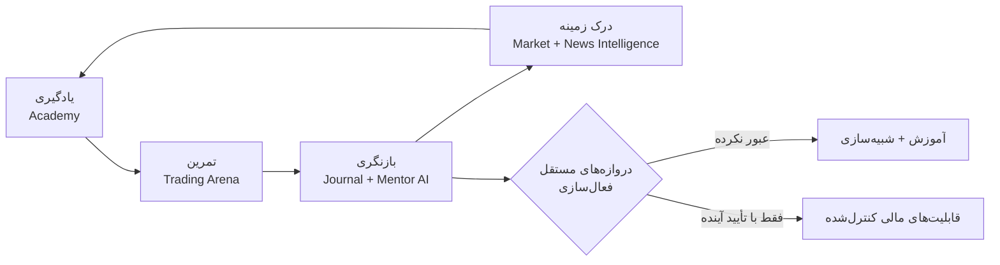
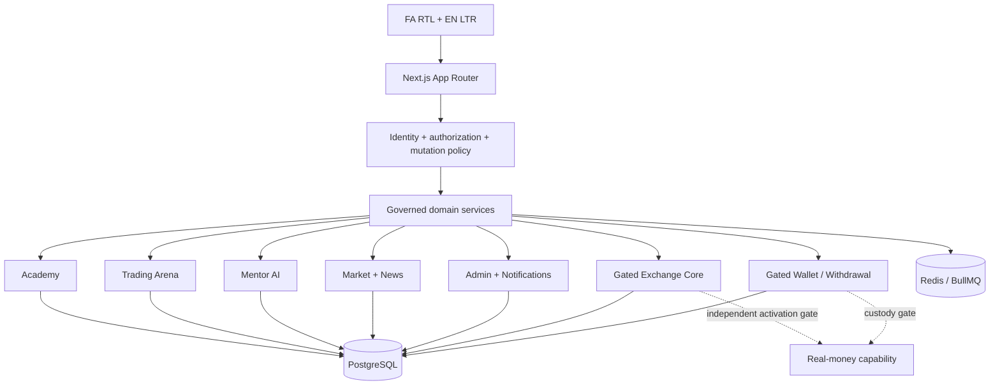

<div align="center" dir="rtl">


# تک‌پی | TecPey

### سیستم‌عامل آموزش مالی دیجیتال و معامله‌گری

**یادگیری با زمینه. تمرین با انضباط. فعال‌سازی با شواهد.**

**«تک‌پی، نقطه امن ورود به بازار رمزارز»**

[وب‌سایت](https://tecpey.ir) · [معماری](./docs/architecture/SERVER_SIDE_SOURCE_OF_TRUTH.md) · [امنیت](./SECURITY.md) · [حاکمیت لانچ](./docs/launch/CONTROLLED_SOFT_LAUNCH_GO_NO_GO_CHECKLIST.md) · [English](./README.md)

`آموزش‌محور` · `معامله‌گری مجازی` · `یادگیری با کمک AI` · `مرجع PostgreSQL` · `فارسی RTL + انگلیسی LTR` · `فعال‌سازی مبتنی بر شواهد`

</div>

> [!IMPORTANT]
> **تک‌پی در مرحله سخت‌سازی برای لانچ کنترل‌شده است.** تریدینگ ارنا از سرمایه مجازی استفاده می‌کند. حضورِ یک قابلیت در مخزن به‌معنیِ فعال‌سازیِ پروداکشن نیست. مخزن تک‌پی شاهدی بر فعال‌بودنِ صرافیِ پول‌واقعی، کاستدی، واریز یا برداشت نیست. وجود کد، CI، شواهد استیجینگ، تأیید عملیاتی و فعال‌سازی پروداکشن مراجع جداگانه‌اند.
>
> **تصمیم فعلی لانچ کنترل‌شده: NO-GO.** صرافیِ پول‌واقعی، کاستدی، واریز، برداشت، پاداش‌های مالیِ عمومی، enterprise و white-label خارج از scope فعلی‌اند و باید تا تأیید مستقل طبق مرجع canonical لانچ غیرفعال بمانند.

## یک چرخه محصول؛ نه مجموعه‌ای از قابلیت‌های پراکنده

تک‌پی به‌جای کنار هم گذاشتن چند صفحه رمزارزی، حول یک چرخه پیوسته یادگیری و تمرین ساخته می‌شود:



آکادمی دانش می‌سازد. تریدینگ ارنا آن را به تمرین مجازی کنترل‌شده تبدیل می‌کند. منتور AI زمینه مجاز یادگیری و تمرین را به بازنگری متصل می‌کند. بازار و اخبار، زمینه روز را اضافه می‌کنند. قابلیت‌های مالی پرریسک‌تر پشت گیت‌های مستقل فنی، عملیاتی، کاستدی، انطباقی و حوزه قضایی باقی می‌مانند.

تز محصول روشن است: **یادگیری → تمرین → بازنگری → درک → فعال‌سازی فقط وقتی شواهد اجازه دهند.**

## محصول واقعی، شواهد واقعی

تصاویر زیر **مشتق مستقیم از اسکرین‌شات‌های واقعی مرورگر تک‌پی** هستند؛ نه ماکاپ، کانسپت یا بازسازی تبلیغاتی. منبع آن‌ها Public Browser Golden Path روی head دقیق PR #642 با SHA `c28ec91f397fb4f1580d2b6d2499d867c176fa77` است. فایل‌های commit‌شده دارایی پایدار Showcase هستند؛ artifact اصلی GitHub Actions retention محدود دارد و به‌عنوان provenance تاریخی ثبت می‌شود، نه مرجع دائمی pixel-level. جزئیات در [`docs/assets/screenshots/showcase/PROVENANCE.md`](./docs/assets/screenshots/showcase/PROVENANCE.md) آمده است.

### تجربه ورود هدایت‌شده

<p align="center">
  <a href="./docs/assets/screenshots/showcase/landing-fa-dark-c28ec91.webp"></a>
</p>

لندینگ فعلی تک‌پی سفر رشد کاربر را نمایش می‌دهد، نه یک قیف صرافی‌محور. آکادمی، منتور، تمرین مجازی، زمینه بازار و مسیر یادگیری در یک پوسته دوزبانه کنار هم قرار گرفته‌اند.

### تمرین جدی، بدون درگیر کردن دارایی واقعی کاربر

<p align="center">
  <a href="./docs/assets/screenshots/showcase/trading-arena-fa-dark-c28ec91.webp"></a>
</p>

تریدینگ ارنا یک محیط شبیه‌سازی با حساب، موجودی، تلاش، پوزیشن، سفارش و اجرای مجازیِ server-authoritative است. موجودی و نتایج شبیه‌سازی‌شده شواهد آموزشی‌اند؛ نه دارایی مشتری، عملکرد واقعی یا وعده بازده.

> artifact اصلی CI شامل captureهای full-resolution آکادمی، Mentor، احراز هویت، موبایل/دسکتاپ، روشن/تیره و FA/EN نیز بوده است. چون retention در GitHub Actions محدود است، این اصل‌ها **پس از expiry به‌عنوان evidence پایدار ادامه‌دار معرفی نمی‌شوند**. مشتق‌های commit‌شده، مسیر capture، ابعاد و hashهای منبع برای traceability ثبت می‌مانند.

## برای سه گروه اصلی ساخته شده

| کاربر | سرمایه‌گذار و شریک راهبردی | تیم فنی |
|---|---|---|
| آموزش ساختاریافته، تمرین مجازی و بازنگری در یک سفر | یک تز پلتفرمی با چند سطح توسعه حول یک lifecycle کنترل‌شده | authorityهای مشخص، مرزهای شکست روشن و state حیاتی سمت سرور |
| آکادمی، ارزیابی، چالش و گواهی | آموزش، Mentor، simulation، هوش بازار و مسیر enterprise | PostgreSQL، idempotency، پایه‌های tenant/RLS و exact-head evidence |
| Mentor با context مجاز یادگیری و تمرین | زیرساخت مالی فقط بعد از گیت‌های مستقل | fail-closed launch، custody و sensitive-mutation controls |

این roadmap ادعای درآمد فعلی، سهم بازار، تأیید رگولاتوری یا بازده آینده نیست.

## ستون‌های محصول

### ۰۱ — آکادمی تک‌پی

آکادمی پایه یادگیری ساختاریافته است: ترم، درس، آزمون، ارزیابی، فلش‌کارت، چالش، شبیه‌سازی، دستاورد، گواهی و progression. مسیرهای canonical پیشرفت و ارزیابی server-backed هستند و browser storage منبع حقیقت state حیاتی نیست.

هدف فقط انتشار محتوا نیست؛ آکادمی باید شواهد ساختاریافته یادگیری بسازد تا تجربه منتور و تمرین را غنی‌تر کند. همه routeها بلوغ یکسان ندارند و parity زبان‌های بیشتر هنوز برنامه فعال است.

### ۰۲ — تریدینگ ارنا

تریدینگ ارنا **تمرین مجازی است، نه معامله پول‌واقعی**. هسته کنترل‌شده آن حساب مجازی، موجودی، تلاش، پوزیشن، سفارش، اجرا، کارمزد و revision را در سرور مدیریت می‌کند. توسعه replay، سناریو، ژورنال، لیگ و analytics باید مرز میان simulation evidence و عملکرد مالی واقعی را حفظ کند.

مرجع: [`docs/arena/TRADING_ARENA_UI_AUTHORITY.md`](./docs/arena/TRADING_ARENA_UI_AUTHORITY.md).

### ۰۳ — Mentor AI

منتور لایه هوشمندی آموزشی و بازنگری است. می‌تواند مفاهیم را توضیح دهد، گفت‌وگوی آموزشی را ادامه دهد و از context مجاز یادگیری و تمرین، تحت کنترل privacy و consent، استفاده کند.

منتور مشاور مالی خودمختار، فروشنده سیگنال، موتور پیش‌بینی یا اجراکننده معامله معرفی نمی‌شود. TecPey AI Operating System چندپرووایدری گسترده‌تر هنوز یک برنامه فعال مهندسی است، نه subsystem کامل enterprise.

مرجع: [`docs/MENTOR_AI_MODEL.md`](./docs/MENTOR_AI_MODEL.md).

### ۰۴ — هوش بازار و اخبار

تک‌پی در حال ساخت لایه discovery منبع‌محور برای زمینه بازار، News، کوین‌ها و ابزارهاست. جهت حاکمیتی روی provenance، freshness، entityها، canonical routeها و اتصال دوباره محتوا به مسیر یادگیری متمرکز است، نه یک feed مبهم.

کیفیت live source، ترجمه، حقوق رسانه، publication authority و indexing باید جداگانه در runtime و staging اثبات شوند.

### ۰۵ — هسته مالی حاکمیت‌شده

مخزن شامل مهندسی معنادار برای order admission، hold، matching، trade، fee، ledger، withdrawal pipeline، reconciliation و audit evidence است. این پایه‌ها مرزهای مالی را از ابتدا جدی می‌گیرند؛ اما مجوز کار با دارایی مشتری نیستند.

صرافی پروداکشن، کاستدی، واریز و برداشت تا عبور از گیت‌های مستقل custody، compliance، provider، reconciliation، recovery و operations غیرفعال می‌مانند.

## چرا معماری مهم است



TecPey از Next.js App Router و domain serviceهای TypeScript در runtime استفاده می‌کند. PostgreSQL مرجع پایدار state حیاتی است و Redis/BullMQ برای coordination و queueهای حاکمیت‌شده استفاده می‌شود. migration پروداکشن و runtime activation عملیات جداگانه‌اند.

### اصول مهندسی enterprise

| اصل | مرز تک‌پی |
|---|---|
| **Server-side source of truth** | state حیاتی کاربر، simulation و مالی در backend authorityهای کنترل‌شده قرار می‌گیرد |
| **Fail closed** | نبود authorization، persistence، provider، reconciliation یا readiness evidence نباید به موفقیت جعلی تبدیل شود |
| **Progressive activation** | آموزش، simulation، اجرای مالی، custody و enterprise هرکدام گیت مستقل دارند |
| **Evidence-driven delivery** | exact-head CI، browser evidence، security manifest و operational drill معیار readiness هستند |
| **Privacy & consent** | memory هوش مصنوعی، behavioral context، notification و community evidence purpose-bound هستند |
| **Tenant isolation direction** | داده tenant-scoped در policy ایزولیشن ثبت می‌شود؛ authority کامل runtime enterprise هنوز برنامه فعال است |
| **Multilingual UX** | فارسی RTL و انگلیسی LTR first-class هستند؛ localization گسترده‌تر ادامه دارد |
| **Truthful claims** | وجود کد هیچ‌وقت به‌عنوان اثبات فعال بودن قابلیت برای مشتری استفاده نمی‌شود |

## نگاه سرمایه‌گذار و شریک راهبردی

ارزش راهبردی تک‌پی از اضافه کردن tabهای بیشتر رمزارزی نمی‌آید؛ از **انباشت context در یک lifecycle کنترل‌شده** می‌آید: یادگیری می‌تواند تمرین را شکل دهد، تمرین بازنگری را غنی کند، بازنگری مسیر یادگیری بعدی را هدایت کند و context بازار دوباره به curriculum متصل شود.

این معماری چند سطح کسب‌وکاری بالقوه ایجاد می‌کند بدون اینکه نیاز به فعال‌سازی زودهنگام پول‌واقعی داشته باشد: آموزش premium، تجربه‌های Mentor پیشرفته، simulation عمیق‌تر، هوش بازار چندزبانه، enterprise delivery و فقط در صورت عبور مستقل از الزامات، قابلیت‌های مالی رگوله‌شده.

مزیت دفاع‌پذیر صرفاً بصری نیست؛ state پایدار یادگیری/تمرین، هوشمندی consent-aware، مرزهای امنیتی، release evidence و progressive activation از مجموعه‌ای از frontend featureها دشوارتر و مسئولانه‌تر قابل تقلید هستند. این یک تز محصول و مهندسی است، **نه ادعای scale تجاری فعلی، مجوز رگولاتوری یا بازده آینده**.

## امنیت، حاکمیت و انضباط عملیاتی

تک‌پی قابلیت مالی را یک مرز امنیتی می‌داند. مخزن شامل پایه‌های session/auth، CSRF، مسیرهای TOTP/passkey، کنترل privileged admin، audit logging، sensitive-mutation policy، tenant-isolation policy، secret scanning و تست‌های اختصاصی authority مالی است.

هم‌زمان، آنچه هنوز اثبات نشده نیز صریح ثبت می‌شود. custody پروداکشن نیازمند زیرساخت signing غیرقابل‌استخراج و شواهد عملیاتی تأییدشده است. runtime isolation کامل multi-tenant، separation of duties کامل، عمق control plane enterprise و governance گسترده‌تر AI هنوز برنامه‌های فعال هستند.

مسیرهای مهم بررسی:

- [`SECURITY.md`](./SECURITY.md)
- [`docs/architecture/SERVER_SIDE_SOURCE_OF_TRUTH.md`](./docs/architecture/SERVER_SIDE_SOURCE_OF_TRUTH.md)
- [`docs/security/ADMIN_CONTROL_PLANE_SECURITY_STANDARD.md`](./docs/security/ADMIN_CONTROL_PLANE_SECURITY_STANDARD.md)
- [`docs/launch/CONTROLLED_SOFT_LAUNCH_GO_NO_GO_CHECKLIST.md`](./docs/launch/CONTROLLED_SOFT_LAUNCH_GO_NO_GO_CHECKLIST.md)

## مرز لانچ کنترل‌شده

| قابلیت | مرز فعلی |
|---|---|
| لندینگ عمومی | **Included** |
| تجربه عمومی فارسی / انگلیسی | **Controlled** |
| Academy | **Controlled** |
| Mentor AI | **Controlled** — وابسته به provider/configuration |
| Trading Arena | **Controlled simulation** — سرمایه مجازی |
| Market & News | **Controlled** — نیازمند runtime freshness/publication evidence |
| Real-money Exchange | **Disabled** |
| Custody | **Disabled** |
| Deposits / Withdrawals | **Disabled** |
| Public financial rewards | **Gated** |
| Community | **Limited governed scope** |
| Multi-tenant / white-label | **مسیر مهندسی post-launch** |
| Public Developer Platform | **Planned** |
| TecPey AI Operating System گسترده | **برنامه فعال، نه subsystem کامل** |

## snapshot شواهد فعلی — ۲۰۲۶-۰۹-۱۳

baseline این Showcase برابر `main@c4751708ae6c1d2f2877ed64e7de36e5b963a045` است که لندینگ growth-story دوزبانه PR #642 را merge کرده است. اسکرین‌شات‌ها و browser evidence از source head دقیق `c28ec91f397fb4f1580d2b6d2499d867c176fa77` آمده‌اند.

روی آن source head، workflowهای CI، Public Browser Golden Path، Full Suite Diagnostics، Repository Audit Manifest، API Security Manifest، Sensitive Mutation Audit، Full History Secret Scanning و AI Tenant RLS Runtime Evidence پیش از merge با موفقیت کامل شده‌اند.

این شواهد برای change پذیرفته‌شده معتبرند، اما **جایگزین protected-staging evidence یا final launch approval نیستند**. مرجع canonical تصمیم همچنان [`docs/launch/CONTROLLED_SOFT_LAUNCH_GO_NO_GO_CHECKLIST.md`](./docs/launch/CONTROLLED_SOFT_LAUNCH_GO_NO_GO_CHECKLIST.md) و [`docs/launch/CURRENT_CONTROLLED_LAUNCH_CANDIDATE.md`](./docs/launch/CURRENT_CONTROLLED_LAUNCH_CANDIDATE.md) است.

## بررسی مهندسی

```bash
npm ci
npm run lint
npm run typecheck
npm test
npm run build
```

سبز بودن build محلی برای یک protected change کافی نیست. exact-head GitHub checks و staging/runtime evidence مرتبط با domain باید جداگانه بررسی شوند.

از اینجا شروع کنید:

- [Server-side source of truth](./docs/architecture/SERVER_SIDE_SOURCE_OF_TRUTH.md)
- [Trading Arena authority](./docs/arena/TRADING_ARENA_UI_AUTHORITY.md)
- [Admin control-plane security](./docs/security/ADMIN_CONTROL_PLANE_SECURITY_STANDARD.md)
- [Wallet engine](./docs/WALLET_ENGINE.md)
- [Mentor AI model](./docs/MENTOR_AI_MODEL.md)
- [Verified screenshot provenance](./docs/assets/screenshots/showcase/PROVENANCE.md)

## گزارش مسئولانه آسیب‌پذیری

آسیب‌پذیری‌ها را در issue عمومی منتشر نکنید. مسیر مسئولانه در [`SECURITY.md`](./SECURITY.md) تعریف شده است.

---

<div align="center" dir="rtl">

### TecPey | تک‌پی

**آموزش اول. تمرین پیش از مواجهه. شواهد پیش از فعال‌سازی.**

</div>
