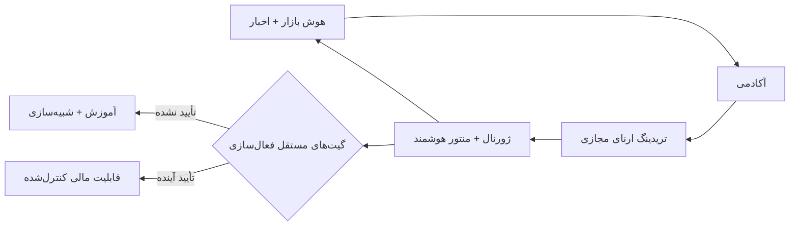

<div align="center" dir="rtl">


# تک‌پی | TecPey

### سیستم‌عامل آموزش مالی دیجیتال و معامله‌گری

**بازار را یاد بگیر. بدون مواجهه مالی تمرین کن. مهارتت را با شواهد بساز.**

**«تک‌پی، نقطه امن ورود به بازار رمزارز»**

[وب‌سایت](https://tecpey.ir) · [English](./README.md) · [معماری](./docs/architecture/SERVER_SIDE_SOURCE_OF_TRUTH.md) · [امنیت](./SECURITY.md) · [حاکمیت لانچ](./docs/launch/CONTROLLED_SOFT_LAUNCH_GO_NO_GO_CHECKLIST.md)

`آموزش‌محور` · `تریدینگ ارنای مجازی` · `منتور هوشمند` · `هوش بازار و اخبار` · `FA RTL + EN LTR` · `فعال‌سازی مبتنی بر شواهد`

</div>

<div dir="rtl">

## یک سفر پیوسته؛ از کنجکاوی تا مهارت

تک‌پی بخش‌هایی را به هم متصل می‌کند که در بسیاری از محصولات رمزارزی از هم جدا هستند. کاربر در **آکادمی** پایه می‌سازد، با **سرمایه مجازی** تصمیم‌گیری را تمرین می‌کند، با **منتور هوشمند** عملکردش را بازنگری می‌کند و با **داده بازار و اخبار منبع‌محور** زمینه تصمیم‌هایش را بهتر می‌فهمد.

چرخه محصول روشن است:

**یادگیری ← تمرین ← بازنگری ← درک زمینه ← رشد**

قابلیت‌های مالی پرریسک‌تر مسئله‌ای جدا از این چرخه‌اند. صرف وجود کد به معنی فعال‌شدن آن‌ها نیست؛ فعال‌سازی مالی به شواهد مستقل فنی، عملیاتی، کاستدی، انطباقی و حوزه قضایی نیاز دارد.

## تجربه واقعی محصول

سوییت مرورگر حاکمیت‌شده، سطوح واقعی دوزبانه محصول را در دسکتاپ/موبایل و حالت روشن/تیره capture می‌کند. این README عمداً thumbnailهای کوچک و lossy قبلی را نمایش نمی‌دهد: evidence بصری باید قابل بررسی باشد، نه صرفاً تزئینی. artifact فول‌رزولوشن head پذیرفته‌شده در بخش شواهد معرفی شده و دارایی‌های پایدار Showcase با کیفیت بالا باید جدا از artifact موقت CI نگه‌داری شوند.

### آکادمی — دانشی که به پیشرفت قابل‌اندازه‌گیری تبدیل می‌شود

آکادمی پایه مسیر یادگیری است: ترم‌ها، درس‌ها، آزمون‌ها، ارزیابی‌ها، فلش‌کارت، چالش، شبیه‌سازی، دستاورد و گواهی. مسیرهای canonical پیشرفت و ارزیابی server-backed هستند. مسیر یادگیری نیز قرار نیست با پایان هفت ترم پایه متوقف شود؛ «ترم رشد بی‌نهایت» جهت ادامه‌دار محصول برای تبدیل یادگیری به یک چرخه رشد شخصی است.

### تریدینگ ارنا — تمرین جدی، بدون درگیر کردن دارایی واقعی کاربر

تریدینگ ارنا محیط شبیه‌سازی کنترل‌شده با حساب، موجودی، فرصت، پوزیشن، سفارش و اجرای مجازی است. هدف این است که کیفیت تصمیم قبل از مواجهه با پول واقعی قابل مشاهده و قابل بازنگری شود. موجودی و نتیجه شبیه‌سازی‌شده، شواهد آموزشی‌اند؛ نه دارایی مشتری، عملکرد واقعی یا وعده بازده.

### منتور هوشمند — راهنمایی متصل به مسیر واقعی کاربر

منتور لایه بازنگری و شخصی‌سازی است. می‌تواند از context مجاز آکادمی و تمرین برای توضیح مفاهیم، شناسایی نقاط ضعف و پیشنهاد قدم بعدی استفاده کند. جهت طراحی آن **coaching مبتنی بر شواهد** است: confidence ساختگی ممنوع، نبود داده نباید پنهان شود و منتور به‌عنوان مشاور مالی خودمختار یا موتور سیگنال معرفی نمی‌شود.

## تفاوت تک‌پی کجاست؟

| لایه محصول | نقش در سفر کاربر | اصل authority |
|---|---|---|
| **آکادمی** | ساخت دانش و شواهد یادگیری | پیشرفت و ارزیابی canonical سمت سرور است |
| **تریدینگ ارنا** | تمرین تصمیم با سرمایه مجازی | state شبیه‌سازی تحت authority سرور است |
| **منتور هوشمند** | تبدیل context یادگیری و تمرین به بازنگری | فقط از context مجاز استفاده می‌کند و نبود evidence را صادقانه نمایش می‌دهد |
| **بازار و اخبار** | افزودن زمینه روز و منبع‌محور | provenance، freshness و publication authority صریح‌اند |
| **هسته مالی** | ساخت امن مرزهای اجرای آینده | فعال‌سازی پول‌واقعی پشت گیت‌های مستقل باقی می‌ماند |

مزیت اصلی، اتصال این لایه‌هاست: یادگیری روی تمرین اثر می‌گذارد؛ تمرین به منتور context می‌دهد؛ بازنگری قدم بعدی یادگیری را شکل می‌دهد؛ و داده و خبر دوباره کاربر را به مسیر آموزشی متصل می‌کنند. ساخت مسئولانه این پیوستگی سخت‌تر از کنار هم گذاشتن چند صفحه رمزارزی است.

## معماری محصول



زیر این تجربه محصول، تک‌پی بر authorityهای صریح ساخته می‌شود: Next.js App Router و سرویس‌های دامنه TypeScript، PostgreSQL برای state حیاتی پایدار، Redis/BullMQ برای coordination کنترل‌شده، پایه‌های tenant/RLS، mutationهای حساس قابل ممیزی و CI مبتنی بر exact-head.

### اصول مهندسی

- **منبع حقیقت سمت سرور:** state حیاتی کاربر، شبیه‌سازی و مالی متعلق به backend authority است.
- **Fail closed:** نبود مجوز، persistence، provider، reconciliation یا readiness نباید بی‌صدا به موفقیت تبدیل شود.
- **شواهد قبل از فعال‌سازی:** وجود کد، CI، شواهد staging، تأیید عملیاتی و فعال‌سازی production تصمیم‌های جدا هستند.
- **حریم خصوصی مبتنی بر هدف:** حافظه منتور و context رفتاری باید مجاز و purpose-bound باشند.
- **دوزبانه از پایه:** فارسی RTL و انگلیسی LTR هر دو سطح درجه‌یک محصول‌اند.
- **فعال‌سازی تدریجی:** آموزش و شبیه‌سازی می‌توانند بدون فعال‌سازی زودهنگام ریسک پول‌واقعی رشد کنند.

## مرز لانچ کنترل‌شده

تمرکز فعلی تک‌پی سخت‌سازی یک لانچ آموزشی کنترل‌شده است: تجربه عمومی، آکادمی، منتور هوشمند، تریدینگ ارنای شبیه‌سازی‌شده و سطوح بازار/اخبار. **وجود قابلیت مالی در مخزن به معنی فعال‌بودن صرافی پول‌واقعی، کاستدی، واریز یا برداشت نیست و این بخش‌ها همچنان gated هستند.**

**در حال ساخت و توسعه صرافی اختصاصی و پیشرفته تک‌پی هستیم**؛ فعال‌سازی مالی production یک برنامه مستقل با الزامات جداگانه کاستدی، compliance، provider، reconciliation، recovery و operations است.

مرجع canonical تصمیم لانچ [`CONTROLLED_SOFT_LAUNCH_GO_NO_GO_CHECKLIST.md`](./docs/launch/CONTROLLED_SOFT_LAUNCH_GO_NO_GO_CHECKLIST.md) است؛ README جایگزین آن سند نیست.

## شواهد این Showcase

شواهد مرورگر full-resolution در [Public Browser Golden Path #1857](https://github.com/tecpey/Tecpey-Os/actions/runs/34941100324) روی exact head زیر ثبت شده‌اند:

`9f3a8fa0c9d43c2f34cacfa24935d9ec300c4baa`

روی همان head هر هشت workflow حاکمیت‌شده با موفقیت کامل شده‌اند: CI، Public Browser Golden Path، Full Suite Diagnostics، Repository Audit Manifest، API Security Manifest، Sensitive Mutation Audit، Full History Secret Scanning و AI Tenant RLS Runtime Evidence.

این شواهد، پذیرش همان وضعیت کد را اثبات می‌کنند؛ **جایگزین protected-staging evidence یا تصمیم نهایی لانچ نیستند.**

## مسیرهای مهم مهندسی

- [منبع حقیقت سمت سرور](./docs/architecture/SERVER_SIDE_SOURCE_OF_TRUTH.md)
- [Authority تریدینگ ارنا](./docs/arena/TRADING_ARENA_UI_AUTHORITY.md)
- [امنیت Admin Control Plane](./docs/security/ADMIN_CONTROL_PLANE_SECURITY_STANDARD.md)
- [Wallet Engine](./docs/WALLET_ENGINE.md)
- [مدل Mentor AI](./docs/MENTOR_AI_MODEL.md)

```bash
npm ci
npm run lint
npm run typecheck
npm test
npm run build
```

سبز بودن build محلی به‌تنهایی تصمیم release نیست. تغییرات محافظت‌شده باید با exact-head CI و شواهد runtime/staging متناسب با سطح ریسکشان ارزیابی شوند.

## گزارش مسئولانه آسیب‌پذیری

آسیب‌پذیری‌ها را در issue عمومی منتشر نکنید. مسیر گزارش مسئولانه در [`SECURITY.md`](./SECURITY.md) آمده است.

</div>

---

<div align="center">

### TecPey

**آموزش اول. تمرین پیش از مواجهه. شواهد پیش از فعال‌سازی.**

</div>
