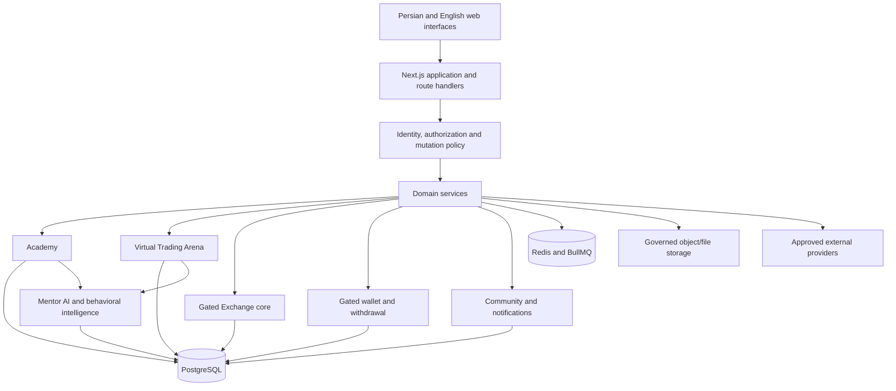

<div align="center">


# تک‌پی (TecPey)

## سیستم‌عاملِ آموزش مالی و ترید دیجیتال

**«تک‌پی، نقطه امن ورود به بازار رمزارز»**

**“TecPey — a safer entry point into the crypto market.”**

[وب‌سایت](https://tecpey.ir) · [آدیت پروژه](./docs/audits/TECPEY_PROJECT_STATE_AUDIT_2026-07-26.md) · [معماری](./docs/architecture/SERVER_SIDE_SOURCE_OF_TRUTH.md) · [امنیت](./SECURITY.md)

[English](./README.md) · **فارسی**

</div>

<div dir="rtl">

> [!IMPORTANT]
> تک‌پی یک پلتفرمِ آموزش‌محور در مرحله‌ی سخت‌سازیِ لانچِ کنترل‌شده است. این مخزن شاملِ تریدِ مجازی و زیرساختِ مالیِ گِیت‌شده است، اما **شاهدی بر فعال‌بودنِ صرافیِ پول‌واقعی، کاستدی، واریز یا برداشت نیست**. پیاده‌سازیِ کد، شواهدِ CI، استقرارِ عملیاتی و فعال‌سازیِ محصول، تصمیم‌های جدا از هم‌اند.

## تک‌پی چیست

تک‌پی به‌عنوان یک **سیستم‌عاملِ آموزش مالی و ترید دیجیتال** ساخته می‌شود: یک پلتفرمِ حاکمیت‌شده که آموزشِ ساختارمند، تمرینِ هدایت‌شده، هوشِ رفتاری و — تنها پس از عبور از گِیت‌های مستقلِ ایمنی و عملیاتی — اجرای مالی را به هم پیوند می‌دهد.

تک‌پی صرفاً یک صرافیِ رمزارز نیست. رابطه‌ی محوریِ محصول، پیوندِ میانِ این‌هاست:

- **آکادمی تک‌پی**، جایی که کاربر مفاهیم و مهارت‌ها را می‌آموزد؛
- **تریدِ مجازی / آرنای ترید**، جایی که این مهارت‌ها را با سرمایه‌ی شبیه‌سازی‌شده تمرین می‌کند؛
- **منتور هوش‌مصنوعی**، که می‌تواند با استفاده از شواهدِ مجازِ یادگیری و تمرین، به بازاندیشی و آگاهیِ ریسک کمک کند؛
- **زیرساختِ صرافی، کیف‌پول و لجر**، که پشتِ گِیت‌های فعال‌سازیِ جدا مهندسی شده است؛
- **جامعه، اعلان‌ها، مدیریت و سرویس‌های سازمانیِ آینده**، که محیطِ یادگیری و عملیات را گسترش می‌دهند بی‌آنکه حریمِ خصوصی یا کنترل‌های مالی تضعیف شوند.

جهت‌گیریِ اولیه ایران‌محور و فارسی‌محور است، با تجربه‌ی روبه‌رشدِ انگلیسی و معماریِ چندزبانه. جهت‌گیریِ بلندمدت شاملِ SaaS سازمانی، عملیاتِ چند‌مستأجری و وایت‌لیبل، اکوسیستمِ توسعه‌دهنده و یک لایه‌ی حاکمیت‌شده‌ی هوش‌مصنوعیِ تک‌پی است. این‌ها آرمان و برنامه‌های بازِ مهندسی‌اند، نه ادعای پروداکشنِ فعلی.

## چرا تک‌پی وجود دارد

ورود به بازارهای رمزارز اغلب پراکنده است. آموزش معمولاً از رابطی که کاربر بعداً در آن عمل می‌کند جدا است. تریدِ دمو معمولاً سفارشِ شبیه‌سازی‌شده ارائه می‌دهد بدونِ سرفصلِ آموزشی، مدلِ بازاندیشی، یا توضیحِ ریسک. الگوهای رفتاری — تریدِ افراطی، اندازه‌گیریِ نادرستِ پوزیشن، مرورِ ناهماهنگ، یا تصمیم‌گیریِ تحتِ فشار — به‌ندرت به پیشرفتِ یادگیرنده متصل می‌شوند.

مسیرِ موردِ نظرِ تک‌پی متفاوت است:

۱. مفاهیم را در مسیری ساختارمند بیاموز.
۲. بدونِ مواجهه با پولِ واقعی تمرین کن.
۳. تصمیم‌ها را — نه فقط نتایج — ثبت و مرور کن.
۴. راهنماییِ آموزشی و رفتاریِ رضایت‌محور دریافت کن.
۵. قابلیت‌های پرریسک‌تر را تنها پس از عبور از گِیت‌های فنی، عملیاتی، حقوقی، کاستدی و قضایی فعال کن.

همین مسیر دلیلِ آن است که آکادمی، آرنا و منتور به‌عنوانِ یک حلقه‌ی محصولیِ واحد طراحی شده‌اند، نه اپلیکیشن‌های بی‌ارتباط.

## اصولِ محصول

- **آموزش در اولویت.** بافتِ یادگیری و سوادِ ریسک پیش از فعال‌سازیِ مالی می‌آید.
- **ایمنی پیش از فعال‌سازی.** یک قابلیت می‌تواند در کد وجود داشته باشد و عمداً برای کاربران در دسترس نباشد.
- **ادعاهای صادقانه‌ی محصول.** اطلاعاتِ آموزشیِ بازار و شبیه‌سازی هرگز نباید به‌عنوانِ صرافیِ فعال یا نتیجه‌ی تضمین‌شده ارائه شوند.
- **پایداریِ سمت‌سرور.** حالتِ حیاتیِ کاربر و مالی به اتوریتی‌های بک‌اند تعلق دارد، نه به حافظه‌ی مرورگر.
- **عملیاتِ مالیِ fail-closed.** نبودِ شواهدِ مجوز، پایداری، قیمت، پروایدر، تطبیق، کاستدی یا آمادگی نباید بی‌صدا به موفقیت تنزل یابد.
- **حریمِ خصوصی و رضایت.** حافظه‌ی رفتاری، شواهدِ جامعه، ارتباطات و بافتِ هوش‌مصنوعی باید از داده‌ی مجاز و برای هدفی مشخص استفاده کنند.
- **حاکمیتِ ریلیزِ شاهد-محور.** تست‌ها، CI روی exact-head، درایوهای عملیاتی و بازبینیِ مستقل تعریف‌کننده‌ی «تکمیل»‌اند — نه تعدادِ مسیر یا صیقلِ ظاهری.
- **تجربه‌ی چندزبانه و در دسترس.** فارسیِ RTL، انگلیسیِ LTR، دسترسیِ کیبورد، چیدمانِ ریسپانسیو و بررسی‌های WCAG الزاماتِ محصول‌اند.
- **معماریِ ماژولارِ سازمانی.** دامنه‌ها اتوریتی‌های صریح دارند و می‌توانند به‌سمتِ تحویلِ سازمانی تکامل یابند، بی‌آنکه به‌معنیِ کامل‌بودنِ چند‌مستأجری امروز باشد.
- **فعال‌سازیِ تدریجیِ قابلیت‌ها.** آموزشِ عمومی، تمرینِ مجازی، اجرای پول‌واقعی، کاستدی و عملیاتِ سازمانی هرکدام گِیتِ ریلیزِ مجزا دارند.

## اکوسیستمِ محصول

### آکادمی تک‌پی

آکادمی بنیادِ یادگیریِ ساختارمند است. مخزن شاملِ یادگیریِ ترم‌محور، درس‌ها، کوییز‌ها، آزمون‌ها، آن‌بوردینگ، رهگیریِ پیشرفت، دستاوردها، گواهی‌ها، فلش‌کارت‌ها، چالش‌ها، شبیه‌سازی‌ها، لبِ ریسک و روان‌شناسی، و تجربه‌های شغل‌محور است، زیرِ [`src/app/academy`](./src/app/academy) و [`src/components/academy`](./src/components/academy).

پیشرفت، آزمون و گواهیِ کانونی اتوریتی‌های PostgreSQL-محور دارند در [`src/lib/academy-progress.ts`](./src/lib/academy-progress.ts)، [`src/lib/academy-assessment.ts`](./src/lib/academy-assessment.ts) و [`src/lib/academy-certificates.ts`](./src/lib/academy-certificates.ts). سوییت‌های امنیتی و یکپارچگی این مرزها را تست می‌کنند. حافظه‌ی منتور می‌تواند پیشرفتِ مجازِ آکادمی را برای پیوستگیِ آموزشی بخواند.

بلوغِ همه‌ی تجربه‌های آکادمی یکسان نیست. بخشی از حالتِ تعامل، لب و ارائه عمداً به‌عنوانِ حالتِ دورریختنیِ مرورگر-محلی طبقه‌بندی شده، و برخی تجربه‌های قدیمی‌تر ناقص مانده‌اند. پوششِ انگلیسی عمقِ کاملِ درختِ مسیرهای فارسی را بازتاب نمی‌دهد. صدورِ گواهی وجود دارد، اما برنامه‌ی کاملِ چرخش و ابطالِ گواهیِ سازمانی ادعا نمی‌شود.

### تریدِ مجازی / آرنای ترید

آرنای ترید تمرینِ شبیه‌سازی‌شده است، نه تریدِ پول‌واقعی. هدفش این است که یادگیرنده مفاهیم را به‌کار بندد، ریسک را مشاهده کند و رفتار را مرور کند، بدونِ انتقالِ وجوهِ مشتری.

هسته‌ی رسمیِ آرنا از یک تجمیعِ PostgreSQL با اتوریتیِ سمت‌سرور برای حساب‌های مجازی، بالانس‌ها، تلاش‌ها، پوزیشن‌ها، سفارش‌ها، اجراها، کارمزدها و revisionها استفاده می‌کند. از حسابِ decimal-string، کنترل‌های idempotency و ورودی‌های بازارِ resolve‌شده‌ی سمت‌سرور بهره می‌برد. مدلِ حاکمیت‌شده‌ی فعلی شاملِ سرمایه‌ی مجازی و یک چرخه‌ی سه‌تلاشی است، با ری‌فلکشن‌های مالکیت‌سرور برای پروجکشن‌های مجازِ یادگیری و جامعه. رجوع کنید به [`src/lib/trading-arena-account.ts`](./src/lib/trading-arena-account.ts)، [`src/lib/trading-arena-execution-v2.ts`](./src/lib/trading-arena-execution-v2.ts)، [`src/lib/trading-arena-reflections.ts`](./src/lib/trading-arena-reflections.ts) و [`docs/arena/TRADING_ARENA_UI_AUTHORITY.md`](./docs/arena/TRADING_ARENA_UI_AUTHORITY.md).

برخی تجربه‌های تاریخیِ replay، سناریو و ژورنال هنوز از ماژول‌های شبیه‌سازیِ محلیِ قرنطینه‌شده استفاده می‌کنند. این مسیرها شاهدِ مالی یا اعتباریِ کانونی نیستند. هیچ نتیجه‌ی شبیه‌سازی‌شده، بالانسِ مجازی یا خروجیِ تاریخی، معرفِ عملکردِ واقعی یا وعده‌ی پاداش نیست.

### منتور هوش‌مصنوعی

منتور هوش‌مصنوعی لایه‌ی هوشِ آموزشی و رفتاریِ تک‌پی است. بنیادِ پیاده‌شده می‌تواند پروفایل‌ها، گفتگوها، خاطرات، بافتِ پیشرفتِ آکادمی و سیگنال‌های منتخبِ آرنا را سمت‌سرور ذخیره کند. می‌تواند به کاربر در مرورِ مفاهیم، بازاندیشی درباره‌ی رویدادهای مجازِ تمرین و توجه به الگوهای مرتبط با ریسک کمک کند. دسترسیِ پروایدر پشتِ مرزِ سرور با fallbackهای حاکمیت‌شده و تست‌های اعتماد نگه داشته می‌شود.

منتور یک مشاورِ مالیِ خودمختار، ارائه‌دهنده‌ی سیگنال یا موتورِ پیش‌بینی نیست. نباید نتیجه تضمین کند، ترید بزند، وجه جابه‌جا کند یا شواهدِ رفتاریِ خصوصی را خارج از مرزهای رضایت و مجوز به‌کار برد. برخی مسیرهای تحویلِ رویداد و تعامل ناقص یا غیرپایدارند، و «سیستم‌عاملِ هوش‌مصنوعیِ تک‌پیِ» گسترده‌تر یک برنامه‌ی باز است. شواهدِ فعلی در [`src/lib/mentor-memory.ts`](./src/lib/mentor-memory.ts)، [`src/lib/ai/mentor-provider.ts`](./src/lib/ai/mentor-provider.ts) و [`docs/MENTOR_AI_MODEL.md`](./docs/MENTOR_AI_MODEL.md) است.

### هسته‌ی صرافی

مخزن شاملِ مهندسیِ پذیرشِ احرازشده‌ی سفارش، holdها، مَچینگ، تریدها، کارمزدها، رکوردهای لجر، شواهدِ اودیت، idempotency و حسابِ decimal-safe است. این‌ها بنیادهای مهمِ پلتفرم‌اند، تست‌شده از طریقِ سوییت‌های اتوریتیِ صرافی و مستندشده در [`docs/architecture/EXCHANGE_ORDER_ADMISSION_AUTHORITY.md`](./docs/architecture/EXCHANGE_ORDER_ADMISSION_AUTHORITY.md) و [`docs/financial/FINANCIAL_CORE_CERTIFICATION.md`](./docs/financial/FINANCIAL_CORE_CERTIFICATION.md).

یک اتوریتیِ read-only برای تطبیقِ لجر ([`src/lib/trading/exchange-reconciliation.ts`](./src/lib/trading/exchange-reconciliation.ts)، `npm run exchange:reconcile:check`) اکنون ثابت‌های بالانسِ کیف‌پول را از `wallet_ledger` و تریدها با `NUMERIC` در PostgreSQL بازتولید می‌کند و در صورتِ هر واگرایی fail-closed می‌شود؛ لایه‌ی مُرده‌ی clampِ بالانس حذف شد.

این مجوزِ عملیاتِ پول‌واقعی نیست. تطبیقِ کاملِ پروداکشن، بازیابیِ نتیجه‌ی مبهم، مالکیتِ توزیع‌شده، شواهدِ پروایدر، کامپلاینس، کاستدی و بازیابیِ پروداکشن مستقلاً گِیت‌شده باقی می‌مانند (ایشو #30). سافت‌لانچِ کنترل‌شده نباید به‌معنیِ در دسترس‌بودنِ صرافیِ زنده تلقی شود.

### کیف‌پول و لجر

تک‌پی شاملِ پذیرشِ برداشتِ دیتابیس-محور، پایدارسازیِ تراکنش پیش از broadcast، بنیادهای صف/ورکر، پردازشِ تأیید و یکپارچگیِ لجر است. این مسیرها تست‌های اختصاصیِ اتوریتی و failure-mode دارند.

کاستدیِ پروداکشن صراحتاً با سیاست غیرفعال است. مخزن شاملِ یک استقرارِ تأییدشده‌ی امضای HSM/MPC پروداکشن نیست، و کاستدیِ کلیدِ خصوصیِ خام به‌عنوانِ راه‌حلِ پروداکشن رد می‌شود. تخصیصِ واریز، امضا، broadcast و فعال‌سازیِ برداشت تابعِ گِیت‌های کاستدی، پروایدرِ چین، تطبیق، کامپلاینس، بازیابیِ فاجعه و عملیاتی باقی می‌مانند. رجوع کنید به [`docs/WALLET_ENGINE.md`](./docs/WALLET_ENGINE.md)، [`docs/WITHDRAW_SECURITY.md`](./docs/WITHDRAW_SECURITY.md) و [`src/lib/wallet/custody-launch-policy.ts`](./src/lib/wallet/custody-launch-policy.ts).

### جامعه و یادگیریِ اجتماعی

بنیادِ حاکمیت‌شده‌ی جامعه از پروفایل‌های خصوصی/رضایتِ پیش‌فرض، پروجکشنِ کانونیِ ری‌فلکشنِ آرنا، چالش‌های ژورنال، شواهدِ ری‌پیوتیشنِ تغییرناپذیر و نمره‌ی انضباطِ خصوصی پشتیبانی می‌کند. رتبه‌بندیِ عمومی، پاداشِ مالی، بورسیه و اتوریتیِ واقعیِ اینستراکتور غیرفعال می‌مانند.

شبکه‌ی حرفه‌ای‌ترِ یادگیری — گرافِ اجتماعی، انتشارِ غنی، مدیریت، جست‌وجو، مدیریتِ چرخه‌ی عمر و ری‌پیوتیشنِ عمومی — کامل نیست. مرزِ فعلی در [`docs/academy/COMMUNITY_REPUTATION_EVIDENCE_AUTHORITY.md`](./docs/academy/COMMUNITY_REPUTATION_EVIDENCE_AUTHORITY.md) و [`docs/academy/COMMUNITY_INSTRUCTOR_ACCESS_BOUNDARY.md`](./docs/academy/COMMUNITY_INSTRUCTOR_ACCESS_BOUNDARY.md) مستند شده است.

### پلتفرمِ اعلان و CRM

مخزن شاملِ ترجیحات و رضایتِ اعلانِ PostgreSQL-محور، بنیادهای پایدارِ outbox/domain، ورکرهای تحویلِ درون‌برنامه‌ای، اتوریتیِ producer و مدیریتِ لیدِ CRM با فیلدهای محافظت‌شده و تست‌های تحویل است. این سرویس‌ها قرار است آکادمی، آرنا، منتور، امنیت و عملیات را به هم متصل کنند، بی‌آنکه به موتورِ تعاملِ بی‌قید تبدیل شوند.

یک پلتفرمِ کاملِ چندکاناله — ایمیل، پیامک، push، کوهورت‌های حاکمیت‌شده، کمپین‌های گسترده، سیاستِ خستگی و تحلیلِ عملیاتیِ کامل — ناقص است. پیام‌های امنیتیِ اجباری باید از بازاریابی جدا بمانند، و هر گسترشِ مخاطب باید سمت‌سرور resolve و رضایت‌محور باشد.

### کنترل‌پلینِ ادمین و امنیت

تک‌پی هویت‌های مجزای ادمین، سشن‌های سمت‌سرور، بررسیِ دسترسی، بنیادهای passkey/step-up، شواهدِ اودیتِ تراکنش-کوپل و یک سطحِ command-center دارد. این‌ها کنترل‌های معنادارند، نه یک محصولِ کاملِ مدیریتِ سازمانی.

اینونتوریِ کاملِ مسیرهای privileged، کنترلِ دوگانه برای اقداماتِ مالیِ پرتأثیر، تفکیکِ وظایف و پوششِ کاملِ دامنه‌های عملیاتی باز باقی می‌مانند. استانداردِ حاکمِ امنیت [`docs/security/ADMIN_CONTROL_PLANE_SECURITY_STANDARD.md`](./docs/security/ADMIN_CONTROL_PLANE_SECURITY_STANDARD.md) است.

### پلتفرمِ توسعه‌دهنده و سازمانی

جهت‌گیریِ بلندمدتِ تک‌پی تحویلِ API-first از طریقِ APIهای حاکمیت‌شده، وبهوک‌ها، SDKها، مستنداتِ توسعه‌دهنده و ماژول‌های محصولِ قابلِ استفاده‌ی مجدد است. پلتفرم همچنین قرار است از مستأجرهای مستقلاً پیکربندی‌شده و آموزش، آرنا، منتور و محصولاتِ مالیِ وایت‌لیبل پشتیبانی کند.

ران‌تایمِ امروز عمداً single-tenant است. ایزوله‌سازیِ سراسریِ مستأجر، پیکربندیِ مستأجر، صورت‌حساب، مسیریابیِ دامنه، کلیدهای مخصوصِ مستأجر و یک کنترل‌پلینِ سازمانی کامل نیستند. یک گیتِ پوششِ جدول‌های tenant-scoped (`npm run tenant:isolation:check`، پشتیبانی‌شده توسطِ [`docs/security/tenant-scoped-table-registry.json`](./docs/security/tenant-scoped-table-registry.json)) اکنون هر ۲۷ جدولِ tenant-scoped را ثبت می‌کند و در صورتِ شیپ‌شدنِ جدولِ جدیدِ ثبت‌نشده fail-closed می‌شود؛ دو جدول در حالِ حاضر تستِ منفیِ cross-tenantِ اثبات‌شده دارند و بقیه به‌عنوانِ pending زیرِ #109 رهگیری می‌شوند. توجه: برخی دامنه‌ها (مثلاً risk و withdrawal) هنوز در لایه‌ی اپ روی مستأجرِ پیش‌فرض پین شده‌اند، پس ستونِ `tenant_id`شان هنوز per-request مقداردهی نمی‌شود. توصیف‌های پلتفرمِ توسعه‌دهنده، SaaS، چند‌مستأجری و وایت‌لیبل فقط جهت‌گیریِ رودمپ‌اند؛ رجوع کنید به [`docs/WHITE_LABEL_PLATFORM.md`](./docs/WHITE_LABEL_PLATFORM.md) و ایشوهای [#20](https://github.com/tecpey/Tecpey-Os/issues/20) و [#109](https://github.com/tecpey/Tecpey-Os/issues/109).

### سیستم‌عاملِ هوش‌مصنوعیِ تک‌پی

سیستم‌عاملِ هوش‌مصنوعیِ تک‌پی در بلندمدت یک لایه‌ی هوشِ حاکمیت‌شده برای کاربران، پشتیبانی، مدیریت، محتوا، QA، عملیات و گردش‌کارهای سازمانی است. مالکِ مسیریابیِ مدل، ابزارها، مجوزهای حافظه، ارزیابی‌ها، اودیت، بودجه و تأییدهای انسانی در بینِ پروایدرها خواهد بود.

آن پلتفرم یک زیرسیستمِ تکمیل‌شده نیست. بنیادِ فعلیِ منتور یک قابلیتِ محصولیِ محدود است؛ نباید برای القای عملیاتِ خودمختار، حاکمیتِ کاملِ هوش‌مصنوعیِ سازمانی، یا مجوزِ اجرای اقداماتِ مالی یا مدیریتی به‌کار رود.

## مرزِ فعلیِ سافت‌لانچ

| قابلیت | حالتِ موردِ نظرِ سافت‌لانچ | یادداشت |
|---|---|---|
| صفحه‌ی عمومی | شامل | مسیرهای عمومیِ حاکمیت‌شده‌ی فارسی و انگلیسی |
| تجربه‌ی فارسی/انگلیسی | کنترل‌شده | تطابقِ عمومی تست‌شده؛ تطابقِ کاملِ اپلیکیشن ناقص است |
| آکادمی | کنترل‌شده | اتوریتیِ پیشرفت/آزمونِ کانونی سمت‌سرور است؛ بلوغِ همه‌ی تجربه‌ها یکسان نیست |
| منتور هوش‌مصنوعی | کنترل‌شده | کمکِ آموزشی با بافتِ مجاز؛ وابسته به پروایدر/پیکربندی |
| آرنای تریدِ مجازی | کنترل‌شده | شبیه‌سازی با سرمایه‌ی مجازی؛ اتوریتیِ اجرای رسمی سمت‌سرور است |
| صرافیِ پول‌واقعی | غیرفعال | کدِ هسته وجود دارد، اما گِیت‌های فعال‌سازیِ مالی و عملیاتی باز می‌مانند |
| کاستدی | غیرفعال | سیاستِ پروداکشن فعال‌سازی را بدونِ زیرساختِ امضای غیرقابلِ‌استخراجِ تأییدشده رد می‌کند |
| برداشت‌ها | غیرفعال | مهندسیِ پایپ‌لاین برابرِ مجوزِ broadcastِ پروداکشن نیست |
| جامعه | محدود | فقط شواهد/چالش‌های حاکمیت‌شده؛ رتبه‌بندیِ عمومی و شبکه‌ی اجتماعیِ گسترده گِیت‌شده‌اند |
| عملیاتِ چند‌مستأجری | پس از لانچ | ران‌تایمِ فعلی single-tenant است |
| پلتفرمِ وایت‌لیبل | پس از لانچ | جهت‌گیریِ استراتژیک، نه قابلیتِ فعلی |
| پلتفرمِ توسعه‌دهنده | برنامه‌ریزی‌شده | APIها برای اپ وجود دارند؛ محصولِ کاملِ توسعه‌دهنده‌ی عمومی ادعا نمی‌شود |
| سیستم‌عاملِ هوش‌مصنوعی | برنامه‌ریزی‌شده | بنیادِ منتور هست؛ لایه‌ی عملیاتیِ گسترده‌تر باز است |

## وضعیتِ فعلیِ مخزن

جدیدترین تحلیلِ QA سطح‌جهانی به تاریخِ **۲۰۲۶-۰۸-۰۶** روی SHA دقیقِ `main` برابرِ **`a8c3b34e41c0fc869c51a937fa51b292375ee25c`** است. گزارشِ کاملِ مبتنی‌بر شواهد را در [`docs/audits/QA_REPORT_2026-08-06.fa.md`](./docs/audits/QA_REPORT_2026-08-06.fa.md) بخوانید؛ آدیتِ مبنایِ پیشین در [`docs/audits/TECPEY_PROJECT_STATE_AUDIT_2026-07-26.md`](./docs/audits/TECPEY_PROJECT_STATE_AUDIT_2026-07-26.md) است.

روی این SHA، مخزن حدودِ ۸۷۰ فایلِ TypeScript/TSX (~۱۴۵هزار خط) شاملِ ۹۶ API route، ۱۶۵ صفحه و ۲۷۰ ماژولِ کتابخانه است که با ۱۸۵ فایلِ تست، ۴۰ مهاجرتِ دیتابیسِ hash-pin‌شده و ۱۱ workflow در CI محافظت می‌شود. انضباطِ مهندسی بالاست: **۰ عدد** `@ts-ignore`، تنها یک `: any`، و ۵ فایل با نشانِ TODO/FIXME. چک‌های `main` برای کیفیت، بهداشتِ مخزن، اتوریتیِ API و mutationِ حساس، Golden Pathِ مرورگرِ عمومی (Chromium + Firefox × FA/EN)، اعمالِ کانتینر/SBOM/آسیب‌پذیری، rollback/restoreِ والیوم و provenanceِ ایمیج با موفقیت کامل می‌شوند.

**کارهای اخیراً merge‌شدهٔ لانچِ کنترل‌شده:** پایهٔ resolution چندمستأجریِ درخواست (`resolveRequestTenant`، Host→tenant hint، `platform_tenant_domains`)؛ رفعِ یک CVE ترابرندهٔ HIGH (socket.io-parser)؛ اثبات‌های ایزوله‌سازیِ cross-tenant که رجیستریِ `#109` را به **۱۴ از ۲۸** جدولِ اثبات‌شده رساند؛ ترمیمِ ستون‌های هرگزمهاجرت‌نشدهٔ learning-brainِ آکادمی (مهاجرتِ `0055`)؛ سکشنِ اختصاصیِ Trading Arenaِ عمومی (FA/EN)؛ و سطحِ Trader Toolboxِ دوزبانه، accessible و امن.

**آمادگیِ سافت‌لانچ (آموزشِ تک‌تننتی + آرنای مجازی، کاستدیِ پولِ واقعی خاموش): ≈ ۸۵٪.** مخزن **برای چشم‌اندازِ کاملِ تک‌پی به‌طور کامل آماده‌ی پروداکشن نیست**. مسیرِ بحرانیِ فوری: (۱) یک drift اسکیما در زیرسیستمِ دستاورد آکادمی (`achievement_catalog`/`student_achievements` — ستون‌هایی که کد می‌نویسد ولی مهاجرت نساخته؛ رفعِ fresh-deploy)؛ (۲) شواهدِ بکاپ/restore/بازیابیِ شبیهِ‌پروداکشن (#110) و استیجینگِ واقعی (#229) که نیازمندِ دسترسیِ عملیاتی‌اند؛ سپس عمقِ محتواییِ News/Coins/Toolbox (#83). صرافیِ پول‌واقعی و کاستدی fail-closed و خاموش می‌مانند تا مسیرِ گواهیِ مستقلِ HSM/MPC (#106).

## نمای معماری

تک‌پی یک اپلیکیشنِ Next.js App Router است با سرویس‌های دامنه و APIهای TypeScript در همان ران‌تایمِ قابلِ استقرار. PostgreSQL اتوریتیِ بادوام است. Redis و BullMQ زیرساختِ هماهنگی و صف را برای دامنه‌های حاکمیت‌شده فراهم می‌کنند. یک سرورِ سفارشیِ کامپایل‌شده پیش از listen، آمادگیِ وابستگی و اسکیما را انجام می‌دهد؛ مایگریشن‌های پروداکشن یک اقدامِ عملیاتیِ جداست.



مرورگر هرگز دسترسیِ مستقیم به دیتابیس دریافت نمی‌کند. انتظار می‌رود APIها و سرویس‌های دامنه principal را احراز کنند، ورودی را اعتبارسنجی کنند، بافتِ tenant/principal را در جای لازم اعمال کنند، یک mutationِ تراکنشی انجام دهند و پیش از گزارشِ موفقیت، شواهدِ لازم را ثبت کنند.

قراردادهای کلیدیِ معماری:

- [`docs/architecture/SERVER_SIDE_SOURCE_OF_TRUTH.md`](./docs/architecture/SERVER_SIDE_SOURCE_OF_TRUTH.md)
- [`docs/architecture/DATABASE_MIGRATION_RUNTIME_CONTRACT.md`](./docs/architecture/DATABASE_MIGRATION_RUNTIME_CONTRACT.md)
- [`migrations/README.md`](./migrations/README.md)
- [`docs/operations/PRODUCTION_DEPLOYMENT_CONTRACT.md`](./docs/operations/PRODUCTION_DEPLOYMENT_CONTRACT.md)

## پایداریِ داده و منبعِ حقیقت

قاعده‌ی دائمی این است:

> حالتِ حیاتیِ کاربر، آموزشی، رفتاری، عملیاتی و مالی باید در سرویس‌های بک‌اند و دیتابیسِ پلتفرم معتبر باشد — نه در `localStorage` یا `sessionStorage`.

این از پیوستگیِ cross-device، بازیابیِ حساب، بافتِ منتورِ سازگار، قابلیتِ اودیت، کنترلِ همزمانی، درخواست‌های حریمِ خصوصی و تطبیقِ مالی پشتیبانی می‌کند. اتوریتی‌های PostgreSQL-محور در حالِ حاضر برای پیشرفت و آزمونِ کانونیِ آکادمی، گواهی‌ها، حافظه‌ی منتور، اجرا/ری‌فلکشنِ رسمیِ آرنا، فعالیتِ صرافی، برداشت‌ها، اعلان‌ها، شواهدِ جامعه و تاریخِ اودیتِ حساس وجود دارند.

مخزن حافظه‌ی مرورگر هم دارد. [`scripts/check-browser-persistence.mjs`](./scripts/check-browser-persistence.mjs) آن را اینونتوری و طبقه‌بندی می‌کند تا اتوریتیِ محلیِ جدید بی‌صدا معرفی نشود. استثناهای فعلی شاملِ حالتِ ارائه‌ی دورریختنی و ماژول‌های شبیه‌سازیِ قدیمیِ قرنطینه‌شده است. این استثناها نباید بر پیشرفتِ کانونی، بالانس‌های مالی، شواهدِ منتور، ری‌پیوتیشنِ جامعه یا تاریخِ بادوامِ کاربر اثر بگذارند. شواهدِ restoreِ پروداکشن و failureِ کاملِ cross-device زیرِ حاکمیتِ فعال باقی‌اند.

## مدلِ امنیت

تک‌پی به‌جای یک پرچمِ «امن» واحد، از کنترل‌های لایه‌ای استفاده می‌کند:

- سشن‌های سمت‌سرورِ HttpOnly، ابطالِ JTI، سکرت‌های سخت‌گیرانه‌ی پروداکشن و طولِ عمرِ محدودِ سشن؛
- محافظتِ CSRF مبتنی بر Origin برای درخواست‌های تغییردهنده‌ی مرورگر؛
- بنیادهای TOTP و WebAuthn/passkey، شاملِ احرازِ قوی‌ترِ ادمین؛
- دسترسی‌های صریحِ بک‌اند و هلپرهای بافتِ principal/tenant؛
- محدودیتِ اندازه‌ی بدنه‌ی درخواست، اعتبارسنجی، مانیفستِ عملیات و کنترل‌های idempotency/revision؛
- شواهدِ اودیتِ تراکنش-کوپل برای mutationهای حساسِ حاکمیت‌شده؛
- nonceهای CSP برای اسکریپت‌های حاکمیت‌شده و هدرهای امنیتی؛ یک آلو»لیستِ مقیدِ `connect-src` پروداکشن توسطِ [`src/lib/security/csp-connection-policy.ts`](./src/lib/security/csp-connection-policy.ts) اعمال می‌شود (ایشو #164 بسته شد)، درحالی‌که `style-src` هنوز `'unsafe-inline'` را مجاز می‌داند چون Next.js CSSِ حیاتی را inline می‌کند؛
- مایگریشن‌های قطعی و چک‌سام‌دارِ دیتابیس که خارج از مسیرهای درخواست اجرا می‌شوند؛
- health/readinessِ فقط-تأیید و startupِ fail-closedِ پیش از listen؛
- کریدنشیال‌های اجباریِ پروداکشن و Redisِ احرازشده؛
- Actions/imageهای pin‌شده، تولیدِ SBOM، آستانه‌های آسیب‌پذیری، provenanceِ ایمیج و گردش‌کارِ امضا؛
- گِیت‌های فعال‌سازیِ کاستدی و برداشتِ پروداکشن.

حضورِ یک قابلیت در مخزن به‌معنیِ فعال‌سازیِ پروداکشن نیست. به‌طورِ خاص، آداپترهای کیف‌پول، APIهای سفارش، ورکرها و اسکیماها مجوزِ کاستدی یا تریدِ پول‌واقعی نمی‌دهند. وضعیتِ امنیت و دستورالعملِ افشای مسئولانه در [`SECURITY.md`](./SECURITY.md) است.

## کیفیت و راستی‌آزمایی

پیش از اجرای چک‌ها، گرافِ وابستگیِ قفل‌شده را نصب کنید:

```bash
npm ci
npm run lint
npm run typecheck
npm run build
```

فرمان‌های متمرکزِ اتوریتی شامل این‌هاست:

```bash
npm run migrations:check
npm run test:migrations
npm run test:readiness
npm run test:startup
npm run ui:check
npm run ui:public:check
npm run auth:check
npm run api:security:check
npm run audit:sensitive:check
npm run custody:check
npm run withdrawals:check
npm run exchange:check
npm run tenant:isolation:check
npm run test:e2e:public
npm run audit:hygiene
```

`npm run release:check` بسیاری از سوییت‌های اتوریتیِ مخزن را تجمیع می‌کند. برخی چک‌های PostgreSQL، Redis، مرورگر، کانتینر یا محیطِ پروداکشن نیازمندِ سرویس‌ها و پیکربندیِ متناظرِ خود هستند.

CI بر پایه‌ی اتوریتی تفکیک شده است: گردش‌کارِ کیفیتِ اصلی، امنیتِ mutationِ API، اودیتِ mutationِ حساس، اتوریتیِ صرافی، Golden Pathِ مرورگرِ عمومی، بهداشتِ مخزن، شواهدِ استیجینگ و زنجیره‌ی تأمینِ کانتینر. یک گردش‌کارِ سبز قراردادِ دقیقِ خود را در کامیتِ دقیقِ خود اثبات می‌کند؛ جایگزینِ شواهدِ استیجینگ، گواهیِ پروایدر، بازبینیِ دستی یا درایوِ بازیابیِ فاجعه نیست.

## دسترس‌پذیری و بین‌المللی‌سازی

محصولِ عمومی از فارسیِ RTL و انگلیسیِ LTR پشتیبانی می‌کند. ماتریسِ حاکمیت‌شده‌ی مرورگر این‌ها را پوشش می‌دهد:

- Chromium فارسیِ موبایل؛
- Chromium انگلیسیِ دسکتاپ؛
- Firefox فارسیِ دسکتاپ؛
- Firefox انگلیسیِ موبایل.

Golden Pathِ عمومی از صفر retry استفاده می‌کند، روی تست‌های flaky شکست می‌خورد، ناوبریِ کیبورد و هندسه‌ی ریسپانسیو را بررسی می‌کند و assertionهای axe/WCAG را اعمال می‌کند. هر دو مسیرِ عمومی، چیدمانِ موبایل و دسکتاپ، fallbackِ observerِ نبودِ انیمیشن، اهدافِ ناوبری و روابطِ کنترلِ ثابت/CTA را راستی‌آزمایی می‌کند.

این شاهدِ قوی برای همان مسیرهاست، نه گواهیِ جامعِ دسترس‌پذیری برای هر مسیرِ احرازشده‌ی آکادمی، آرنا، ادمین یا legacy. عمقِ محتوای انگلیسی و تطابقِ سراسریِ RTL/LTR کارِ در جریان است.

## ساختارِ مخزن

```text
src/app/                 صفحه‌ها، لی‌اوت‌ها و route handlerهای Next.js
src/components/          کامپوننت‌های UIِ مشترک و محصول
src/lib/                 سرویس‌های دامنه، پایداری، امنیت و اتوریتی‌های ران‌تایم
src/tests/               تست‌های واحد، سیاست، PostgreSQL، Redis، همزمانی و امنیت
migrations/              SQL فیزیکی و قراردادِ اپراتورِ مایگریشن
scripts/                 فرمان‌های build، مایگریشن، ورکر، اتوریتی و عملیاتی
tests/e2e/               Golden Pathِ مرورگرِ عمومیِ FA/EN و هارنسِ ران‌تایم
config/                  داده‌ی سیاستِ امنیتیِ حاکمیت‌شده‌ی API
public/                  دارایی‌های استاتیکِ شیپ‌شده
storage/                 مونتِ استوریجِ ران‌تایم؛ اتوریتیِ سورس‌کد نیست
deploy/                  دارایی‌های استقرارِ Nginx و systemd
docs/architecture/       قراردادهای فعلیِ معماری و اتوریتی
docs/security/           استانداردهای امنیتی و داده‌ی اتوریتیِ امنیتیِ تولیدشده
docs/operations/         قراردادهای استقرارِ پروداکشن و عملیاتی
docs/                    مراجعِ استراتژیک، حاکمیتی، عملیاتی و تاریخی
docs/audits/             آدیت‌های نقطه‌ای و شاهد-محورِ مخزن
.github/workflows/       گِیت‌های CI، امنیت، مرورگر و زنجیره‌ی تأمینِ exact-head
server.ts                سرورِ سفارشی، آمادگی، health، WebSocket و ورودیِ shutdown
Dockerfile               ایمیجِ پروداکشنِ چندمرحله‌ایِ rootless
docker-compose.production.yml  ترکیبِ پروداکشنِ digest-محور
```

گزارش‌های تاریخیِ زیرِ `docs/internal-qa` و اسنادِ فازِ قدیمی‌تر شاهدِ نقطه‌ای‌اند، نه اتوریتیِ خودکارِ فعلی. وقتی اسناد اختلاف دارند، قراردادِ پیاده‌سازیِ فعلی، تست‌ها، ایشوی دقیقِ گیت‌هاب و آخرین آدیت را راستی‌آزمایی کنید.

## توسعه‌ی محلی

### پیش‌نیازها

- Node.js `>=20.11.0`
- npm `>=10.0.0 <11.0.0`
- PostgreSQL برای کارِ بادوامِ دامنه و مایگریشن
- Redis برای صف‌ها، ابطال، هماهنگی و کارِ ران‌تایمِ شبیهِ‌پروداکشن
- وابستگی‌های مرورگرِ Playwright فقط هنگامِ اجرای تست‌های مرورگر

### راه‌اندازی

```bash
git clone https://github.com/tecpey/Tecpey-Os.git
cd Tecpey-Os
npm ci
```

مخزن عمداً یک `.env` پروداکشنِ قابلِ استقرار با کریدنشیالِ پیش‌فرض ارائه نمی‌دهد. یک `.env.local` رهگیری‌نشده بسازید و مقادیرِ لازم برای کاری که اجرا می‌کنید را پیکربندی کنید، از جمله `DATABASE_URL`، `REDIS_URL` و سکرت‌های سشن/احرازِ اپلیکیشن. سکرت‌های محلی را با ابزارِ رمزنگارانه‌ی امن تولید کنید؛ هرگز آن‌ها را در پروداکشن بازاستفاده نکنید یا فایل را کامیت نکنید. [`scripts/validate-env.mjs`](./scripts/validate-env.mjs) اتوریتیِ اجراییِ محیط است، و [`docs/operations/PRODUCTION_DEPLOYMENT_CONTRACT.md`](./docs/operations/PRODUCTION_DEPLOYMENT_CONTRACT.md) الزاماتِ پروداکشن را توصیف می‌کند.

اسکیمای حاکمیت‌شده را مقداردهیِ اولیه کنید و سرورِ توسعه‌ی سفارشی را اجرا کنید:

```bash
npm run db:migrate
npm run dev
```

فرمان‌های مفیدِ توسعه:

```bash
npm run typecheck
npm run lint
npm test
npm run build
```

`npm run dev:next` سرورِ توسعه‌ی Next.js را بدونِ قراردادِ کاملِ سرورِ سفارشی اجرا می‌کند و شاهدِ پروداکشن نیست. startupِ شبیهِ‌پروداکشن از bootstrap کامپایل‌شده و سرورِ سفارشی استفاده می‌کند:

```bash
npm run build
npm run prod:start
```

مایگریشنِ پروداکشن یک اقدامِ جدای اپراتور است. درخواست‌های HTTP و probeهای آمادگی هرگز اسکیما را اعمال یا ترمیم نمی‌کنند.

## مدلِ پروداکشن و استقرار

قراردادِ فعلیِ پروداکشن از این‌ها استفاده می‌کند:

- یک `Dockerfile` چندمرحله‌ای با ران‌تایمِ کمینه و non-root؛
- digestهای ثابتِ ایمیج در `docker-compose.production.yml`؛
- کریدنشیال‌های اجباریِ PostgreSQL، Redis، سشن و اپلیکیشن بدونِ پیش‌فرضِ قابلِ استقرار؛
- Redisِ خصوصیِ احرازشده و والیوم‌های بادوامِ PostgreSQL/Redis/اپلیکیشن؛
- یک اقدامِ مایگریشنِ کانونیِ یک‌باره پیش از سرویسِ وب؛
- سرورِ سفارشیِ کامپایل‌شده و آمادگیِ دیتابیس/اسکیما/Redisِ پیش از listen؛
- endpointهای liveness و readinessِ وابستگی‌آگاه؛
- shutdownِ محدودِ HTTP، WebSocket، ورکر و Redis؛
- GitHub Actions و imageهای سرویسِ pin‌شده؛
- گردش‌کارهای تولیدِ SBOM، اعمالِ آسیب‌پذیریِ high/critical، provenance، attestation و امضای keyless؛
- شواهدِ rollbackِ candidate-to-previous و restoreِ والیوم در CI.

قراردادِ کانونیِ استقرار [`docs/operations/PRODUCTION_DEPLOYMENT_CONTRACT.md`](./docs/operations/PRODUCTION_DEPLOYMENT_CONTRACT.md) است. عملیاتِ مایگریشن در [`migrations/README.md`](./migrations/README.md) تعریف شده است.

این کنترل‌های مخزن پیاده‌شده و CI-evidenced‌اند. انتشارِ رجیستری، provenance/امضای پس از مرج، توزیعِ سکرت‌های پروداکشن، پیکربندیِ هاستِ واقعی، سیاستِ بکاپ، RPO/RTO و اجرای بازیابیِ فاجعه مسئولیت‌های عملیاتی‌اند. پیش از وابستگی به یک استقرارِ پروداکشن باید مستقلاً راستی‌آزمایی شوند.

## رودمپ و گِیت‌های ریلیز

رودمپ بر پایه‌ی مرزِ ریسک سازمان‌دهی شده، نه حجمِ ویژگی:

۱. **سافت‌لانچِ کنترل‌شده:** تجربه‌ی عمومیِ FA/EN، آکادمیِ کنترل‌شده، منتورِ آموزشی و آرنای مجازیِ رسمی؛ شواهدِ کاملِ بازیابی، استیجینگ، CSP، کیفیت و ریلیز.
۲. **سخت‌سازیِ Beta:** تطابقِ عمیق‌ترِ cross-device/محصول، ارتباطات، چرخه‌ی عمرِ جامعه، کامل‌بودنِ عمومی/کشف، عملیاتِ ادمین و شواهدِ مستقلِ red-team.
۳. **فعال‌سازیِ پول‌واقعی:** تطبیق، کاستدی/HSM-MPC، پروایدرهای چین، کامپلاینس، ایمنیِ برداشت، بازیابیِ فاجعه، تفکیکِ وظایف و گواهیِ پروداکشن.
۴. **سازمانی و چند‌مستأجری:** ایزوله‌سازیِ مستأجر، پیکربندی، تحویلِ وایت‌لیبل، صورت‌حساب، پشتیبانی و عملیاتِ مستأجر.
۵. **اکوسیستمِ توسعه‌دهنده:** قراردادهای APIِ عمومی، کلیدها، وبهوک‌ها، SDKها، مستندات و حاکمیتِ شریک.
۶. **لایه‌ی عملیاتیِ هوش‌مصنوعی:** مسیریابیِ حاکمیت‌شده‌ی پروایدر، ابزارها، ارزیابی‌ها، اسکوپ‌های حافظه، سیاستِ هزینه، اودیت و تأییدهای انسانی.

کارِ جاری در [ایشوهای گیت‌هاب](https://github.com/tecpey/Tecpey-Os/issues) رهگیری می‌شود. [آدیتِ تاریخ‌دارِ وضعیتِ پروژه](./docs/audits/TECPEY_PROJECT_STATE_AUDIT_2026-07-26.md) مسیرِ بحرانیِ فعال را ترسیم می‌کند بی‌آنکه هر ایشوی با عنوانِ «P0» را بلاکِ لانچِ آموزشیِ محدودتر بداند.

## نقشه‌ی مستندات

| نوعِ اتوریتی | اسناد | نحوه‌ی استفاده |
|---|---|---|
| اتوریتیِ استراتژیک | [`docs/TECPEY_MASTER_BLUEPRINT.md`](./docs/TECPEY_MASTER_BLUEPRINT.md)، [`docs/TECPEY_CONSTITUTION.md`](./docs/TECPEY_CONSTITUTION.md) | جهت‌گیریِ محصول و اصولِ دائمی؛ نه اثباتِ پیاده‌سازی |
| حاکمیتِ ریلیز | [`docs/FINAL_IMPLEMENTATION_GATE.md`](./docs/FINAL_IMPLEMENTATION_GATE.md)، ایشوهای فعلیِ گیت‌هاب | نیتِ گِیت و کارِ رهگیری‌شده؛ تاریخ و کدِ فعلی را راستی‌آزمایی کنید |
| قراردادهای معماری | [`docs/architecture/SERVER_SIDE_SOURCE_OF_TRUTH.md`](./docs/architecture/SERVER_SIDE_SOURCE_OF_TRUTH.md)، [`docs/architecture/DATABASE_MIGRATION_RUNTIME_CONTRACT.md`](./docs/architecture/DATABASE_MIGRATION_RUNTIME_CONTRACT.md) | ثابت‌های فعلیِ بک‌اند و مایگریشن |
| اتوریتیِ امنیت | [`SECURITY.md`](./SECURITY.md)، [`docs/security/ADMIN_CONTROL_PLANE_SECURITY_STANDARD.md`](./docs/security/ADMIN_CONTROL_PLANE_SECURITY_STANDARD.md)، [`docs/SECURITY.md`](./docs/SECURITY.md) | سیاستِ افشا و استانداردهای پیاده‌سازی |
| رانبوک‌های عملیاتی | [`migrations/README.md`](./migrations/README.md)، [`docs/operations/PRODUCTION_DEPLOYMENT_CONTRACT.md`](./docs/operations/PRODUCTION_DEPLOYMENT_CONTRACT.md)، [`docs/OPERATIONS_RUNBOOK.md`](./docs/OPERATIONS_RUNBOOK.md) | عملیاتِ مایگریشن، استقرار و incident |
| آدیت‌ها | [`docs/audits/TECPEY_PROJECT_STATE_AUDIT_2026-07-26.md`](./docs/audits/TECPEY_PROJECT_STATE_AUDIT_2026-07-26.md)، [`docs/audits/REPOSITORY_HYGIENE_BASELINE_20260719.md`](./docs/audits/REPOSITORY_HYGIENE_BASELINE_20260719.md) | شاهدِ تاریخ‌دار؛ هرگز فرض نکنید SHAی بعدی را توصیف می‌کند |
| مراجعِ زنده | [`docs/PRODUCTION_DECISIONS.md`](./docs/PRODUCTION_DECISIONS.md)، [`docs/LAUNCH_ACCEPTED_RISKS.md`](./docs/LAUNCH_ACCEPTED_RISKS.md) | تاریخِ تصمیم؛ هنگامِ منسوخ‌شدنِ ورودی‌ها با قراردادهای فعلی تطبیق دهید |

عاملانِ کدنویسیِ هوش‌مصنوعی و مشارکت‌کنندگان باید پیش از ویرایش، [`AGENTS.md`](./AGENTS.md) به‌علاوه‌ی قراردادِ فعلیِ مرتبط را بخوانند. گزارش‌های فازِ قدیمی‌تر و QAی داخلی تاریخ را حفظ می‌کنند اما ممکن است ادعاهای معماری یا بلوغِ منسوخ داشته باشند.

## مشارکت و حاکمیتِ مهندسی

تک‌پی از یک مدلِ تحویلِ عمداً باریک استفاده می‌کند:

۱. یک Issue قرارداد را تعریف می‌کند؛
۲. یک برنچِ اختصاصی فقط همان Issue را دارد؛
۳. یک pull requestِ متمرکز تغییر را حمل می‌کند؛
۴. CI روی exact-head و سوییت‌های اتوریتیِ مرتبط باید pass شوند؛
۵. یک آدیتِ مستقلِ جدا تلاش می‌کند پذیرش را نقض کند؛
۶. کارِ تأییدشده بدونِ مخلوط‌کردنِ اسکوپِ نامرتبط مرج می‌شود.

مشارکت‌کنندگان باید کامیت‌ها را منطقی نگه دارند، از پاک‌سازیِ نامرتبط بپرهیزند، رفتارِ fail-closed را حفظ کنند، هرگز assertionها را برای buildِ سبز تضعیف نکنند، هرگز سکرت یا خروجیِ diagnostic تولیدشده کامیت نکنند، و هنگامِ تغییرِ یک قرارداد مستندات را صادقانه به‌روز کنند. رجوع کنید به [`CONTRIBUTING.md`](./CONTRIBUTING.md).

## سلبِ مسئولیتِ محصول و مالیِ مسئولانه

محتوای آموزشی و تعاملاتِ منتورِ تک‌پی ابزارهای آموزشیِ عمومی‌اند، نه مشاوره‌ی مالی، سرمایه‌گذاری، حقوقی یا مالیاتیِ فردی‌شده. فعالیتِ آرنای تریدِ مجازی شبیه‌سازی است؛ بالانس‌های مجازی و عملکردِ شبیه‌سازی‌شده یا تاریخی، معرفِ دارایی‌های مشتری نیستند و نتایجِ آینده را تضمین نمی‌کنند.

هر سرویسِ پول‌واقعی تابعِ فعال‌سازیِ صریحِ محصول، بازبینیِ حقوقی و قضاییِ قابلِ اعمال، الزاماتِ هویت/کامپلاینس، کاستدی و پروایدرهای تأییدشده، تطبیق، امنیت، بازیابیِ فاجعه و شواهدِ عملیاتی است. در دسترس‌بودن در سورس‌کد یا مستندات به‌معنیِ ارائه‌ی یک سرویس در یک حوزه‌ی قضاییِ خاص نیست.

## لایسنس، امنیت و تماس

تک‌پی تحتِ [لایسنسِ اختصاصیِ](./LICENSE) مخزن توزیع می‌شود. الزاماتِ مشارکتِ مجاز در [`CONTRIBUTING.md`](./CONTRIBUTING.md) توصیف شده است.

آسیب‌پذیری‌ها را از طریقِ Issue عمومی گزارش نکنید. از [`SECURITY.md`](./SECURITY.md) پیروی کنید و با `security@tecpey.ir` یا `support@tecpey.ir` تماس بگیرید. اطلاعاتِ تماسِ عمومیِ منتشرشده‌ی پروژه عبارت‌اند از `info@tecpey.ir`، [tecpey.ir](https://tecpey.ir) و [@tecpeyco](https://t.me/tecpeyco).

</div>
