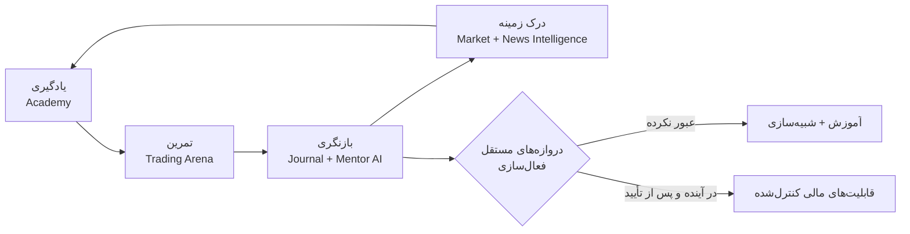
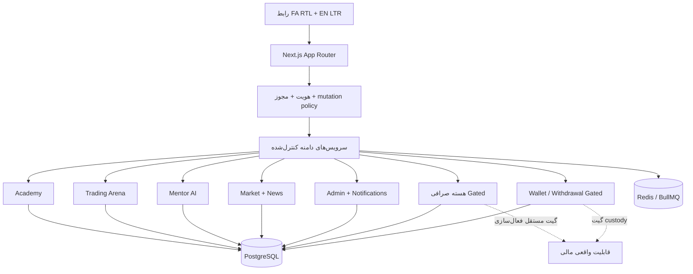

<div align="center" dir="rtl">


# تک‌پی | TecPey

### سیستم‌عامل آموزش مالی دیجیتال و معامله‌گری

**یادگیری با زمینه. تمرین با انضباط. فعال‌سازی با شواهد.**

**«تک‌پی، نقطه امن ورود به بازار رمزارز»**

[وب‌سایت](https://tecpey.ir) · [معماری](./docs/architecture/SERVER_SIDE_SOURCE_OF_TRUTH.md) · [امنیت](./SECURITY.md) · [حاکمیت لانچ](./docs/launch/CONTROLLED_SOFT_LAUNCH_GO_NO_GO_CHECKLIST.md) · [English](./README.md)

`آموزش‌محور` · `معامله‌گری مجازی` · `یادگیری با کمک AI` · `مرجع PostgreSQL` · `فارسی RTL + انگلیسی LTR` · `فعال‌سازی مبتنی بر شواهد`

</div>

> [!IMPORTANT]
> **تک‌پی در مرحله سخت‌سازی برای لانچ کنترل‌شده است.** تریدینگ ارنا از سرمایه مجازی استفاده می‌کند. صرافی واقعی، نگه‌داری دارایی، واریز و برداشت قابلیت‌های جداگانه و دروازه‌گذاری‌شده‌اند و در این صفحه به‌عنوان سرویس فعال تولید معرفی نمی‌شوند. در تک‌پی: وجود کد ≠ اثبات CI ≠ اثبات استیجینگ ≠ تأیید عملیاتی ≠ فعال‌سازی در تولید.

## یک چرخه محصول؛ نه مجموعه‌ای از قابلیت‌های پراکنده رمزارزی

مسیر رایج ورود به بازار رمزارز تکه‌تکه است: کاربر یک‌جا آموزش می‌بیند، جای دیگری بازار را دنبال می‌کند، در محیطی جدا تمرین می‌کند و در نهایت بدون پیوستگی کافی میان دانش، رفتار و اقدام وارد محیط‌های پرریسک می‌شود.

تک‌پی حول یک چرخه متفاوت ساخته می‌شود:



آکادمی دانش می‌سازد. تریدینگ ارنا دانش را به تمرین کنترل‌شده تبدیل می‌کند. منتور AI زمینه یادگیری و تمرین را به بازنگری متصل می‌کند. بازار و اخبار، زمینه روز را اضافه می‌کنند. قابلیت‌های مالی پرریسک‌تر فقط پس از عبور مستقل از دروازه‌های فنی، عملیاتی، نگه‌داری دارایی، انطباق و حوزه قضایی فعال می‌شوند.

تز محصول همین پیوستگی است: **یک سیستم یادگیری مالی که می‌تواند همراه کاربر رشد کند، بدون اینکه وانمود کند همه قابلیت‌های آینده همین امروز فعال‌اند.**

## محصول واقعی، شواهد واقعی

تصاویر زیر **اسکرین‌شات واقعی خود تک‌پی** هستند؛ نه ماکاپ، کانسپت یا بازسازی تبلیغاتی. این تصاویر توسط Public Browser Golden Path برای head دقیق PR #642 با SHA `c28ec91f397fb4f1580d2b6d2499d867c176fa77` ثبت شده‌اند. فایل‌های اصلی با کیفیت کامل و منشأ دقیق در [`docs/assets/screenshots/showcase/PROVENANCE.md`](./docs/assets/screenshots/showcase/PROVENANCE.md) مستند شده‌اند.

### تجربه ورود هدایت‌شده

<p align="center">
  
</p>

لندینگ فعلی تک‌پی مسیر کاربر را به‌شکل یک سفر رشد معرفی می‌کند، نه یک قیف صرافی‌محور. تجربه دوزبانه، آکادمی، منتور، تمرین مجازی، زمینه بازار و مسیر یادگیری بلندمدت را به هم متصل می‌کند و در عین حال قابلیت‌های واقعی مالی را صادقانه پشت دروازه‌های خود نگه می‌دارد.

### تمرین بدون درگیر کردن دارایی واقعی کاربر

<p align="center">
  
</p>

تریدینگ ارنا یک محیط شبیه‌سازی است که حساب مجازی، موجودی، تلاش‌ها، موقعیت‌ها، سفارش‌ها و اجراهای آن در سمت سرور مرجع دارند. هدف آن ساخت یک محیط جدی برای تمرین اجرای تصمیم و بازبینی رفتار است؛ نه ساختن ادعای عملکرد یا سود.

> artifact اصلی CI شامل captureهای باکیفیت Academy، Mentor، صفحات احراز هویت، موبایل/دسکتاپ، روشن/تیره و FA/EN نیز هست. README اصلی عمداً متمرکز نگه داشته شده و manifest شواهد، reviewer را به نسخه‌های دقیق و کامل هدایت می‌کند.

## ساخته‌شده برای سه گروه اصلی

<table>
<tr>
<td width="33%" valign="top">

### برای کاربران

یک مسیر پیوسته از **فهم → تمرین → بازنگری**.

- آکادمی ساختاریافته
- آزمون، ارزیابی، چالش و گواهی
- تریدینگ ارنا با سرمایه مجازی
- منتور AI با زمینه مجاز یادگیری و تمرین
- بازار و اخبار با هدف افزایش فهم
- امنیت حساب در دل همان تجربه محصول

</td>
<td width="33%" valign="top">

### برای سرمایه‌گذار و شریک راهبردی

یک تز پلتفرمی با چند سطح توسعه پیرامون یک سفر کاربری کنترل‌شده.

- آموزش و تجربه‌های پریمیوم
- منتور هوشمند
- شبیه‌سازی و تمرین پیشرفته
- هوش بازار چندزبانه
- پایه‌های enterprise / white-label
- مسیر اکوسیستم توسعه‌دهندگان
- زیرساخت مالی فقط بعد از عبور از گیت‌های مستقل

این roadmap ادعای درآمد، سهم بازار یا آمادگی رگولاتوری فعلی نیست.

</td>
<td width="33%" valign="top">

### برای تیم فنی

authorityهای نام‌گذاری‌شده و مرزهای شکست روشن، به‌جای ادعای صرفاً ظاهری.

- state حیاتی در PostgreSQL
- simulation مرجع در سرور
- idempotency و محاسبات امن مالی
- پایه‌های RLS و tenant isolation
- audit و sensitive-mutation controls
- CI exact-head و browser evidence
- فعال‌سازی تدریجی قابلیت‌ها

</td>
</tr>
</table>

## ستون‌های محصول

### ۰۱ — آکادمی تک‌پی

آکادمی پایه یادگیری است: ترم‌ها، درس‌ها، آزمون‌ها، ارزیابی‌ها، فلش‌کارت، چالش، شبیه‌سازی، دستاورد، گواهی و پیشرفت. مسیرهای canonical پیشرفت و ارزیابی به persistence سمت سرور متصل‌اند و browser storage مرجع اصلی آن‌ها نیست.

آکادمی صرفاً محل انتشار محتوا نیست؛ هدف آن ساخت شواهد ساختاریافته یادگیری است تا بتواند تجربه منتور و تمرین‌های آینده را غنی‌تر کند. همه routeها در یک سطح بلوغ نیستند و parity کامل زبان‌های بیشتر هنوز برنامه فعال مهندسی است؛ README این تفاوت را پنهان نمی‌کند.

### ۰۲ — تریدینگ ارنا

تریدینگ ارنا **تمرین مجازی** است، نه معامله واقعی. هسته کنترل‌شده آن حساب مجازی، موجودی، تلاش، پوزیشن، سفارش، اجرا، کارمزد و revision را در سرور نگه می‌دارد. موجودی و نتیجه شبیه‌سازی‌شده، شواهد آموزشی‌اند؛ نه دارایی مشتری و نه وعده بازده.

جهت توسعه Arena شامل replay، سناریو، ژورنال، لیگ و تحلیل‌های عمیق‌تر است، در حالی که مرز میان شواهد شبیه‌سازی و عملکرد مالی واقعی باید حفظ شود. مرجع UI: [`docs/arena/TRADING_ARENA_UI_AUTHORITY.md`](./docs/arena/TRADING_ARENA_UI_AUTHORITY.md).

### ۰۳ — Mentor AI

منتور لایه هوشمندی و بازنگری تک‌پی است. نقش آن توضیح مفاهیم، ادامه گفت‌وگوی آموزشی و کمک به کاربر برای بررسی زمینه مجاز یادگیری، تمرین و رفتار است. دسترسی providerها پشت مرزهای سرور قرار می‌گیرد و memory/context تابع حریم خصوصی و رضایت کاربر است.

منتور به‌عنوان مشاور مالی خودمختار، فروشنده سیگنال، موتور پیش‌بینی یا اجراکننده معامله معرفی نمی‌شود. TecPey AI Operating System چندپرووایدری گسترده‌تر یک برنامه فعال مهندسی است، نه ادعای یک subsystem کامل enterprise. مرجع: [`docs/MENTOR_AI_MODEL.md`](./docs/MENTOR_AI_MODEL.md).

### ۰۴ — هوش بازار و اخبار

تجربه عمومی تک‌پی در حال تبدیل‌شدن به یک لایه discovery مبتنی بر منبع برای اخبار، بازار، کوین‌ها و ابزارهاست. جهت حاکمیتی آن provenance، تازگی، entityها، canonical routeها و اتصال داخلی به مسیر آموزش را حفظ می‌کند تا خروجی به یک feed غیرقابل ردیابی تبدیل نشود.

کیفیت منبع زنده، ترجمه، حقوق رسانه، authority انتشار و indexing نگرانی‌های عملیاتی مستقل‌اند و باید در staging به‌صورت جداگانه اثبات شوند.

### ۰۵ — هسته مالی کنترل‌شده

repository شامل مهندسی معنادار برای پذیرش سفارش، hold، matching، trade، fee، ledger، pipeline برداشت، reconciliation و audit است. اهمیت این بخش در آن است که boundaryهای مالی از ابتدا جدی گرفته شده‌اند.

اما وجود این کدها **مجوز کار با دارایی واقعی مشتری نیست**. صرافی واقعی، custody، واریز و برداشت تا زمانی که گیت‌های custody، compliance، provider، reconciliation، recovery و عملیات مستقل تأیید نشده‌اند غیرفعال می‌مانند. ببینید: [`docs/WALLET_ENGINE.md`](./docs/WALLET_ENGINE.md) و چک‌لیست لانچ کنترل‌شده.

## چرا معماری مهم است



تک‌پی از Next.js App Router و سرویس‌های دامنه TypeScript در runtime اصلی استفاده می‌کند. PostgreSQL authority پایدار state حیاتی است و Redis/BullMQ هماهنگی و queueها را پشتیبانی می‌کند. migration تولید و فعال‌سازی runtime عمداً دو اقدام عملیاتی جدا هستند.

### اصول مهندسی

| اصل | معنی در تک‌پی |
|---|---|
| **Server-side source of truth** | state حیاتی کاربر، simulation و مالی متعلق به authorityهای backend است |
| **Fail closed** | نبود مجوز، persistence، قیمت، provider، reconciliation یا evidence نباید به موفقیت ظاهری تبدیل شود |
| **Progressive activation** | آموزش، simulation، اجرای واقعی، custody و enterprise هرکدام گیت مستقل دارند |
| **Evidence-driven delivery** | CI exact-head، browser evidence، security manifest و drillهای عملیاتی readiness را تعریف می‌کنند |
| **Privacy & consent** | memory هوش مصنوعی، context رفتاری، notification و community evidence هدف‌محور و مجاز هستند |
| **Tenant isolation direction** | داده‌های tenant-scoped زیر policy قرار دارند؛ authority کامل enterprise runtime هنوز برنامه فعال است |
| **Multilingual UX** | فارسی RTL و انگلیسی LTR سطح اول‌اند؛ زبان‌های بیشتر مسیر فعال توسعه‌اند |
| **Truthful claims** | وجود قابلیت در کد هرگز به‌عنوان اثبات فعال بودن برای مشتری استفاده نمی‌شود |

## نگاه سرمایه‌گذار و شریک راهبردی

ارزش راهبردی تک‌پی از زیاد کردن tabهای نامرتبط رمزارزی نمی‌آید؛ از **انباشت context در یک چرخه کنترل‌شده** می‌آید: آنچه کاربر یاد می‌گیرد می‌تواند تمرین را شکل دهد؛ تمرین می‌تواند بازنگری را تغذیه کند؛ بازنگری می‌تواند قدم بعدی آموزش را هوشمندتر کند؛ و زمینه بازار دوباره به curriculum متصل شود.

این معماری بدون نیاز به لانچ عجولانه صرافی واقعی، چند سطح بالقوه محصول ایجاد می‌کند: آموزش پریمیوم، تجربه‌های پیشرفته Mentor، simulation عمیق‌تر، هوش بازار، enterprise delivery و—فقط در صورت تأمین الزامات مستقل—قابلیت‌های مالی قانون‌مند.

تز دفاع‌پذیری فقط بصری نیست: state پیوسته آموزش/تمرین، هوشمندی مبتنی بر رضایت، شواهد release، boundaryهای امنیتی و progressive activation مسئولانه سخت‌تر از کپی‌کردن مجموعه‌ای از UI featureهاست. این یک **تز محصول و مهندسی** است، نه ادعای مقیاس تجاری فعلی، مجوز رگولاتوری یا بازده آینده.

## امنیت، حاکمیت و انضباط عملیاتی

تک‌پی قابلیت مالی را یک boundary امنیتی می‌داند. repository شامل foundationهای session/auth، CSRF، مسیرهای TOTP/passkey، کنترل‌های ادمین privileged، audit logging، sensitive-mutation policy، tenant-isolation policy، secret scanning و تست‌های اختصاصی financial authority است.

به همان اندازه مهم است که پروژه موارد **اثبات‌نشده** را نیز صریح نگه می‌دارد. custody تولید به signing غیرقابل‌استخراج تأییدشده و evidence عملیاتی نیاز دارد. isolation کامل multi-tenant در runtime، جداسازی کامل وظایف privileged routes، enterprise control-plane عمیق و governance گسترده AI هنوز برنامه‌های فعال‌اند، نه ادعاهای تکمیل‌شده.

مسیرهای مفید برای review:

- [`SECURITY.md`](./SECURITY.md)
- [`docs/architecture/SERVER_SIDE_SOURCE_OF_TRUTH.md`](./docs/architecture/SERVER_SIDE_SOURCE_OF_TRUTH.md)
- [`docs/security/ADMIN_CONTROL_PLANE_SECURITY_STANDARD.md`](./docs/security/ADMIN_CONTROL_PLANE_SECURITY_STANDARD.md)
- [`docs/launch/CONTROLLED_SOFT_LAUNCH_GO_NO_GO_CHECKLIST.md`](./docs/launch/CONTROLLED_SOFT_LAUNCH_GO_NO_GO_CHECKLIST.md)

## مرز لانچ کنترل‌شده

| قابلیت | مرز فعلی موردنظر |
|---|---|
| لندینگ عمومی | **Included** |
| تجربه عمومی فارسی / انگلیسی | **Controlled** |
| Academy | **Controlled** |
| Mentor AI | **Controlled** — وابسته به provider/configuration |
| Trading Arena | **Controlled simulation** — سرمایه مجازی |
| Market & News | **Controlled** — نیازمند evidence runtime برای freshness/publication |
| صرافی واقعی | **Disabled** |
| Custody | **Disabled** |
| واریز / برداشت | **Disabled** |
| جوایز مالی عمومی | **Gated** |
| Community | **دامنه کنترل‌شده محدود** |
| Multi-tenant / white-label | **جهت فعال مهندسی پس از لانچ** |
| Developer Platform عمومی | **Planned** |
| TecPey AI Operating System گسترده | **برنامه فعال، نه subsystem کامل** |

## snapshot شواهد فعلی — ۲۰۲۶-۰۹-۱۳

baseline repository برای این Showcase برابر `main@c4751708ae6c1d2f2877ed64e7de36e5b963a045` است که لندینگ دوزبانه growth-story را در PR #642 merge کرده است.

head دقیق محصول که تصاویر و browser evidence نهایی از آن گرفته شده `c28ec91f397fb4f1580d2b6d2499d867c176fa77` است. روی همان head، این workflowهای کنترل‌شده پیش از merge موفق شدند:

- CI
- Public Browser Golden Path
- Full Suite Diagnostics
- Repository Audit Manifest
- API Security Manifest
- Sensitive Mutation Audit
- Full History Secret Scanning
- AI Tenant RLS Runtime Evidence

این evidence برای change پذیرفته‌شده قوی است، اما **جای evidence فعلی protected staging یا تأیید نهایی لانچ را نمی‌گیرد**. مرجع تصمیم release همچنان [`docs/launch/CONTROLLED_SOFT_LAUNCH_GO_NO_GO_CHECKLIST.md`](./docs/launch/CONTROLLED_SOFT_LAUNCH_GO_NO_GO_CHECKLIST.md) است.

## برای بررسی فنی

```bash
npm ci
npm run lint
npm run typecheck
npm test
npm run build
```

سبز بودن build محلی برای یک change محافظت‌شده کافی نیست. exact-head checks و evidence مرتبط staging/runtime همان domain نیز باید بررسی شود.

از اینجا شروع کنید:

- [Server-side source of truth](./docs/architecture/SERVER_SIDE_SOURCE_OF_TRUTH.md)
- [Trading Arena authority](./docs/arena/TRADING_ARENA_UI_AUTHORITY.md)
- [Admin control-plane security](./docs/security/ADMIN_CONTROL_PLANE_SECURITY_STANDARD.md)
- [Wallet engine](./docs/WALLET_ENGINE.md)
- [Mentor AI model](./docs/MENTOR_AI_MODEL.md)
- [منشأ اسکرین‌شات‌های تأییدشده](./docs/assets/screenshots/showcase/PROVENANCE.md)

## گزارش مسئولانه آسیب‌پذیری

لطفاً آسیب‌پذیری‌ها را در issue عمومی منتشر نکنید. مسیر گزارش مسئولانه در [`SECURITY.md`](./SECURITY.md) ثبت شده است.

---

<div align="center" dir="rtl">

### تک‌پی | TecPey

**اول آموزش. قبل از مواجهه واقعی، تمرین. قبل از فعال‌سازی، شواهد.**

</div>
