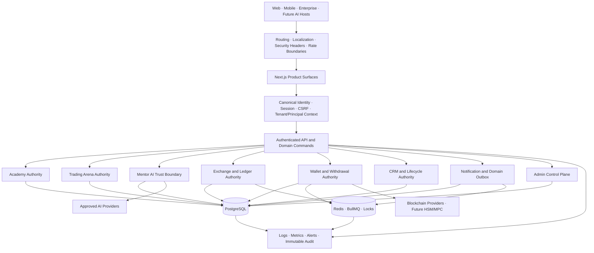

<div align="center">


# TecPey OS

### Financial Education, Trading Intelligence & Digital Asset Infrastructure
### سیستم‌عامل آموزش مالی، هوش معاملاتی و زیرساخت دارایی‌های دیجیتال

**Education First · Server Authoritative · Intelligence Native · Financially Safe by Design**

> **تک‌پی، نقطه امن ورود به بازار رمزارز**

[Website](https://tecpey.ir) · [Exchange](https://my.tecpey.ir) · [English](#english) · [فارسی](#persian)


</div>

> [!CAUTION]
> TecPey is under active production hardening. This repository must **not** be represented as a production-certified real-money exchange while any P0 financial, custody, compliance, tenant-isolation, operational-recovery or release-evidence gate remains open. A green build is necessary, but it is not release authorization.

> [!IMPORTANT]
> The latest verified `main` baseline referenced by this document is commit `6558d7be2c4ee98eb5baa633c9905f80b00672fe` dated **20 July 2026**. Product-completion percentages remain evidence-weighted estimates from the dated launch baseline and are not live telemetry.

---

<a id="english"></a>

## 1. Executive Overview

TecPey is building a multilingual **Financial Education & Digital Asset Operating System** that connects structured learning, simulated trading, behavioral intelligence, spot exchange infrastructure, wallet operations, identity, reputation, administration and future enterprise distribution on one governed platform core.

TecPey is not positioned as another crypto exchange with education attached as a marketing page. Its primary product thesis is:

> Safer participation in digital-asset markets begins with knowledge, supervised practice, behavioral feedback, disciplined risk management and trustworthy infrastructure.

The defining user value loop is:

**Learn → Practice without financial risk → Receive governed intelligent feedback → Build discipline and verifiable reputation → Access safer financial services**

The initial market focus is Iran. The platform strategy is multilingual, API-first and designed to evolve toward enterprise SaaS, multi-tenant and white-label distribution without misrepresenting current isolation maturity.

### Brand promise

**TecPey — the safe starting point for entering the crypto market.**  
**تک‌پی، نقطه امن ورود به بازار رمزارز**

Safety is treated as an engineering and product constraint, not a slogan. The repository therefore uses explicit launch gates, fail-closed authority boundaries, immutable evidence and dated readiness claims.

---

## 2. Product System

| Product domain | User or business responsibility | Current representation |
|---|---|---|
| **TecPey Academy** | Structured financial education, lessons, quizzes, flashcards, assessments, challenges, certificates and progression | Implemented foundation under content, assessment and Golden Path hardening |
| **Trading Arena** | Risk-free practice with virtual capital, governed attempts, orders, positions, fees, PnL, journal evidence and behavioral learning | Authoritative Phase A implemented; replay/scenario depth remains roadmap work |
| **Mentor AI** | Personalized educational and trading-behavior guidance using authorized server history | Governed foundation implemented; Exchange-connected intelligence remains separately gated |
| **Exchange Core** | Authenticated spot order admission, holds, matching, trades, fees, ledger, market data, risk and audit | Implemented foundation under P0 precision, recovery and reconciliation hardening |
| **Wallet & Withdrawal Engine** | Deposit/withdrawal lifecycle, signing boundary, broadcast, confirmation, recovery and operational evidence | Pipeline implemented; unrestricted production custody remains disabled by launch gate |
| **Identity & Reputation** | Cross-product identity, achievements, learning evidence, trust and future professional profile | Foundation implemented; platform-wide tenant/principal proof remains active work |
| **Admin Control Plane** | Individual administrator identity, permissions, passkey-oriented access, audit and security operations | Strong foundation; dual control and full privileged-route closure remain |
| **Notification Platform** | Consent-aware in-app, push, email, SMS and future channel orchestration | Server-authoritative foundations implemented; broader channel and policy rollout remains |
| **CRM & Lifecycle Platform** | Durable lead, support, campaign and customer-lifecycle data | Durable lead authority foundation implemented; complete operating model remains roadmap |
| **Developer Platform** | Public APIs, SDKs, webhooks, MCP/AI-host integrations and developer operations | Strategic roadmap, not represented as production-complete |
| **Business & White-label Platform** | Tenant control plane, configuration, branding, billing, analytics and enterprise operations | Strategic target; full isolation is not yet claimed |

### Education-first operating model

Academy, Arena and Mentor are equally important parts of the same trust system:

- Academy builds correct mental models and financial literacy.
- Arena turns knowledge into observable practice without risking real funds.
- Mentor converts authorized learning and trading evidence into personalized feedback.
- Reputation records verified progress and disciplined behavior.
- Exchange and wallet services must remain gated until the user-facing and infrastructure safety conditions are satisfied.

---

## 3. Verified Engineering Reality

The following table describes merged foundations and open boundaries. It intentionally avoids treating incomplete roadmap work as implemented capability.

| Area | Verified foundation | Open boundary / release implication |
|---|---|---|
| **Academy authority** | Official lesson progress, XP, achievements and term outcomes are server-issued and cross-device | Complete content QA, assessment validity, certificate lifecycle and staging Golden Path evidence remain |
| **Trading Arena authority** | PostgreSQL-backed aggregate, orders, positions, fees, PnL, revision, idempotency, server market evidence and journal foundations | Historical replay, governed scenarios, reflection writes and broader simulation fidelity remain |
| **Mentor AI trust boundary** | Authentication/custody secrets are blocked before provider egress; context is typed as untrusted; PII is minimized; provider timeout/circuit controls, transactional memory, append-only evidence, output safety and server-backed consent are present | Future real-Exchange signals, broader AI Operating System tools, model evaluation and cross-tenant retrieval proof remain gated |
| **Exchange order authority** | Authenticated admission, balance holds, matching/trade/ledger foundations and security manifests exist | Decimal-safe end-to-end conservation, deterministic recovery, order-book reconstruction and reconciliation remain P0 |
| **Wallet execution** | Database-authoritative withdrawal execution, signed-transaction persistence before broadcast, confirmation workers and Redis/BullMQ lifecycle evidence exist | HSM/MPC, non-exportable keys, chain certification, dual control and on-chain reconciliation remain P0 |
| **Custody launch gate** | Unsafe production signer configurations are rejected and real-money custody cannot be inferred from the presence of wallet code | Production custody is NO-GO until approved cryptographic and operational evidence exists |
| **Authentication and sessions** | Unified sessions, CSRF controls, strict revocation paths, passkey/2FA foundations and sensitive mutation evidence exist | Full privileged-route inventory, tenant-aware service identity and operational dual control remain |
| **CRM and Offline Sync** | Durable PostgreSQL authority, deduplication/idempotency and outage-safe response semantics have dedicated guards and tests | Full platform lifecycle, reconciliation operations and scale evidence remain |
| **Notifications** | Persistence, runtime, producer and domain-outbox authority guards exist | Complete omnichannel delivery, consent policy, fatigue controls and provider SLO evidence remain |
| **Multi-tenant / white-label** | Tenant/workspace foundations and explicit strategic requirements exist | Platform-wide cross-tenant and cross-principal isolation is **not yet proven**; work is tracked under issues #109 and #155 |
| **Repository QA** | CI already enforces multiple domain authority guards, PostgreSQL/Redis integration suites, full tests, production build and runtime smoke | Repository-wide semantic line review is active under issue #156; no full-review completion claim exists yet |

### Dated completion baseline

The evidence-weighted baseline dated **19 July 2026** estimated:

- **70%** readiness for a tightly controlled Core Soft Launch;
- **40%** completion of the full TecPey OS vision;
- **NO-GO** for unrestricted real-money activation.

These figures are planning indicators, not certifications. See [`docs/launch/TECPEY_COMPLETION_BASELINE_20260719.md`](./docs/launch/TECPEY_COMPLETION_BASELINE_20260719.md).

---

## 4. Current P0 Critical Path

Real-money or broad production claims remain blocked until the following are closed with exact-head evidence:

1. **Exchange precision and reconciliation**  
   Eliminate unsafe numeric paths and prove conservation across order admission, holds, matching, fills, fees, balances and ledger under normal, concurrent, replay and recovery conditions.

2. **Production custody and chain certification**  
   Implement approved HSM/MPC or equivalent non-exportable signing, tenant/key separation, transaction-intent binding, dual control, compromise response, deterministic chain fixtures, testnet evidence and on-chain reconciliation.

3. **Cross-tenant and cross-principal isolation**  
   Prove default-deny identity derivation and isolation across PostgreSQL, repositories, Redis, queues, storage, webhooks, AI memory, notifications, Academy, Arena, Exchange, wallet, CRM, audit and exports.

4. **Compliance activation**  
   Complete production KYC/AML provider integration, jurisdictional/legal approval, sanctions and adverse-action controls, negative tests, retention policy and operator runbooks.

5. **Operational recovery evidence**  
   Complete staging Golden Paths, backup/restore, rollback, disaster recovery, queue recovery, ambiguous-provider recovery, alert delivery and incident-response drills.

6. **Repository-wide strict QA**  
   Reconcile every tracked path and applicable text line under the audit denominator defined in [`docs/qa/REPOSITORY_LINE_BY_LINE_QA_PROGRAM.md`](./docs/qa/REPOSITORY_LINE_BY_LINE_QA_PROGRAM.md).

---

## 5. Architecture



### Authority model

- Browser and mobile clients propose commands and render server state.
- Verified server identity determines user, role, tenant, workspace and authorization context.
- PostgreSQL is the durable source of truth for account, progress, history, preferences, financial records and Mentor memory.
- Redis and queues coordinate bounded asynchronous work; they do not replace the durable financial ledger.
- External AI and blockchain providers are untrusted dependencies behind explicit timeout, validation, evidence and recovery boundaries.
- Admin and service actions require named identity, narrow scope and durable audit evidence.

---

## 6. Permanent Engineering Invariants

These rules are platform contracts rather than implementation preferences.

### Server-authoritative persistence

All durable user, learning, Arena, Exchange, wallet, CRM, preference, activity and Mentor state must live in backend services and the platform database.

`localStorage`, `sessionStorage` and IndexedDB may be used only for explicitly disposable UI cache or bounded migration support. They must never be the source of truth for:

- identity or authorization;
- Academy completion, answers, XP, achievements or certificates;
- Arena attempts, orders, positions, balances, PnL or journal evidence;
- Exchange balances, orders, holds, fills, trades or ledger;
- wallet or withdrawal status;
- privacy consent or communication preferences;
- Mentor memory, behavioral profile or conversation continuity.

### Fail-closed privileged and financial behavior

Missing database, Redis, provider, market price, authorization, tenant context, replay protection or audit evidence must not silently downgrade safety or return false durable success.

### Deterministic financial arithmetic

Financial values must use governed decimal representations, explicit scale and rounding rules, and conservation checks. JavaScript binary floating-point arithmetic is not an acceptable accounting authority.

### Idempotent and recoverable commands

Mutating commands require stable identity, revision or state preconditions, idempotency/correlation evidence and an explicit recovery strategy for ambiguous outcomes.

### Tenant and principal isolation

Tenant or principal scope must be derived from trusted server identity, never accepted from a browser payload as authority. Isolation must cover data, cache, queues, storage, providers, logs, metrics, AI retrieval and operational exports.

### Evidence-defined completion

A feature is not production-ready because its UI exists or because compilation succeeds. Completion requires code, schema, negative tests, integration evidence, runtime behavior, recovery semantics, observability and an explicit release decision.

### Bilingual and accessible product quality

Persian RTL and English LTR experiences must have functional parity, correct semantics, accessible interaction, responsive behavior and trustworthy financial language.

---

## 7. Security, Privacy and Trust Posture

| Boundary | Required posture |
|---|---|
| **Authentication** | Canonical short-lived sessions, strict revocation where risk requires it, secure httpOnly cookies and no client-authored identity |
| **Authorization** | Server-derived roles/scopes, explicit tenant grants, default deny and negative tests |
| **CSRF and mutation safety** | Origin verification, bounded bodies, rate limits, no-store/private responses and idempotency where applicable |
| **Secrets** | No production secrets, user credentials, custody material or real tokens in source, fixtures, PRs, artifacts or logs |
| **PII** | Data minimization, purpose limitation, encryption where required, redaction, retention and auditable access |
| **AI egress** | Secret blocking, typed untrusted context, consent, minimization, timeout, output validation and append-only request evidence |
| **Financial mutation** | Deterministic values, transaction boundaries, conservation, replay protection and durable audit |
| **Custody** | Production signing disabled until non-exportable key controls, policy evidence and recovery requirements pass |
| **Admin operations** | Individual identity, strong authentication, narrow permission, step-up/dual control where needed and immutable evidence |
| **Supply chain** | Locked dependencies, reviewed workflows, minimal permissions, deterministic install and no unreviewed executable assets |

### Mentor AI-specific controls

The current Mentor trust boundary includes:

- pre-egress blocking for authentication and custody secrets;
- Unicode/encoding-aware secret inspection;
- minimization/redaction of personal and wallet identifiers;
- rejection of browser-authored history as server memory authority;
- typed separation of untrusted user, lesson and stored context;
- prompt-injection signals and poisoned-context filtering;
- provider timeout, cancellation, bounded fallback and circuit breaking;
- output rejection for guaranteed returns, direct trade signals and unsafe recovery guidance;
- transactional user/assistant memory writes with truthful durable or ephemeral status;
- append-only secret-free AI request evidence;
- server-backed consent for external-provider and behavioral-personalization use.

These controls do not authorize autonomous trading, copy trading, guaranteed-return claims or unrestricted use of real Exchange behavior.

### Responsible disclosure

Do not open a public issue containing exploitable vulnerabilities, credentials, private user data or custody information. Use the authorized private TecPey security channel. General contact: **info@tecpey.ir**.

---

## 8. Financial and Custody Safety

### Exchange correctness requirements

Before production approval, the Exchange domain must prove:

- order, hold, fill, fee, balance and ledger conservation;
- precision and rounding behavior for every supported market;
- deterministic matching under concurrency;
- cancellation, partial fill and replacement correctness;
- idempotent command and worker behavior;
- recovery after database, Redis, worker or market-data failure;
- order-book reconstruction from durable authority;
- reconciliation reports with immutable evidence.

### Wallet and withdrawal requirements

Before unrestricted real-money custody, the platform must prove:

- non-exportable signing keys through approved HSM/MPC or equivalent custody;
- tenant, vault, key and environment separation;
- key ceremony, rotation, compromise and disaster-recovery procedures;
- transaction-intent binding for chain, destination, amount, fee, nonce and policy evidence;
- quorum or dual control for sensitive withdrawals;
- signed transaction persistence before broadcast;
- replay-safe signing and replacement-transaction rules;
- deterministic handling of timeout, duplicate and ambiguous RPC outcomes;
- chain-specific testnet certification and on-chain/ledger reconciliation.

The production custody gate intentionally rejects unsafe environment-key authority.

---

## 9. Quality Engineering System

### Repository-wide line-by-line audit

Issue [#156](https://github.com/tecpey/Tecpey-Os/issues/156) governs the exhaustive audit. The program distinguishes:

1. a deterministic inventory of every tracked path;
2. automated line-addressable review leads;
3. semantic review by domain and risk;
4. adversarial tests and runtime evidence;
5. bounded remediation PRs;
6. final denominator reconciliation and executive release recommendation.

The audit tooling produces:

```bash
npm run qa:repository:inventory
npm run qa:repository:scan
npm run qa:repository:evidence
```

Generated evidence is stored under `.artifacts/repository-audit/` in CI and uploaded as a workflow artifact. Generated reports are evidence inputs and are not committed as source authority.

### Exact-head merge discipline

A required check is valid only for the exact PR head that is being merged. After any code or configuration change, previous workflow results no longer authorize merge.

Before merge:

- verify the current head SHA;
- verify every required workflow ran against that SHA;
- confirm migrations and focused integration tests actually executed;
- confirm full tests, production build and governed runtime smoke passed;
- reconcile review threads and requested changes;
- verify no temporary recovery workflow or diagnostic asset remains;
- merge using expected-head protection.

### Current CI quality pipeline

The primary CI pipeline includes:

1. deterministic locked dependency installation;
2. production environment contract validation;
3. clean PostgreSQL migration execution;
4. migration idempotency and critical-schema verification;
5. TypeScript checking;
6. ESLint with zero warnings;
7. frontend style and public interaction authority guards;
8. custom-runtime development smoke;
9. browser-persistence authority guard;
10. Admin authentication boundary guard;
11. canonical session and strict-revocation guards and integration tests;
12. Mentor AI red-team gate;
13. withdrawal admission/runtime guards and PostgreSQL tests;
14. Offline Sync authority and PostgreSQL tests;
15. CRM lead authority and PostgreSQL tests;
16. Academy authority and progress tests;
17. Arena, wallet and migration authority guards;
18. notification persistence, runtime, producer and domain-outbox guards;
19. Exchange order-admission authority guard;
20. complete automated test suite;
21. production Next.js build;
22. governed production-runtime UI smoke.

Additional workflows enforce API Security Manifest, Sensitive Mutation Audit, Exchange Authority, Full Suite Diagnostics and repository audit evidence.

A passing pipeline does not override open P0 release gates.

---

## 10. Technology Stack

| Layer | Technology and policy |
|---|---|
| Application | Next.js 16.2, React 19.2, TypeScript 5 |
| Styling and UI | Tailwind CSS 4, Lucide, Chart.js, Recharts; brand-specific design authority |
| Localization | `next-intl`, Persian RTL and English LTR foundations |
| Server runtime | Governed custom TypeScript server through `tsx server.ts` |
| Database | PostgreSQL through `pg`; canonical advisory-locked migration plan |
| Queue and coordination | Redis, BullMQ, bounded workers, deduplication and recovery evidence |
| Financial precision | `decimal.js` plus domain-specific scale, rounding and conservation requirements |
| Authentication | `jose`, httpOnly session cookies, CSRF, revocation and passkey/2FA foundations |
| Cryptography | Noble cryptographic packages and chain-specific provider abstractions |
| AI | Provider-agnostic trust boundary with policy, consent, minimization and evidence |
| Testing | Node test runner with TypeScript through `tsx`, PostgreSQL/Redis integration suites and runtime smoke |
| CI | GitHub Actions with exact-head quality and authority workflows |
| Supported tooling | Node.js `>=20.11.0`; npm `>=10.0.0 <11.0.0` |

---

## 11. Repository Map

```text
.github/             CI, security workflows, issue and repository governance
src/app/             Next.js pages, layouts, product surfaces and API routes
src/components/      Shared and domain-specific UI components
src/lib/             Domain authority, persistence, security and infrastructure
src/tests/           Unit, security, PostgreSQL, Redis and integration tests
scripts/             Migrations, authority guards, QA and operational utilities
docs/                Governance, architecture, product, security and launch evidence
public/               Public static assets
server.ts             Governed custom runtime entry point
package.json          Commands, runtime dependencies and release orchestration
package-lock.json     Locked npm dependency graph
```

Repository structure is not itself proof of ownership. The audit manifest classifies every tracked path by domain, risk and review batch.

---

## 12. Local Development

### Prerequisites

- Node.js `>=20.11.0`
- npm `>=10.0.0 <11.0.0`
- PostgreSQL
- Redis

### Setup

```bash
git clone https://github.com/tecpey/Tecpey-Os.git
cd Tecpey-Os
npm ci
cp .env.example .env.local
# Configure only approved local/development values.
npm run env:check
npm run db:migrate
npm run dev
```

`npm run dev` starts the governed custom TecPey server through `tsx server.ts`. `npm run dev:next` is available for Next-only development, but it does not replace custom-runtime verification.

### Core verification commands

```bash
npm run env:check
npm run db:migrate
npm run typecheck
npm run lint
npm test
npm run build
npm run ui:runtime:prod
```

### Domain authority commands

```bash
npm run auth:check
npm run test:auth-session
npm run ai:redteam:check
npm run custody:check
npm run test:custody-gate
npm run withdrawals:check
npm run test:withdrawal-admission
npm run offline:check
npm run test:offline-sync
npm run crm:check
npm run test:crm-leads
npm run academy:progress:check
npm run test:academy-progress
npm run exchange:check
npm run test:exchange-order-authority
npm run api:security:check
npm run test:api-security-manifest
npm run audit:sensitive:check
npm run test:sensitive-mutation-audit
```

### Full release-oriented check

```bash
npm run release:check
```

This command is a technical gate, not an executive production authorization. External compliance, custody, recovery and operational evidence still apply.

> [!WARNING]
> Never place real production secrets, seed phrases, private keys, API tokens, user data, KYC records, wallet addresses linked to identity or live custody material in local files, test fixtures, commits, pull requests, CI output or issue comments.

---

## 13. Authoritative Documentation

Before changing critical behavior, read the documents in this order:

1. [`docs/TECPEY_MASTER_BLUEPRINT.md`](./docs/TECPEY_MASTER_BLUEPRINT.md) — strategic platform definition and product intent.
2. [`docs/FINAL_IMPLEMENTATION_GATE.md`](./docs/FINAL_IMPLEMENTATION_GATE.md) — implementation and launch-gate framework.
3. [`docs/governance/TECPEY_DOCUMENTATION_GOVERNANCE.md`](./docs/governance/TECPEY_DOCUMENTATION_GOVERNANCE.md) — documentation authority, hierarchy and non-duplication rules.
4. [`docs/governance/TECPEY_DECISION_LOG.md`](./docs/governance/TECPEY_DECISION_LOG.md) — permanent architectural and product decisions.
5. [`docs/architecture/TECPEY_BACKEND_AUTHORITY_MAP.md`](./docs/architecture/TECPEY_BACKEND_AUTHORITY_MAP.md) — runtime, database and domain authority map.
6. [`docs/launch/TECPEY_COMPLETION_BASELINE_20260719.md`](./docs/launch/TECPEY_COMPLETION_BASELINE_20260719.md) — dated evidence-weighted completion baseline.
7. [`docs/arena/TRADING_ARENA_UI_AUTHORITY.md`](./docs/arena/TRADING_ARENA_UI_AUTHORITY.md) — Arena client/server authority and ambiguous-command recovery.
8. [`docs/qa/REPOSITORY_LINE_BY_LINE_QA_PROGRAM.md`](./docs/qa/REPOSITORY_LINE_BY_LINE_QA_PROGRAM.md) — repository-wide audit denominator, severity and review discipline.

Documentation must describe verified reality. Aspirational functionality must be labeled roadmap, planned or gated.

---

## 14. Development and Pull Request Policy

Every change should be bounded to one coherent objective.

Required expectations:

- begin from the current verified `main`;
- record the issue, invariant and affected authority boundary;
- avoid unrelated refactoring;
- add negative tests for security, financial and persistence changes;
- add migrations and constraints when application correctness depends on them;
- update documentation when the verified platform reality changes;
- collect all failures from one exact head before issuing a repair commit;
- keep diagnostics out of the source tree;
- do not merge with unresolved review threads or stale checks.

Large audit findings should be remediated in separate domain PRs so review remains possible and rollback remains bounded.

---

## 15. Roadmap — Explicitly Not a Completion Claim

The full TecPey OS vision includes:

- complete multi-tenant and white-label isolation;
- tenant control plane, billing, configuration and branding;
- public API, SDK, webhook and developer portal;
- MCP server and distribution through approved AI hosts;
- broader AI Operating System for users, support, CRM, QA, administration and executive operations;
- advanced Arena historical replay, scenarios, psychology and portfolio labs;
- governed social learning and professional reputation;
- additional compliant financial products after legal, risk and operational approval.

Roadmap presence does not mean runtime implementation, certification or launch approval.

---

<a id="persian"></a>

## 16. خلاصه مدیریتی فارسی

### تک‌پی چیست؟

تک‌پی یک **سیستم‌عامل آموزش مالی، هوش معاملاتی و زیرساخت دارایی‌های دیجیتال** است؛ نه صرفاً یک صرافی رمزارز. هدف تک‌پی این است که آموزش ساختاریافته، تمرین بدون ریسک، منتور هوشمند، صرافی، کیف پول، هویت، اعتبار حرفه‌ای، مدیریت سازمانی و سرویس‌های توسعه‌دهندگان را روی یک هسته مشترک و قابل‌اعتماد به هم متصل کند.

چرخه اصلی ارزش محصول:

**آموزش → تمرین بدون ریسک در Trading Arena → دریافت بازخورد هوشمند و کنترل‌شده → ساخت انضباط و اعتبار → استفاده امن‌تر از خدمات مالی**

تمرکز نخست بازار ایران است؛ اما معماری و استراتژی محصول برای چندزبانه‌بودن، API-first، مقیاس سازمانی، SaaS، Multi-tenant و White-label طراحی شده است. با این حال، تکمیل جداسازی چندمستاجری هنوز در حال اثبات است و نباید به‌عنوان قابلیت نهایی معرفی شود.

### وضعیت واقعی و صادقانه پروژه

آخرین خط مبنای اشاره‌شده در این README، commit زیر روی `main` است:

```text
6558d7be2c4ee98eb5baa633c9905f80b00672fe
```

در این وضعیت:

- هسته Academy برای پیشرفت رسمی، XP، دستاورد و نتایج دوره‌ها منبع حقیقت سروری دارد.
- Trading Arena برای سفارش، موقعیت، کارمزد، PnL، revision، idempotency و شواهد ژورنال دارای پایه سروری و PostgreSQL است.
- Mentor AI اکنون قبل از خروج داده به Provider، اسرار احراز هویت و Custody را مسدود می‌کند، داده را طبقه‌بندی و کمینه می‌کند، تاریخچه مرورگر را منبع حافظه نمی‌داند، Timeout/Circuit Breaker دارد و حافظه مکالمه را به‌صورت تراکنشی ثبت می‌کند.
- هسته Exchange برای سفارش، Hold، Matching، Trade، Ledger و Audit پایه‌های مهمی دارد؛ اما تکمیل Decimal-safe و reconciliation مالی همچنان P0 است.
- مسیر برداشت وجه و Workerها پیاده‌سازی شده‌اند؛ اما Custody واقعی تا HSM/MPC، جداسازی کلید، Dual Control و گواهی شبکه‌ها **NO-GO** است.
- Session، CSRF، Revocation، Passkey/2FA و Audit عملیات حساس پایه‌های جدی دارند؛ اما جداسازی سراسری Tenant/Principal و تکمیل کنترل‌های مدیریتی ادامه دارد.
- QA سراسری و خط‌به‌خط تمام فایل‌های Repository در Issue شماره [#156](https://github.com/tecpey/Tecpey-Os/issues/156) مدیریت می‌شود و تا تکمیل Denominator، هیچ ادعای «بررسی کامل همه فایل‌ها» مجاز نیست.

### مهم‌ترین P0های باقی‌مانده

1. اثبات محاسبات Decimal-safe و conservation کامل در Exchange؛
2. HSM/MPC واقعی، کلیدهای غیرقابل‌استخراج، Dual Control و reconciliation زنجیره؛
3. اثبات جداسازی Cross-tenant و Cross-principal در دیتابیس، Redis، Queue، Storage، AI و تمام دامنه‌ها؛
4. فعال‌سازی عملیاتی و حقوقی KYC/AML و Compliance؛
5. Staging Golden Path، Backup/Restore، Rollback، Disaster Recovery و Incident Drill؛
6. تکمیل QA خط‌به‌خط تمام فایل‌ها و ثبت شواهد معنایی برای هر فایل متنی.

### قواعد غیرقابل‌مذاکره

- منبع حقیقت تمام داده‌های پایدار، Backend و Database است.
- `localStorage`، `sessionStorage` و IndexedDB حق مالکیت وضعیت حساب، آموزش، Arena، Exchange، کیف پول، Consent یا حافظه Mentor را ندارند.
- عملیات مالی، مدیریتی و امنیتی در نبود مجوز، دیتابیس، Provider، Tenant Context یا Replay Protection معتبر باید Fail Closed شوند.
- محاسبات مالی با JavaScript Number مجوز Production نمی‌گیرند.
- Tenant ID یا User ID ارسالی از Browser منبع Authority نیست.
- هیچ PR فقط با Build سبز Merge نمی‌شود؛ تست منفی، هم‌زمانی، بازیابی، Migration، Runtime و Exact-head CI لازم است.
- هیچ Workflow موقت، Self-modifying یا فایل Diagnostic نباید وارد `main` شود.
- UI/UX باید برندمحور، متمایز، دسترس‌پذیر و دارای برابری واقعی فارسی و انگلیسی باشد.
- قابلیت‌های آینده باید صریحاً Roadmap معرفی شوند، نه قابلیت آماده.

### دستورهای QA جدید Repository

```bash
npm run qa:repository:inventory
npm run qa:repository:scan
npm run qa:repository:evidence
```

این ابزارها تمام فایل‌های Track‌شده را شمارش، Hash و طبقه‌بندی می‌کنند و برای خطوط پرریسک Review Lead می‌سازند. خروجی خودکار جای بررسی معنایی، Red Team، Integration Test یا تصمیم Release را نمی‌گیرد.

---

## 17. Security, Brand and License

This repository is proprietary. Source code, documentation, architecture, product specifications and brand assets remain the intellectual property of TecPey and may not be copied, redistributed, sublicensed or used to create competing products without explicit written authorization.

The logo at [`docs/assets/brand/tecpey-logo-official.webp`](./docs/assets/brand/tecpey-logo-official.webp) is the official TecPey mark. It must not be replaced, redrawn, recolored or used outside approved brand contexts without authorization.

<div align="center">

**Build trust before transactions.**

**اول اعتماد؛ بعد معامله.**

</div>
