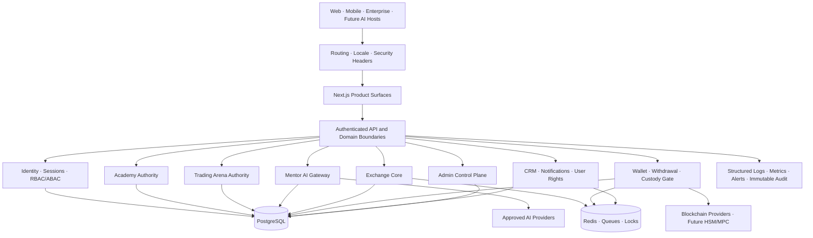

<div align="center">


# TecPey OS

### Financial Education, Trading Intelligence & Digital Asset Infrastructure
### سیستم‌عامل آموزش مالی، هوش معاملاتی و زیرساخت دارایی‌های دیجیتال

**Education First · Server Authoritative · Intelligence Native · Security Governed · Enterprise Ready by Design**

> **تک‌پی، نقطه امن ورود به بازار رمزارز**

[Website](https://tecpey.ir) · [Exchange Surface](https://my.tecpey.ir) · [English](#english) · [فارسی](#persian)


</div>

> [!IMPORTANT]
> TecPey OS is an actively hardened financial-education and digital-asset platform. This repository must **not** be represented as a production-certified real-money exchange. Real-money exchange, custody and unrestricted withdrawal activation remain **NO-GO** until all applicable P0 financial, custody, compliance, tenant-isolation and operational gates are closed with exact-head evidence.

> [!NOTE]
> This README intentionally avoids unsupported completion percentages. Product and release status are expressed through verified capabilities, remaining boundaries and explicit release gates.

---

<a id="english"></a>

## Executive Summary

TecPey is building a multilingual **Financial Education, Trading Intelligence and Digital Asset Operating System**. It connects structured education, risk-free trading practice, governed AI assistance, exchange infrastructure, wallet and withdrawal workflows, identity, reputation, administration, notifications, CRM, APIs and future enterprise/white-label operations on one controlled platform core.

TecPey is not positioned as another standalone crypto exchange. Its product thesis is:

> **Users should learn, practice, receive evidence-based feedback and build disciplined behavior before they are exposed to higher-risk financial actions.**

The core user loop is:

**Learn → Practice → Receive governed intelligent feedback → Build discipline and reputation → Access safer financial services**

The first market focus is Iran, with Persian RTL and English LTR product surfaces. The long-term architecture targets regional and global operation, API-first distribution, SaaS, multi-tenancy, white-label delivery and enterprise-grade governance. Those targets are not treated as completed capabilities until isolation and operations are proven.

### Audit baseline for this revision

- Repository baseline before this documentation/audit branch: `6558d7be2c4ee98eb5baa633c9905f80b00672fe`
- Repository-wide QA program: [Issue #157](https://github.com/tecpey/Tecpey-Os/issues/157)
- Tenant/principal isolation foundation: [Issue #155](https://github.com/tecpey/Tecpey-Os/issues/155)
- Platform Red Team program: [Issue #100](https://github.com/tecpey/Tecpey-Os/issues/100)

---

## Release Posture

| Area | Verified position | Remaining boundary |
|---|---|---|
| **Public website and education surfaces** | Implemented and actively hardened | Full staging Golden Path, visual regression, accessibility and operational evidence remain required |
| **Academy authority** | Official progress, XP, achievements and key learning outcomes have server-owned foundations | Complete content QA, assessment integrity, certificate lifecycle and all cross-device journeys must remain continuously proven |
| **Trading Arena** | Server-authoritative execution foundations, orders, positions, fees, PnL, revision, idempotency and evidence journal exist | Historical replay, server-owned scenarios, reflection workflows, deep market simulation and full lifecycle QA remain |
| **Mentor AI** | Secret-egress blocking, typed untrusted context, provider timeout/circuit controls, transactional conversation persistence, consent and output-safety foundations are implemented | Broader AI OS, evaluation framework, cost governance, tool permissions and Exchange-connected intelligence remain governed future work |
| **Exchange Core** | Authenticated order admission, holds, matching, trades, ledger and audit foundations exist | Decimal-safe completion, conservation/reconciliation, deterministic recovery, reconstruction and production market operations remain P0 |
| **Wallet and withdrawals** | Database-authoritative workflow, signed-transaction-before-broadcast evidence, confirmation lifecycle and launch gate exist | Production HSM/MPC, per-chain certification, key ceremonies, provider recovery and on-chain reconciliation remain P0 |
| **Identity and Admin** | Unified session, revocation, CSRF, individual Admin identity, RBAC/passkey and audit foundations exist | Full privileged-route inventory, dual control, break-glass, access review and operational completion remain |
| **CRM and notifications** | Durable lead authority, retention foundations, notification persistence/runtime/outbox controls exist | Full omnichannel operations, user-rights workflows, deliverability, consent analytics and tenant-aware operation remain |
| **Multi-tenant / white-label** | Strategic architecture and partial tenant-aware foundations exist | Platform-wide tenant/principal isolation is not yet proven and must not be marketed as complete |
| **Developer platform** | API-oriented internal architecture and documented direction exist | Public API versioning, SDKs, webhooks, developer portal, quotas and external support contract remain roadmap |
| **Real-money launch** | **NO-GO** | Requires financial, custody, compliance, isolation, staging, recovery and executive release evidence |

### What the current repository does not authorize

A green CI run, successful build or visually complete UI does not by itself authorize:

- unrestricted real-money deposits, trading or withdrawals;
- production custody using exportable environment private keys;
- claims of complete HSM/MPC readiness;
- claims of full regulatory approval or production KYC/AML activation;
- claims of complete multi-tenant or white-label isolation;
- AI-generated personalized financial advice, guaranteed returns or direct trading signals;
- claims of complete disaster-recovery or operational readiness without drill evidence.

---

## Product System

### TecPey Academy

The Academy is the education authority of TecPey OS. Its intended responsibility includes:

- structured terms, lessons and prerequisites;
- quizzes, assessments and final evaluation;
- flashcards and spaced repetition;
- challenges, achievements, XP and learning progression;
- bilingual, verifiable certificates;
- scholarship, funded-practice and career pathways;
- Mentor-assisted review based on authorized learning history;
- cross-device account continuity backed by server persistence.

Learning results must never be accepted merely because a browser claims that a lesson, quiz or term was completed. Official state is issued and verified by backend authority.

### Trading Arena

Trading Arena is the risk-free practice environment connecting education to execution behavior. The product direction includes:

- virtual capital and governed attempt/subscription cycles;
- current-market simulation and future historical replay;
- authoritative orders, positions, fees, PnL and account revision;
- deterministic idempotency and ambiguous-command recovery;
- trading journal and evidence-backed review;
- risk, psychology, portfolio and scenario laboratories;
- Mentor feedback derived from authorized Arena evidence;
- market-making/simulation support to prevent empty training markets.

Arena performance is educational evidence. It is not a promise of real-world profitability and must not become a copy-trading or signal-selling surface.

### Mentor AI

Mentor AI is the governed intelligence layer for learning and trading discipline—not an unrestricted chatbot and not an investment-advice engine.

Current trust-boundary principles include:

- authentication and custody secrets are blocked before provider egress;
- PII and wallet identifiers are minimized or redacted;
- browser-authored history is not accepted as server memory authority;
- server context is serialized as typed untrusted data;
- prompt-injection signals are detected and recorded;
- provider calls have timeout, cancellation, bounded fallback and circuit controls;
- user and assistant turns are persisted transactionally or memory is reported as ephemeral;
- behavioral personalization is server-consented and default-off;
- unsafe output such as guarantees, direct buy/sell signals or credential requests is rejected;
- request evidence is append-only and must not contain secrets.

Future AI OS capabilities—support, CRM, content, QA, compliance, operations and executive intelligence—must reuse the same permission, audit, privacy and provider-governance foundation.

### Exchange Core

The Exchange domain is responsible for:

- authenticated order admission;
- risk and balance checks;
- balance holds and releases;
- matching and trade creation;
- fees and financial posting;
- ledger evidence and reconciliation;
- market data and order-book lifecycle;
- command idempotency, replay protection and recovery;
- security and immutable audit evidence.

All financial amounts must use deterministic precision rules. JavaScript floating-point approximations are not an acceptable source of truth for balances, holds, fills, fees, PnL or ledger conservation.

### Wallet, Custody and Withdrawals

The wallet subsystem covers deposit/withdrawal intent, policy admission, signing, broadcast, confirmation and settlement evidence. The current repository contains production launch gates precisely because pipeline code is not equivalent to production custody readiness.

Production custody requires, at minimum:

- non-exportable HSM/MPC or equivalent approved signing authority;
- tenant/vault/key isolation and rotation;
- dual control and transaction-intent binding;
- deterministic idempotent signing;
- chain-specific testnet and provider certification;
- ambiguous provider-response recovery;
- withdrawal, ledger and on-chain reconciliation;
- key ceremony, backup, compromise and disaster-recovery runbooks.

### Identity, Reputation and Social Learning

The long-term identity layer connects verified learning, Arena achievements, professional reputation and opt-in social learning. Sensitive financial behavior, balances, wallet addresses, KYC data and private Mentor evidence must remain private by default. Public identity and evidence sharing require explicit user control and platform policy.

### Admin Control Plane

Administrative actions require individual identity, explicit permission and immutable evidence. Shared admin credentials are not an acceptable operating model. Sensitive actions should progressively require step-up authentication, dual control, reason capture, change evidence and post-action review.

### Notifications and CRM

Notifications and CRM are platform capabilities rather than scattered delivery calls. They must coordinate purpose, consent, tenant, recipient eligibility, channel, urgency, localization, quiet hours, frequency caps, deduplication, retention, delivery evidence and user rights.

### Enterprise, SaaS and White-label

TecPey is designed to evolve into a multi-product, multi-tenant platform where TecPey itself is the first tenant—not a permanent hard-coded exception. Full white-label readiness requires proven isolation across:

- database rows and constraints;
- sessions, API keys and service identities;
- Redis keys, locks and cache;
- queues and workers;
- storage paths and exports;
- webhooks and integrations;
- AI memory and retrieval;
- logs, metrics and audit evidence;
- custody keys, compliance, billing and configuration.

This isolation remains an active P0 program and is not claimed as complete.

---

## Architecture



### Core trust boundaries

1. **Browser → API**: the browser submits intent, not authoritative identity, tenant, financial state or progression.
2. **API → domain service**: authorization, validation, rate/body limits, idempotency and audit are enforced before mutation.
3. **Domain service → PostgreSQL**: transactions, constraints and ownership rules preserve durable truth.
4. **Domain service → Redis/queue**: jobs, locks, retries and deduplication are namespaced and recoverable.
5. **Mentor → external AI provider**: data is classified, minimized, consent-checked and audited before egress.
6. **Withdrawal engine → signer/provider**: transaction intent and custody policy must be bound before signing or broadcast.
7. **Tenant/principal boundary**: identity and ownership come from trusted server context, never client-supplied tenant authority.
8. **Admin boundary**: privileged actions require individual identity, scoped permission and durable evidence.

---

## Permanent Engineering Principles

### Server authority

All durable user and platform state must be stored in backend services and the platform database. This includes account history, learning progress, assessments, XP, achievements, Arena execution, transactions, preferences, CRM records, notifications and Mentor memory.

Browser storage may be used only for explicitly classified disposable cache, UI preference or one-time migration support. It must never be the source of truth for financial, educational, identity, privacy or behavioral state.

### Fail closed

Financial and privileged operations must fail closed when required identity, database, Redis, provider, price, permission, tenant context, replay protection or audit evidence is unavailable.

A dependency outage must not return false success for a durable write.

### Deterministic financial correctness

- represent amounts through decimal strings, integer minor units or governed decimal types;
- define scale and rounding per asset and operation;
- prove conservation across balances, holds, orders, fills, fees and ledger;
- protect command semantics with idempotency keys and revisions;
- recover ambiguous external results without duplicating the semantic action;
- reconcile internal state against provider/on-chain evidence.

### Security and privacy by design

- least privilege and explicit authorization;
- strict session revocation on high-risk mutations;
- CSRF protection for cookie-authenticated changes;
- bounded request bodies and private/no-store responses where required;
- secret-free logs and audit metadata;
- append-only evidence for sensitive changes;
- PII minimization, retention and user-rights controls;
- secure provider and webhook verification;
- no real secrets or custody material in source, fixtures, pull requests or CI logs.

### Evidence defines completion

A feature is not complete because code exists or a page renders. Completion requires the relevant combination of:

- source-of-truth proof;
- authorization and negative tests;
- database constraints and migration evidence;
- concurrency, replay and failure tests;
- runtime and integration evidence;
- observability and recovery behavior;
- documentation and operational ownership;
- exact-head CI.

---

## Technology Stack

| Layer | Current technology |
|---|---|
| Application | Next.js 16.2, React 19.2, TypeScript 5 |
| Styling and UI | Tailwind CSS 4, Lucide, Chart.js, Recharts |
| Data fetching | TanStack React Query |
| Internationalization | next-intl, Persian RTL and English LTR foundations |
| Database | PostgreSQL through `pg`, canonical migrations and migration idempotency checks |
| Queue and coordination | Redis, BullMQ and Redis-backed lifecycle tests |
| Financial precision | `decimal.js` plus ongoing domain hardening |
| Authentication | `jose`, httpOnly session cookies, revocation, CSRF and passkey foundations |
| Cryptography | Noble cryptography packages and governed chain abstractions |
| Testing | Node test runner with TypeScript execution through `tsx` |
| Runtime | Custom TypeScript server, Node.js `>=20.11`, npm `>=10 <11` |

---

## Repository Map

```text
.github/          GitHub workflows, templates and repository governance
config/           Machine-readable security and QA policy/exception files
docs/             Governance, architecture, product, security, QA and launch evidence
public/           Public static assets and machine-readable discovery files
scripts/          Migrations, CI guards, workers, audit and QA tooling
src/app/          Next.js pages, layouts and API routes
src/components/   Shared and domain product UI
src/lib/          Domain services, authority boundaries and infrastructure
src/tests/        Unit, security, authority, PostgreSQL and Redis integration tests
server.ts         Governed custom application server
```

---

## Quality Assurance and CI

### Repository-wide line audit

The repository contains a deterministic audit that inventories every Git-tracked file and processes every eligible text line:

```bash
npm run qa:repository:audit
npm run qa:repository:audit:p0
npm run qa:repository:audit:strict
```

The audit generates:

- complete file inventory with SHA-256, size, line count, domain and binary classification;
- JSON findings with path, line, rule, severity, confidence and ownership domain;
- human-readable Markdown report;
- SARIF output for tooling integration;
- governed exceptions requiring owner, issue, reason and expiry.

Deterministic scanning is evidence input. Critical domains still require manual code review, adversarial tests and runtime proof. Governance is defined in [`docs/qa/REPOSITORY_QA_GOVERNANCE.md`](./docs/qa/REPOSITORY_QA_GOVERNANCE.md).

### Current permanent checks

The repository currently exposes dedicated guards and tests for:

- environment contract and database migrations;
- migration idempotency and critical-schema authority;
- TypeScript and ESLint;
- public UI and runtime style authority;
- browser-persistence authority;
- Admin and authentication/session boundaries;
- AI Mentor trust and red-team controls;
- wallet custody launch gate;
- withdrawal admission/runtime behavior;
- durable API command idempotency;
- sensitive mutation audit evidence;
- bounded request bodies;
- API security manifest and route policy;
- Offline Sync authority and PostgreSQL integration;
- Academy progress authority;
- CRM lead durability and retention;
- Exchange order admission and worker authority;
- Arena, Wallet and Notification authority;
- full test suite, production build and runtime smoke.

### High-value commands

```bash
npm run env:check
npm run db:migrate
npm run typecheck
npm run lint
npm run auth:check
npm run ai:redteam:check
npm run custody:check
npm run withdrawals:check
npm run api:security:check
npm run audit:sensitive:check
npm run exchange:check
npm run test
npm run build
npm run ui:runtime:prod
npm run release:check
```

### Exact-head rule

Merge and release evidence is valid only when all required workflows pass on one unchanged commit. A later repair commit invalidates earlier success evidence and requires the complete applicable gate set to run again.

---

## Release Gates

### Merge gate

A pull request must provide:

- bounded, reviewable scope;
- source and test changes together;
- no hidden temporary workflow or recovery asset;
- passing required CI and independent authority workflows;
- no unresolved review thread;
- updated documentation when architecture, policy or release posture changes.

### Controlled soft-launch gate

A controlled soft launch additionally requires:

- staging environment parity;
- Persian and English Golden Paths;
- accessibility and responsive QA;
- production environment validation;
- database migration and rollback evidence;
- worker, queue, email/webhook and alert delivery evidence;
- support, incident and operational ownership;
- backup/restore and recovery evidence appropriate to the enabled scope.

### Real-money gate

Real-money activation additionally requires closure of all applicable P0 work including:

- Exchange decimal precision and reconciliation;
- production custody and chain certification;
- KYC/AML and legal/jurisdiction approval;
- tenant/principal isolation for the deployed operating model;
- withdrawal, ledger and on-chain reconciliation;
- security testing, monitoring and incident readiness;
- executive release sign-off based on current evidence.

---

## Local Development

### Prerequisites

- Node.js `>=20.11.0`
- npm `>=10.0.0 <11.0.0`
- PostgreSQL 16-compatible environment
- Redis 7-compatible environment

### Setup

```bash
git clone https://github.com/tecpey/Tecpey-Os.git
cd Tecpey-Os
npm ci
cp .env.example .env.local
# Configure development-only values. Never copy production secrets.
npm run env:check
npm run db:migrate
npm run dev
```

`npm run dev` starts the governed custom server through `tsx server.ts`. `npm run dev:next` starts Next.js directly for narrow frontend development, but production behavior must be verified through the custom-server path.

### Before opening a pull request

```bash
npm run qa:repository:audit
npm run typecheck
npm run lint
npm test
npm run build
```

Run the focused domain guards and integration suites for every affected trust boundary. For a release candidate, run the full governed release gate with the required PostgreSQL, Redis and environment services.

> [!WARNING]
> Never commit real API credentials, user data, database dumps, private keys, recovery phrases, production tokens or live custody material. Use documented placeholder values and approved secret-management channels only.

---

## Operational Processes

Several domains include worker or retention commands. These commands are not automatically equivalent to production operations; deployments must provide ownership, scheduling, alerting and recovery.

```bash
npm run notifications:worker:in-app
npm run notifications:worker:domain
npm run crm:worker
npm run crm:retention
npm run exchange:worker
npm run offline:reconcile
npm run idempotency:retention
```

Every production worker requires:

- singleton/concurrency policy;
- retry and dead-letter behavior;
- idempotency and duplicate-delivery proof;
- metrics and alert ownership;
- graceful shutdown and deploy safety;
- replay/reconciliation runbook;
- tenant and principal namespace enforcement where applicable.

---

## Authoritative Documentation

Read critical documents before modifying product authority or release behavior:

1. [`docs/TECPEY_MASTER_BLUEPRINT.md`](./docs/TECPEY_MASTER_BLUEPRINT.md) — strategic platform blueprint.
2. [`docs/FINAL_IMPLEMENTATION_GATE.md`](./docs/FINAL_IMPLEMENTATION_GATE.md) — implementation and release gate framework.
3. [`docs/governance/TECPEY_DOCUMENTATION_GOVERNANCE.md`](./docs/governance/TECPEY_DOCUMENTATION_GOVERNANCE.md) — documentation hierarchy and non-duplication policy.
4. [`docs/governance/TECPEY_DECISION_LOG.md`](./docs/governance/TECPEY_DECISION_LOG.md) — governed decisions and changes.
5. [`docs/architecture/TECPEY_BACKEND_AUTHORITY_MAP.md`](./docs/architecture/TECPEY_BACKEND_AUTHORITY_MAP.md) — runtime, database and domain authority map.
6. [`docs/launch/TECPEY_COMPLETION_BASELINE_20260719.md`](./docs/launch/TECPEY_COMPLETION_BASELINE_20260719.md) — historical evidence baseline; do not treat its percentages as permanently current.
7. [`docs/arena/TRADING_ARENA_UI_AUTHORITY.md`](./docs/arena/TRADING_ARENA_UI_AUTHORITY.md) — Arena client/server authority and ambiguous-command recovery.
8. [`docs/qa/REPOSITORY_QA_GOVERNANCE.md`](./docs/qa/REPOSITORY_QA_GOVERNANCE.md) — repository-wide audit and exception governance.
9. [`SECURITY.md`](./SECURITY.md) — private vulnerability disclosure policy.

When documents disagree, use the documented authority hierarchy and the most recent approved decision/evidence—not file age, filename prominence or optimistic wording.

---

## Engineering Change Discipline

Contributors and AI coding agents must:

- inspect authoritative documentation before editing a critical domain;
- preserve server-side source of truth;
- derive identity, tenant and permissions from trusted server context;
- keep financial and privileged paths fail closed;
- add negative and outage tests, not only happy-path tests;
- avoid duplicating domain authority across routes, utilities or browser state;
- include migration, rollback and compatibility reasoning;
- keep Persian and English behavior aligned;
- maintain accessibility and responsive interaction quality;
- avoid unsupported product or readiness claims;
- leave the repository cleaner, more explicit and more testable than before.

Third-party skills, agents, plugins and automation must follow TecPey Skill Governance: inspect code and hooks, assess permissions and network/shell access, test in isolation and adopt only with explicit value and controlled scope.

---

<a id="persian"></a>

## خلاصه اجرایی فارسی

تک‌پی در حال ساخت یک **سیستم‌عامل آموزش مالی، هوش معاملاتی و زیرساخت دارایی‌های دیجیتال** است که آکادمی، تمرین معامله بدون ریسک، منتور هوشمند، هسته صرافی، کیف پول و برداشت، هویت و اعتبار، پنل مدیریت، CRM، اعلان‌ها، APIها و زیرساخت سازمانی آینده را روی یک هسته کنترل‌شده به هم متصل می‌کند.

تک‌پی صرفاً یک صرافی رمزارز نیست. فرض اصلی محصول این است که کاربر باید پیش از قرارگرفتن در معرض اقدامات مالی پرریسک‌تر، آموزش ببیند، تمرین کند، بازخورد مبتنی بر شواهد دریافت کند و انضباط رفتاری بسازد.

مسیر اصلی تجربه کاربر:

**آموزش → تمرین → بازخورد هوشمند کنترل‌شده → ساخت انضباط و اعتبار → دسترسی امن‌تر به خدمات مالی**

تمرکز نخست محصول بازار ایران و تجربه کامل فارسی RTL است، در کنار سطح انگلیسی LTR. معماری بلندمدت برای API-first، SaaS، Multi-tenant، White-label و مقیاس سازمانی طراحی شده است؛ اما این موارد تا زمان اثبات جداسازی و عملیات واقعی، قابلیت تکمیل‌شده محسوب نمی‌شوند.

### وضعیت واقعی انتشار

- سایت عمومی و بخش‌های آموزشی پیاده‌سازی شده‌اند و در فاز سخت‌گیری Production قرار دارند.
- پیشرفت رسمی Academy و بخش مهمی از نتایج یادگیری دارای پایه سروری است.
- Trading Arena دارای پایه اجرای سروری، سفارش، موقعیت، کارمزد، PnL، revision، idempotency و ژورنال شواهد است.
- Mentor AI دارای مرز اعتماد برای جلوگیری از خروج اسرار، Context تایپ‌شده، کنترل Provider، ذخیره تراکنشی گفتگو، Consent و کنترل خروجی ناامن است.
- Exchange Core دارای پایه سفارش، Hold، Matching، Trade، Ledger و Audit است؛ اما هنوز برای فعال‌سازی پول واقعی مجاز نیست.
- جریان برداشت و Confirmation وجود دارد، ولی Custody واقعی HSM/MPC و گواهی مستقل شبکه‌ها هنوز P0 است.
- Multi-tenant و White-label هدف معماری هستند و جداسازی کامل آنها هنوز اثبات نشده است.
- وضعیت فعال‌سازی پول واقعی: **NO-GO** تا بسته‌شدن تمام Gateهای مالی، Custody، Compliance، Isolation و Operations.

### آکادمی تک‌پی

آکادمی مرجع رسمی آموزش در تک‌پی است و باید درس‌ها، پیش‌نیازها، آزمون‌ها، فلش‌کارت، چالش، XP، دستاورد، گواهی و مسیر رشد را به‌صورت قابل‌اعتماد مدیریت کند. مرورگر فقط Intent کاربر را ارسال می‌کند؛ ادعای مرورگر درباره تکمیل درس یا قبولی، منبع حقیقت نیست.

### Trading Arena

Arena محیط تمرین بدون ریسک است و باید اجرای معامله، سفارش، موقعیت، کارمزد، PnL، چرخه فرصت‌ها، ژورنال، سناریو، روان‌شناسی و تحلیل رفتار را با داده معتبر سرور مدیریت کند. نتیجه Arena آموزش و شواهد رفتاری است، نه تضمین سود و نه بستر سیگنال‌فروشی یا Copy Trading.

### Mentor AI

منتور هوشمند باید در نقش مربی آموزشی و رفتاری عمل کند، نه مشاور سرمایه‌گذاری بدون محدودیت. اصول فعلی:

- عبارت بازیابی، کلید خصوصی، رمز عبور، OTP، Token و اطلاعات Custody پیش از تماس با Provider مسدود می‌شوند؛
- PII و شناسه‌های حساس کاهش یا Redact می‌شوند؛
- History ارسالی مرورگر حافظه معتبر سرور محسوب نمی‌شود؛
- Prompt Injection و Context آلوده کنترل می‌شوند؛
- تماس Provider دارای Timeout، Cancellation، Fallback محدود و Circuit Breaker است؛
- گفتگو به‌صورت تراکنشی ذخیره می‌شود یا Ephemeral بودن حافظه صریح اعلام می‌شود؛
- شخصی‌سازی رفتاری نیازمند Consent سروری و پیش‌فرض آن خاموش است؛
- تضمین سود، دستور مستقیم خرید/فروش، درخواست Credential و خروجی ناامن رد می‌شود.

### صرافی، کیف پول و Custody

تمام محاسبات مالی باید قطعی، Decimal-safe و قابل Reconciliation باشند. استفاده از JavaScript Number به‌عنوان مرجع Balance، Hold، Fill، Fee، PnL یا Ledger قابل قبول نیست.

فعال‌سازی Custody واقعی نیازمند HSM/MPC یا مرجع امضای تاییدشده، جداسازی Vault/Key، Dual Control، Intent Binding، امضای Idempotent، تست مستقل هر Chain، Recovery و Reconciliation داخلی/On-chain است.

### منبع حقیقت سروری

تمام داده‌های پایدار باید در Backend و Database نگهداری شوند، از جمله:

- حساب، تاریخچه و Preference؛
- پیشرفت آموزشی، آزمون، XP و گواهی؛
- سفارش، موقعیت، تراکنش و PnL؛
- CRM، اعلان و تاریخچه خدمات؛
- حافظه و گفتگوهای Mentor؛
- وضعیت Cross-device کاربر.

`localStorage`، `sessionStorage` و IndexedDB فقط برای Cache موقت، Preference رابط یا Migration کنترل‌شده قابل استفاده‌اند و هرگز منبع اصلی داده مالی، آموزشی، هویتی یا حریم خصوصی نیستند.

### قواعد غیرقابل مذاکره

- عملیات مالی و مدیریتی در نبود هویت، مجوز، دیتابیس، Redis، Price، Provider یا Audit معتبر باید Fail Closed شوند.
- هیچ Write ناموفق نباید پاسخ موفق کاذب ایجاد کند.
- هر Command حساس باید Revision، Idempotency و Recovery مشخص داشته باشد.
- تمام P0 و P1ها باید اصلاح یا به‌صورت صریح Release را Block کنند.
- قابلیت آینده نباید به‌عنوان قابلیت تکمیل‌شده معرفی شود.
- UI/UX باید برندمحور، متمایز، دسترس‌پذیر، Responsive و دارای برابری واقعی فارسی و انگلیسی باشد.
- سبزشدن Build به‌تنهایی مجوز Merge یا Release نیست.

### ممیزی خط‌به‌خط کل مخزن

ممیزی جدید مخزن تمام فایل‌های Track‌شده را Inventory می‌کند و تمام خطوط متنی واجد شرایط را با قواعد قطعی بررسی می‌کند:

```bash
npm run qa:repository:audit
npm run qa:repository:audit:p0
npm run qa:repository:audit:strict
```

خروجی شامل Inventory کامل، Hash، تعداد خطوط، Domain، Findings با Path/Line/Severity، گزارش Markdown و SARIF است. استثناها فقط با Owner، Issue، دلیل و تاریخ انقضا پذیرفته می‌شوند.

این Scanner جایگزین بررسی انسانی، تست Runtime، Threat Modeling، Reconciliation مالی و Disaster Recovery نیست. سند حاکم آن:

[`docs/qa/REPOSITORY_QA_GOVERNANCE.md`](./docs/qa/REPOSITORY_QA_GOVERNANCE.md)

### راه‌اندازی توسعه

```bash
git clone https://github.com/tecpey/Tecpey-Os.git
cd Tecpey-Os
npm ci
cp .env.example .env.local
npm run env:check
npm run db:migrate
npm run dev
```

پیش از PR حداقل این موارد اجرا شوند:

```bash
npm run qa:repository:audit
npm run typecheck
npm run lint
npm test
npm run build
```

برای دامنه تغییرکرده، Guard و Integration Test تخصصی همان دامنه نیز الزامی است.

---

## Security, Brand and License

Security vulnerabilities must be reported privately according to [`SECURITY.md`](./SECURITY.md), not through a public issue containing exploit or sensitive details. General contact: **info@tecpey.ir**.

This repository is proprietary. Source code, documentation, architecture, brand assets and product specifications are the intellectual property of TecPey. They may not be copied, redistributed, sublicensed or used to create competing products without explicit written authorization.

The image at [`docs/assets/brand/tecpey-logo-official.webp`](./docs/assets/brand/tecpey-logo-official.webp) is the official TecPey mark. It must not be replaced, redrawn, recolored or used outside approved brand contexts without authorization.

---

<div align="center">

**Build trust before transactions.**

**اول اعتماد؛ بعد معامله.**

</div>
