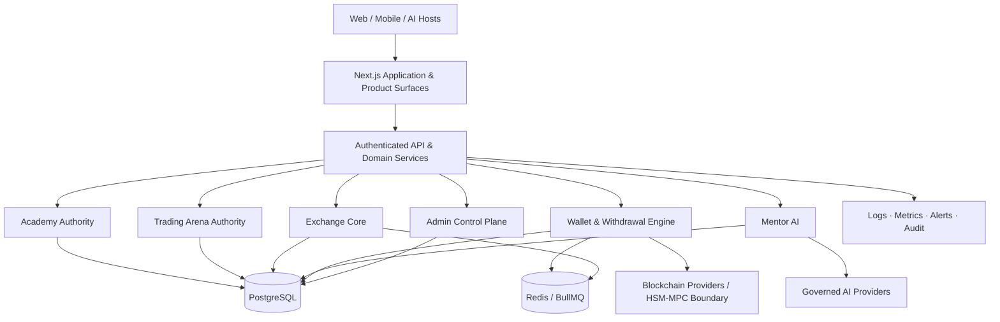

<div align="center">

<a href="https://tecpey.ir" aria-label="TecPey official website">
  
</a>

# TecPey OS

### Financial Education, Trading Intelligence & Digital Asset Infrastructure
### سیستم‌عامل آموزش مالی، هوش معاملاتی و زیرساخت دارایی‌های دیجیتال

**Education First · Server Authoritative · Intelligence Native · Enterprise Ready by Design**

> **تک‌پی، نقطه امن ورود به بازار رمزارز**

[Website](https://tecpey.ir) · [Exchange](https://my.tecpey.ir) · [English](#english) · [فارسی](#persian)


</div>

> [!IMPORTANT]
> TecPey is an actively hardened platform, not a production-certified real-money exchange. The current evidence-weighted baseline estimates **70% Core Soft Launch readiness** and **40% completion of the complete TecPey OS vision**. Real-money activation remains **NO-GO** while any P0 financial, custody, compliance, security or operational gate is open.

---

<a id="english"></a>

## What TecPey Is

TecPey is building a multilingual **Financial Education, Trading Intelligence and Digital Asset Operating System**. It connects structured learning, risk-free market practice, behavioral intelligence, exchange infrastructure, wallet operations, identity, reputation, administration and future enterprise services on one governed platform core.

TecPey is not positioned as “another crypto exchange.” Its defining product loop is:

**Learn → Practice → Receive intelligent feedback → Build discipline and reputation → Access safer financial services**

The initial market focus is Iran. The platform is nevertheless being designed to evolve toward multilingual regional operation, enterprise-grade infrastructure, SaaS and multi-tenant deployment, white-label products, public APIs, SDKs, webhooks, MCP-based distribution and integrations with future AI hosts.

### Brand promise

**TecPey helps users build knowledge and discipline before exposing them to financial risk.**

The official TP mark displayed above is the only approved TecPey logo for this repository. The governed source asset is:

[`docs/assets/brand/tecpey-logo-official.webp`](./docs/assets/brand/tecpey-logo-official.webp)

---

## Current Engineering Reality

| Area | Current state | Verified boundary and remaining work |
|---|---|---|
| **Core Soft Launch** | **70% — production hardening** | Major authority remediations are merged. Production verification and P0 financial, custody, compliance and operations gates remain. |
| **Full TecPey OS vision** | **40%** | Multi-tenancy, white-label operations, developer platform and the broader financial ecosystem are later programs. |
| **Academy** | Integrated / hardening | Official progress, XP, achievements and term outcomes are server-issued and cross-device. Content QA, assessment proof and staging Golden Path verification remain. |
| **Trading Arena** | Authoritative Phase A | PostgreSQL execution state, revisioned commands, idempotency, server market data, positions, orders, fees, PnL, dashboard and server-evidence journal are merged. Historical replay, server-owned scenarios and post-trade reflection writes remain. |
| **Mentor AI** | Implemented foundation | Server memory, conversations and Academy/Arena behavioral context exist. Provider governance, durable-write guarantees, versioning, evaluation, cost controls and deeper Exchange evidence remain. |
| **Exchange Core** | Implemented / P0 hardening | Authenticated orders, holds, matching, trades, ledger and audit foundations exist. Decimal-safe completion, crash recovery, order-book reconstruction and financial reconciliation remain P0. |
| **Wallet & Withdrawals** | Pipeline implemented / custody NO-GO | Database-authoritative execution, signed-transaction persistence before broadcast, confirmation workers, timeout-derived polling and Redis-backed BullMQ lifecycle evidence are merged. Production HSM/MPC custody, per-chain certification and on-chain reconciliation remain P0. |
| **Identity, Security & Admin** | Strong foundation | Unified sessions, CSRF, revocation foundations, individual Admin identities, RBAC, passkey-oriented control plane and immutable audit foundations exist. Privileged-route inventory, dual control and operations completion remain. |
| **Multi-tenant / White-label** | Strategic target | The current runtime must not be represented as fully tenant-isolated. Tenant data, configuration, keys, queues, cache, billing and operational isolation require dedicated proof. |

### Recently merged hardening

- Trading Arena production UI and journal now use server-authoritative execution evidence.
- Ambiguous Arena commands retain the original action, revision and idempotency identity; different commands are blocked until reconciliation.
- Price-dependent Arena actions fail closed when authoritative market data is unavailable.
- Withdrawal execution consumes authoritative PostgreSQL values rather than queue-owned financial data.
- Signed withdrawal bytes and deterministic transaction hashes are persisted before network broadcast.
- BullMQ job identities, live deduplication, watcher recovery and timeout coverage are protected by Redis-backed integration tests.
- CI enforces browser-persistence, Admin, Academy, Arena, Wallet and database-migration authority boundaries.

### Current P0 critical path

1. **Decimal-safe Exchange matching and reconciliation** — remove unsafe JavaScript numeric correctness paths and prove conservation across orders, holds, fills, fees, balances and ledger.
2. **Production custody and chain certification** — real HSM/MPC integration, deterministic provider fixtures, testnet evidence, ambiguous-RPC recovery and withdrawal/ledger/on-chain reconciliation.
3. **Compliance activation** — production KYC/AML providers, jurisdiction and legal approval, negative tests and evidence retention.
4. **Security and privileged operations** — complete privileged-route inventory, dual control, high-assurance administrative workflows and response procedures.
5. **Strict QA and operational proof** — staging Golden Path, backup/restore, rollback, disaster recovery, alert delivery and incident runbooks.

See [`docs/launch/TECPEY_COMPLETION_BASELINE_20260719.md`](./docs/launch/TECPEY_COMPLETION_BASELINE_20260719.md) for the evidence-weighted scoring model.

---

## Product System

| Platform | Responsibility |
|---|---|
| **TecPey Academy** | Structured financial education, lessons, assessments, flashcards, challenges, certificates and progression. |
| **Trading Arena** | Risk-free execution practice with virtual capital, three-attempt cycles, behavioral evidence and server-owned state. |
| **Mentor AI** | Personalized learning and trading intelligence built from authorized user history and behavioral signals. |
| **Exchange Core** | Spot order intake, holds, matching, trades, fees, ledger, market data, risk and audit boundaries. |
| **Wallet & Custody** | Deposit and withdrawal workflows, chain providers, signing boundary, broadcast, confirmation and recovery. |
| **Identity & Reputation** | Cross-product profile, achievements, learning record, trust and future professional reputation. |
| **Admin Control Plane** | Individual administrator identities, permissions, audit, security operations and future dual-control workflows. |
| **Developer Platform** | Planned APIs, SDKs, webhooks, MCP server and AI-host integrations. |
| **Business & White-label Platform** | Planned tenant control plane, branding, configuration, billing, analytics and enterprise operations. |

### Strategic expansion path

```text
TecPey Core
  ├─ Academy
  ├─ Trading Arena
  ├─ Mentor AI
  ├─ Exchange & Wallet
  ├─ Identity, Reputation & Social Layer
  ├─ Admin, Risk, Compliance & Operations
  ├─ API Platform, SDKs, Webhooks & MCP
  └─ Multi-tenant SaaS & White-label Ecosystem
```

The expansion path is a roadmap, not a claim that every module is production-ready today.

---

## Architecture



### Permanent architecture principles

- **Server-side persistence is the source of truth.** Browser `localStorage` or `sessionStorage` must never own durable user, financial, progression, history or Mentor state.
- **Financial and privileged actions fail closed.** Missing database, Redis, provider, market price, authorization or replay protection cannot silently downgrade safety.
- **Commands are revisioned and idempotent.** Ambiguous outcomes must be recoverable without producing a second semantic action.
- **Financial arithmetic must be deterministic.** Decimal strings and governed precision rules are required; floating-point approximation is not an acceptable accounting boundary.
- **API-first and AI-distribution-ready.** Product capabilities should be reusable by web, mobile, enterprise, MCP and future AI hosts.
- **Multi-tenant is a target architecture, not a marketing claim.** Tenant isolation must be proven across data, keys, queues, cache, storage, observability and operations.
- **Bilingual and accessible by design.** Persian RTL and English LTR parity, accessibility and visual regression are product-quality gates.
- **Evidence defines completion.** Code volume or UI appearance does not equal production readiness; CI, integration, concurrency, recovery and runtime proof are required.

---

## Technology Stack

| Layer | Technology |
|---|---|
| Application | Next.js 16.2, React 19.2, TypeScript 5 |
| UI | Tailwind CSS 4, Lucide, Chart.js, Recharts |
| Internationalization | `next-intl`, Persian RTL and English LTR foundations |
| Database | PostgreSQL via `pg`, advisory-locked canonical migrations and clean/idempotent CI verification |
| Queue & Recovery | Redis, BullMQ and Redis-backed lifecycle tests |
| Financial Precision | `decimal.js` with ongoing Exchange precision hardening |
| Authentication | `jose`, httpOnly cookie sessions, CSRF, revocation and step-up/passkey foundations |
| Blockchain | Noble cryptography packages and governed chain-provider abstractions |
| AI | Governed OpenAI/Anthropic provider integrations and server-owned Mentor memory foundations |
| Testing | Node test runner with TypeScript through `tsx`, authority guards and runtime integration suites |
| Runtime | Custom TypeScript server, Node.js 20+, npm 10 |

---

## Quality and Release Gates

Every pull request targeting `main` is expected to pass the exact-head quality pipeline:

1. locked dependency installation;
2. production environment contract;
3. clean PostgreSQL migration execution;
4. migration idempotency and critical-schema verification;
5. TypeScript type checking;
6. ESLint with zero warnings;
7. browser-persistence authority guard;
8. Admin authentication boundary guard;
9. Academy authority boundary guard;
10. Trading Arena authority boundary guard;
11. Wallet authority boundary guard;
12. database-migration authority guard;
13. complete automated tests, including PostgreSQL and Redis-backed integration coverage;
14. production Next.js build.

Useful local commands:

```bash
npm run env:check
npm run db:migrate
npm run typecheck
npm run lint
npm test
npm run build
```

A green build alone does not authorize release. Production activation also requires security, financial reconciliation, custody, compliance, operations and staging evidence.

### Definition of Done for critical capabilities

A critical capability is not considered complete until it has:

- production implementation;
- authorization and source-of-truth enforcement;
- negative, concurrency and ambiguous-failure tests;
- CI evidence on the exact head;
- runtime or integration evidence using real infrastructure where applicable;
- documented recovery, rollback and operational ownership;
- no unresolved P0 or P1 finding in its release boundary.

---

## Local Development

### Prerequisites

- Node.js `>=20.11.0`
- npm `>=10.0.0 <11.0.0`
- PostgreSQL
- Redis

### Setup

```bash
git clone https://github.com/tecpey/Tecpey-Os.git
cd Tecpey-Os
npm ci
cp .env.example .env.local
# Configure the required local environment values.
npm run env:check
npm run db:migrate
npm run dev
```

The default development command starts the governed custom TecPey server through `tsx server.ts`. `npm run dev:next` is available for Next-only development, but production behavior must be verified through the governed custom-server path.

> [!WARNING]
> Never place real production secrets, private keys, user data, KYC evidence or live custody material in local files, fixtures, commits, pull requests or CI logs.

---

## Repository Map

```text
src/app/          Next.js routes, product pages and API endpoints
src/components/   Shared and domain UI components
src/lib/          Domain logic, authority boundaries and infrastructure
src/tests/        Unit, authority, concurrency and integration tests
scripts/          CI guards, environment validation and QA utilities
docs/             Governance, architecture, security, product and launch evidence
server.ts         Governed custom application server
```

---

## Authoritative Documentation

Read these documents before changing critical platform behavior:

- [`docs/TECPEY_MASTER_BLUEPRINT.md`](./docs/TECPEY_MASTER_BLUEPRINT.md) — strategic platform blueprint and long-term product direction.
- [`docs/FINAL_IMPLEMENTATION_GATE.md`](./docs/FINAL_IMPLEMENTATION_GATE.md) — implementation and launch gate framework.
- [`docs/architecture/TECPEY_BACKEND_AUTHORITY_MAP.md`](./docs/architecture/TECPEY_BACKEND_AUTHORITY_MAP.md) — runtime, database and domain authority map.
- [`docs/launch/TECPEY_COMPLETION_BASELINE_20260719.md`](./docs/launch/TECPEY_COMPLETION_BASELINE_20260719.md) — evidence-weighted completion baseline.
- [`docs/arena/TRADING_ARENA_UI_AUTHORITY.md`](./docs/arena/TRADING_ARENA_UI_AUTHORITY.md) — Arena client/server authority and ambiguous-command recovery.
- [`docs/security/ADMIN_CONTROL_PLANE_SECURITY_STANDARD.md`](./docs/security/ADMIN_CONTROL_PLANE_SECURITY_STANDARD.md) — privileged identity, authorization and administrative security standard.

Repository documentation must describe verified reality. Aspirational capabilities must be labelled as roadmap and must never be presented as implemented or production-certified.

---

## Development Governance

- Work from the highest-risk verified gap rather than visual completeness.
- Do not create duplicate engines, persistence paths or parallel sources of truth.
- Keep pull requests narrow enough to audit and prove.
- Review all third-party Skills, plugins and automation before adoption; inspect code, hooks, shell/network access and telemetry, then test in isolation.
- Commit generated migrations, tests, authority guards and operational documentation together with the capability they protect.
- Do not merge a financial or privileged change solely because CI is green; inspect runtime assumptions, failure boundaries and reconciliation.
- Preserve Persian and English parity in user-facing product work.
- Use the official TecPey logo only; do not replace, redraw, recolor or approximate the brand mark.

---

<a id="persian"></a>

## خلاصه فارسی

### تک‌پی چیست؟

تک‌پی یک **سیستم‌عامل آموزش مالی، هوش معاملاتی و خدمات دارایی‌های دیجیتال** است؛ نه صرفاً یک صرافی رمزارز. هدف پلتفرم این است که آموزش، تمرین بدون ریسک، منتور هوشمند، معامله، کیف پول، اعتبار حرفه‌ای، مدیریت سازمانی و سرویس‌های توسعه‌دهندگان را روی یک هسته مشترک، امن و قابل‌اعتماد به هم متصل کند.

مسیر اصلی تجربه کاربر در تک‌پی:

**آموزش → تمرین در Trading Arena → دریافت بازخورد هوشمند → ساخت انضباط و اعتبار → استفاده امن‌تر از خدمات مالی**

تمرکز نخست محصول بازار ایران است، اما معماری و نقشه‌راه از ابتدا برای چندزبانه‌بودن، API-first، مقیاس سازمانی، SaaS، Multi-tenant، White-label و توزیع در میزبان‌های هوش مصنوعی طراحی می‌شود.

### وضعیت واقعی پروژه

بر اساس خط مبنای فعلی:

- آمادگی هسته برای سافت‌لانچ کنترل‌شده: **۷۰٪**
- پیشرفت کل چشم‌انداز TecPey OS: **۴۰٪**
- وضعیت فعال‌سازی پول واقعی: **NO-GO تا زمان بسته‌شدن همه P0ها**

پیشرفت‌های مهمی که وارد `main` شده‌اند:

- پیشرفت رسمی، XP، دستاوردها و نتایج دوره‌های Academy به‌صورت سروری صادر می‌شوند.
- اجرای اصلی Trading Arena، سفارش‌ها، موقعیت‌ها، کارمزد، PnL، revision، idempotency و ژورنال شواهد به سرور و PostgreSQL منتقل شده‌اند.
- نتیجه نامشخص فرمان Arena با همان action، revision و idempotency بازیابی می‌شود و فرمان متفاوت تا تعیین تکلیف قبلی مسدود است.
- عملیات وابسته به قیمت در Arena هنگام نبود قیمت معتبر سرور Fail Closed می‌شوند.
- اجرای برداشت وجه از داده معتبر PostgreSQL استفاده می‌کند و تراکنش امضاشده پیش از Broadcast به‌صورت پایدار ذخیره می‌شود.
- زمان‌بندی BullMQ، deduplication، بازیابی watcherها و پوشش timeout با Redis integration test محافظت می‌شوند.
- برنامه مایگریشن دیتابیس به‌صورت مرکزی، advisory-locked و با اجرای واقعی و تکرار idempotent روی PostgreSQL در CI کنترل می‌شود.
- CI علاوه بر TypeScript، ESLint، تست‌ها و Build، مرزهای Browser Persistence، Admin، Academy، Arena، Wallet و Database Migration را کنترل می‌کند.

### مهم‌ترین موانع باقی‌مانده

1. تکمیل محاسبات Decimal-safe، بازیابی و reconciliation مالی صرافی؛
2. راه‌اندازی واقعی HSM/MPC و گواهی مستقل هر شبکه بلاکچین؛
3. فعال‌سازی عملیاتی KYC/AML و تأیید حقوقی حوزه فعالیت؛
4. تکمیل کنترل‌های مدیران، Dual Control و تست مسیرهای دارای دسترسی بالا؛
5. تست کامل Staging، Backup/Restore، Rollback، Disaster Recovery و Incident Response؛
6. تکمیل جداسازی Multi-tenant و White-label برای چشم‌انداز سازمانی؛
7. API سروری بازتاب پس از معامله و سناریوهای تاریخی Arena.

### قواعد غیرقابل‌مذاکره توسعه

- منبع حقیقت تمام داده‌های پایدار باید Backend و Database باشد.
- هیچ داده مالی، پیشرفت آموزشی، تاریخچه، حافظه Mentor یا وضعیت حساب نباید با `localStorage` به‌عنوان منبع اصلی نگهداری شود.
- عملیات مالی و مدیریتی در نبود وابستگی، قیمت یا مجوز معتبر باید Fail Closed شوند.
- هیچ قابلیت مالی با محاسبات تقریبی JavaScript Number تأیید Production نمی‌شود.
- هیچ PR فقط به دلیل سبز بودن Build قابل Merge نیست؛ تست خطا، هم‌زمانی، نتیجه نامشخص، بازیابی و شواهد Runtime نیز لازم است.
- طراحی UI/UX باید برندمحور، متمایز، دسترس‌پذیر و دارای برابری واقعی فارسی و انگلیسی باشد.
- قابلیت‌های آینده باید صریحاً با عنوان Roadmap معرفی شوند و نباید به‌عنوان قابلیت آماده نمایش داده شوند.
- در تمام طراحی‌ها و مستندات فقط از لوگوی رسمی تک‌پی استفاده می‌شود.

---

## Security, Brand & License

This repository is proprietary. Source code, documentation, architecture, brand assets and product specifications remain the intellectual property of TecPey and may not be copied, redistributed, sublicensed or used to create competing products without explicit written authorization.

The logo in [`docs/assets/brand/tecpey-logo-official.webp`](./docs/assets/brand/tecpey-logo-official.webp) is the official TecPey mark. It must not be replaced, redrawn, recolored or used outside approved brand contexts without authorization.

Security reports should be disclosed privately through the authorized TecPey security channel rather than public issues. General contact: **info@tecpey.ir**.

---

<div align="center">

**Build trust before transactions.**

**اول اعتماد؛ بعد معامله.**

</div>
