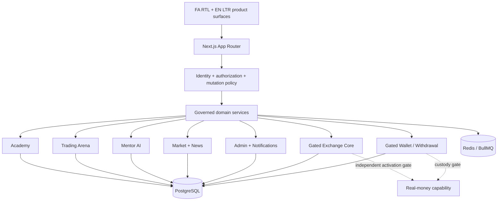

<div align="center">


# TecPey

### Digital Financial Education & Trading Operating System

**Learn with context. Practice with discipline. Activate with evidence.**

**«تک‌پی، نقطه امن ورود به بازار رمزارز»**

[Website](https://tecpey.ir) · [Architecture](./docs/architecture/SERVER_SIDE_SOURCE_OF_TRUTH.md) · [Security](./SECURITY.md) · [Launch Governance](./docs/launch/CONTROLLED_SOFT_LAUNCH_GO_NO_GO_CHECKLIST.md) · [فارسی](./README.fa.md)

`Education-first` · `Virtual trading` · `AI-assisted learning` · `PostgreSQL authority` · `FA RTL + EN LTR` · `Evidence-gated activation`

</div>

> [!IMPORTANT]
> **TecPey is under controlled launch hardening.** Trading Arena uses simulated capital. Repository implementation, CI evidence, staging evidence, operational approval and production activation are separate authorities. Repository presence of a capability does not imply production activation. The repository is **not evidence that real-money Exchange, custody, deposits, or withdrawals are active**.
>
> **Current controlled-launch decision: NO-GO.** Real-money Exchange, custody, deposits, withdrawals, public financial rewards, enterprise and white-label activation remain outside the current launch scope and must stay disabled or separately certified under the canonical launch authority.

## One Product Loop, Not a Collection of Crypto Features

TecPey is being built around one connected learning and practice loop rather than a set of unrelated crypto pages:


```mermaid
flowchart LR
    A[Learn\nAcademy] --> B[Practice\nTrading Arena]
    B --> C[Reflect\nJournal + Mentor AI]
    C --> D[Understand\nMarket + News Intelligence]
    D --> A
    C --> E{Independent\nactivation gates}
    E -->|Not passed| F[Education + simulation]
    E -->|Future approval only| G[Governed financial capabilities]
```

Academy builds knowledge. Trading Arena turns knowledge into controlled virtual practice. Mentor AI connects authorized learning and practice context to reflection. Market and News surfaces add timely context. Higher-risk financial capabilities stay behind independent technical, operational, custody, compliance and jurisdictional gates.

The product thesis is continuity: **learn → practice → reflect → understand → activate only when evidence permits**.

## Real Product, Real Evidence

The screenshots below are **actual TecPey browser-derived captures**, not mockups, concept art or reconstructed marketing screens. They come from the governed Public Browser Golden Path for the exact head of merged PR #642 (`c28ec91f397fb4f1580d2b6d2499d867c176fa77`). The committed derivatives are the durable showcase assets; the source GitHub Actions artifact is retention-limited and is documented as historical provenance rather than permanent pixel-level review authority. See [`docs/assets/screenshots/showcase/PROVENANCE.md`](./docs/assets/screenshots/showcase/PROVENANCE.md).

### Guided entry experience

<p align="center">
  <a href="./docs/assets/screenshots/showcase/landing-fa-dark-c28ec91.webp"></a>
</p>

The current landing experience presents TecPey as a growth journey rather than an exchange-first funnel. Academy, Mentor, virtual practice, market context and the longer learning path live in one bilingual product shell.

### Serious practice without customer-fund exposure

<p align="center">
  <a href="./docs/assets/screenshots/showcase/trading-arena-fa-dark-c28ec91.webp"></a>
</p>

Trading Arena is a simulation environment with server-authoritative virtual accounts, balances, attempts, positions, orders and executions. Simulated balances and outcomes are educational evidence—not customer assets, real performance or promises of return.

> The source CI artifact also contained full-resolution Academy, Mentor, authentication, responsive, light/dark and FA/EN captures. GitHub Actions retention is finite, so those originals are **not presented as continuing durable evidence after artifact expiry**. The committed showcase derivatives, source paths, dimensions and hashes remain documented for traceability.

## Built for Three Audiences

| Learners | Partners & investors | Engineers |
|---|---|---|
| Structured learning, virtual practice and reflection in one journey | A platform thesis with multiple expansion surfaces around one governed lifecycle | Named authorities, explicit failure boundaries and server-side critical state |
| Academy, assessments, challenges and certificates | Education, Mentor, simulation, market intelligence and future enterprise delivery | PostgreSQL authority, idempotency, tenant/RLS foundations and exact-head evidence |
| Mentor context from authorized learning/practice signals | Financial infrastructure only after independent activation gates | Fail-closed launch, custody and sensitive-mutation controls |

No revenue, market-share, regulatory approval or future-return claim is implied by the product roadmap.

## Product Pillars

### 01 — TecPey Academy

Academy is the structured learning foundation: terms, lessons, quizzes, assessments, flashcards, challenges, simulations, achievements, certificates and progression. Canonical progress and assessment paths are server-backed rather than treating browser storage as the source of truth.

The goal is not simply to publish content. Academy creates structured learning evidence that can inform Mentor context and future practice experiences. Not every route has identical maturity and broader language parity remains an active program.

### 02 — Trading Arena

Trading Arena is **virtual practice, not real-money trading**. Its governed core owns virtual accounts, balances, attempts, positions, orders, executions, fees and revisions on the server. Longer-term replay, scenario, journal, league and analytics work must preserve the distinction between simulation evidence and real financial performance.

See [`docs/arena/TRADING_ARENA_UI_AUTHORITY.md`](./docs/arena/TRADING_ARENA_UI_AUTHORITY.md).

### 03 — Mentor AI

Mentor is TecPey’s educational intelligence and reflection layer. It can explain concepts, continue learning conversations and use authorized learning/practice context subject to privacy and consent controls.

Mentor is not presented as an autonomous financial adviser, signal seller, prediction engine or trade executor. The broader multi-provider TecPey AI operating layer remains an active engineering program rather than a completed enterprise subsystem.

See [`docs/MENTOR_AI_MODEL.md`](./docs/MENTOR_AI_MODEL.md).

### 04 — Market & News Intelligence

TecPey is building a source-backed discovery layer for market context, News, coins and tools. The governing direction emphasizes provenance, freshness, entities, canonical routes and links back into the learning journey rather than an opaque content feed.

Live-source quality, translation, media rights, publication authority and indexing behavior require independent runtime and staging evidence.

### 05 — Governed Financial Core

The repository contains meaningful engineering for order admission, holds, matching, trades, fees, ledgers, withdrawal pipelines, reconciliation and audit evidence. Those foundations establish financial-domain boundaries early; they do not authorize customer-fund operation.

Production Exchange, custody, deposits and withdrawals remain disabled until their own custody, compliance, provider, reconciliation, recovery and operational gates are approved.

## Why the Architecture Matters


```mermaid
flowchart TB
    UX[FA RTL + EN LTR product surfaces] --> APP[Next.js App Router]
    APP --> IAM[Identity + authorization + mutation policy]
    IAM --> DOMAIN[Governed domain services]

    DOMAIN --> ACA[Academy]
    DOMAIN --> ARENA[Trading Arena]
    DOMAIN --> AI[Mentor AI]
    DOMAIN --> NEWS[Market + News]
    DOMAIN --> ADMIN[Admin + Notifications]
    DOMAIN --> EX[Gated Exchange Core]
    DOMAIN --> WALLET[Gated Wallet / Withdrawal]

    ACA --> PG[(PostgreSQL)]
    ARENA --> PG
    AI --> PG
    NEWS --> PG
    ADMIN --> PG
    EX --> PG
    WALLET --> PG
    DOMAIN --> REDIS[(Redis / BullMQ)]

    EX -. independent activation gate .-> REAL[Real-money capability]
    WALLET -. custody gate .-> REAL
```

TecPey uses Next.js App Router and TypeScript domain services in the deployable runtime. PostgreSQL is the durable authority for critical state; Redis/BullMQ provides governed coordination and queues. Production migrations and runtime activation remain operationally separate actions.

### Enterprise engineering principles

| Principle | TecPey boundary |
|---|---|
| **Server-side source of truth** | Critical user, simulation and financial state belongs to governed backend authorities |
| **Fail closed** | Missing authorization, persistence, provider, reconciliation or readiness evidence must not silently become success |
| **Progressive activation** | Education, simulation, financial execution, custody and enterprise operation have separate gates |
| **Evidence-driven delivery** | Exact-head CI, browser evidence, security manifests and operational drills define readiness |
| **Privacy & consent** | AI memory, behavioral context, notifications and community evidence are purpose-bound |
| **Tenant isolation direction** | Tenant-scoped data is enrolled in isolation policy; complete enterprise runtime authority remains an active program |
| **Multilingual UX** | Persian RTL and English LTR are first-class; broader localization remains active work |
| **Truthful claims** | Code existence is never used as proof of customer activation |

## Investor & Strategic Partner View

TecPey’s strategic value is not based on adding more crypto tabs. It comes from **compounding context across a governed lifecycle**: learning can shape practice, practice can shape reflection, reflection can guide the next learning step, and market context can reconnect to curriculum.

That creates several potential business surfaces without requiring premature real-money activation: premium education, richer Mentor experiences, advanced simulation, multilingual market intelligence, enterprise delivery and—only where independent requirements permit—regulated financial capabilities.

The defensibility thesis is operational as much as visual: persistent learning/practice state, consent-aware intelligence, security boundaries, release evidence and progressive activation are harder to reproduce responsibly than a collection of frontend features. This is a product and engineering thesis, **not a claim of present commercial scale, regulatory approval or future returns**.

## Security, Governance & Operational Discipline

TecPey treats financial capability as a security boundary. The repository includes session/auth foundations, CSRF controls, TOTP/passkey paths, privileged administration controls, audit logging, sensitive-mutation policy, tenant-isolation policy, secret scanning and dedicated financial authority tests.

The project also records what is not yet proven. Production custody requires approved non-exportable signing infrastructure and operational evidence. Complete multi-tenant runtime isolation, complete separation of duties, deeper enterprise control-plane coverage and broader AI governance remain active programs rather than finished claims.

Useful review paths:

- [`SECURITY.md`](./SECURITY.md)
- [`docs/architecture/SERVER_SIDE_SOURCE_OF_TRUTH.md`](./docs/architecture/SERVER_SIDE_SOURCE_OF_TRUTH.md)
- [`docs/security/ADMIN_CONTROL_PLANE_SECURITY_STANDARD.md`](./docs/security/ADMIN_CONTROL_PLANE_SECURITY_STANDARD.md)
- [`docs/launch/CONTROLLED_SOFT_LAUNCH_GO_NO_GO_CHECKLIST.md`](./docs/launch/CONTROLLED_SOFT_LAUNCH_GO_NO_GO_CHECKLIST.md)

## Controlled Launch Boundary

| Capability | Current intended boundary |
|---|---|
| Public landing | **Included** |
| Persian / English public experience | **Controlled** |
| Academy | **Controlled** |
| Mentor AI | **Controlled** — provider/configuration dependent |
| Trading Arena | **Controlled simulation** — virtual capital |
| Market & News | **Controlled** — runtime freshness/publication evidence required |
| Real-money Exchange | **Disabled** |
| Custody | **Disabled** |
| Deposits / Withdrawals | **Disabled** |
| Public financial rewards | **Gated** |
| Community | **Limited governed scope** |
| Multi-tenant / white-label | **Post-launch engineering direction** |
| Public Developer Platform | **Planned** |
| Broader TecPey AI Operating System | **Active program, not a completed subsystem** |

## Current Evidence Snapshot — 2026-09-13

The Showcase baseline is `main@c4751708ae6c1d2f2877ed64e7de36e5b963a045`, which merged the bilingual growth-story landing in PR #642. Screenshot/browser evidence comes from exact source head `c28ec91f397fb4f1580d2b6d2499d867c176fa77`.

On that source head, the governed CI, Public Browser Golden Path, Full Suite Diagnostics, Repository Audit Manifest, API Security Manifest, Sensitive Mutation Audit, Full History Secret Scanning and AI Tenant RLS Runtime Evidence workflows completed successfully before merge.

That is evidence for the accepted product change; it is **not a substitute for protected-staging evidence or final launch approval**. The canonical decision authority remains [`docs/launch/CONTROLLED_SOFT_LAUNCH_GO_NO_GO_CHECKLIST.md`](./docs/launch/CONTROLLED_SOFT_LAUNCH_GO_NO_GO_CHECKLIST.md) and [`docs/launch/CURRENT_CONTROLLED_LAUNCH_CANDIDATE.md`](./docs/launch/CURRENT_CONTROLLED_LAUNCH_CANDIDATE.md).

## Explore the Engineering

```bash
npm ci
npm run lint
npm run typecheck
npm test
npm run build
```

A green local build is not sufficient for a protected change. Review exact-head GitHub checks and domain-specific staging/runtime evidence.

Start here:

- [Server-side source of truth](./docs/architecture/SERVER_SIDE_SOURCE_OF_TRUTH.md)
- [Trading Arena authority](./docs/arena/TRADING_ARENA_UI_AUTHORITY.md)
- [Admin control-plane security](./docs/security/ADMIN_CONTROL_PLANE_SECURITY_STANDARD.md)
- [Wallet engine](./docs/WALLET_ENGINE.md)
- [Mentor AI model](./docs/MENTOR_AI_MODEL.md)
- [Verified screenshot provenance](./docs/assets/screenshots/showcase/PROVENANCE.md)

## Responsible Disclosure

Please do not disclose vulnerabilities through public issues. Follow [`SECURITY.md`](./SECURITY.md) for the responsible disclosure path.

---

<div align="center">

### TecPey

**Education first. Practice before exposure. Evidence before activation.**

</div>
