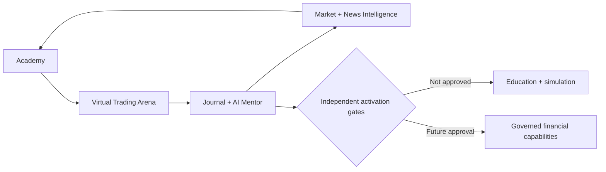

<div align="center">


# TecPey

### Digital Financial Education & Trading Operating System

**Learn the market. Practice without exposure. Build skill with evidence.**

**«تک‌پی، نقطه امن ورود به بازار رمزارز»**

[Website](https://tecpey.ir) · [فارسی](./README.fa.md) · [Architecture](./docs/architecture/SERVER_SIDE_SOURCE_OF_TRUTH.md) · [Security](./SECURITY.md) · [Launch Governance](./docs/launch/CONTROLLED_SOFT_LAUNCH_GO_NO_GO_CHECKLIST.md)

`Education-first` · `Virtual Trading Arena` · `AI Mentor` · `Market & News Intelligence` · `FA RTL + EN LTR` · `Evidence-gated activation`

</div>

## One journey from curiosity to capability

TecPey connects the parts that are usually fragmented across crypto products. A learner can build foundations in the **Academy**, practice decisions with **virtual capital**, reflect with an **AI Mentor**, and use **market and news context** to understand what is happening around those decisions.

The product loop is simple:

**Learn → Practice → Reflect → Understand → Grow**

Higher-risk financial capabilities are a separate activation problem. They do not become available merely because code exists; they require independent technical, operational, custody, compliance and jurisdictional evidence.

## Product experience

The governed browser suite captures the real bilingual product across desktop/mobile and light/dark states. This README intentionally avoids the previous tiny lossy thumbnails: visual evidence should remain inspectable, not decorative. The full-resolution browser artifact for the accepted product head is linked from the evidence snapshot below; durable high-resolution showcase assets are being promoted separately from the ephemeral CI bundle.

### Academy — knowledge that becomes measurable progress

Academy is the learning foundation: structured terms, lessons, assessments, flashcards, challenges, simulations, achievements and certificates. Canonical progress and assessment paths are server-backed. The long-term learning path extends beyond the seven foundational terms into a continuing growth model rather than ending at a static course boundary.

### Trading Arena — serious practice, zero customer-fund exposure

Trading Arena is a governed simulation environment with virtual accounts, balances, attempts, positions, orders and executions. Its purpose is to make decision quality observable before real financial exposure. Simulated balances and results are educational evidence—not customer assets, real performance or promises of return.

### AI Mentor — guidance grounded in the learner's path

Mentor is the reflection and personalization layer. It can use authorized Academy and practice context to explain concepts, surface weak areas and guide the next learning step. The design goal is evidence-grounded coaching: no fabricated confidence, no silent substitution of missing data, and no presentation as an autonomous financial adviser or signal engine.

## What makes TecPey different

| Product layer | Role in the journey | Authority principle |
|---|---|---|
| **Academy** | Build structured knowledge and learning evidence | Canonical progress and assessments are server-backed |
| **Trading Arena** | Practice decisions with virtual capital | Simulation state is governed on the server |
| **AI Mentor** | Turn learning and practice context into reflection | Uses authorized context and must degrade honestly when evidence is missing |
| **Market & News** | Add timely source-backed context | Provenance, freshness and publication authority are explicit |
| **Financial Core** | Engineer future execution boundaries safely | Real-money activation remains behind independent gates |

The defensibility thesis is the connection between these layers. Learning can shape practice; practice can shape reflection; reflection can shape the next lesson; market context can reconnect the user to curriculum. That continuity is harder to reproduce responsibly than a collection of disconnected crypto pages.

## Product architecture


```mermaid
flowchart LR
    A[Academy] --> B[Virtual Trading Arena]
    B --> C[Journal + AI Mentor]
    C --> D[Market + News Intelligence]
    D --> A
    C --> E{Independent activation gates}
    E -->|Not approved| F[Education + simulation]
    E -->|Future approval| G[Governed financial capabilities]
```

Under the product layer, TecPey is built around explicit authorities: Next.js App Router and TypeScript domain services, PostgreSQL for durable critical state, Redis/BullMQ for governed coordination, tenant/RLS foundations, auditable sensitive mutations, and exact-head CI evidence.

### Engineering principles

- **Server-side source of truth:** critical user, simulation and financial state belongs to governed backend authorities.
- **Fail closed:** missing authorization, persistence, provider, reconciliation or readiness evidence must not silently become success.
- **Evidence before activation:** implementation, CI, staging evidence, operational approval and production activation are separate decisions.
- **Privacy by purpose:** Mentor memory and behavioral context must be authorized and purpose-bound.
- **Bilingual by design:** Persian RTL and English LTR are first-class product surfaces.
- **Progressive capability gates:** education and simulation can advance without prematurely activating real-money risk.

## Controlled-launch boundary

TecPey is currently being hardened for a controlled educational launch. The public experience, Academy, AI Mentor, Trading Arena simulation, and market/news surfaces are the focus of this phase. **Real-money Exchange, custody, deposits and withdrawals are not implied by this repository and remain gated.**

We are building and developing TecPey's proprietary advanced exchange; production financial activation is a separate program with its own custody, compliance, provider, reconciliation, recovery and operational requirements.

For the canonical decision state, use [`CONTROLLED_SOFT_LAUNCH_GO_NO_GO_CHECKLIST.md`](./docs/launch/CONTROLLED_SOFT_LAUNCH_GO_NO_GO_CHECKLIST.md) rather than this product overview.

## Evidence snapshot

The full-resolution browser evidence is available in [Public Browser Golden Path #1857](https://github.com/tecpey/Tecpey-Os/actions/runs/34941100324) on exact head `9f3a8fa0c9d43c2f34cacfa24935d9ec300c4baa`. On that head, all eight governed workflows completed successfully: CI, Public Browser Golden Path, Full Suite Diagnostics, Repository Audit Manifest, API Security Manifest, Sensitive Mutation Audit, Full History Secret Scanning, and AI Tenant RLS Runtime Evidence.

That proves acceptance of that code state. It does **not** substitute for protected-staging evidence or final launch approval.

## Explore the engineering

- [Server-side source of truth](./docs/architecture/SERVER_SIDE_SOURCE_OF_TRUTH.md)
- [Trading Arena authority](./docs/arena/TRADING_ARENA_UI_AUTHORITY.md)
- [Admin control-plane security](./docs/security/ADMIN_CONTROL_PLANE_SECURITY_STANDARD.md)
- [Wallet engine](./docs/WALLET_ENGINE.md)
- [Mentor AI model](./docs/MENTOR_AI_MODEL.md)

```bash
npm ci
npm run lint
npm run typecheck
npm test
npm run build
```

A green local build is not a release decision. Protected changes are evaluated with exact-head CI and the domain-specific runtime/staging evidence required by their risk level.

## Responsible disclosure

Please do not disclose vulnerabilities through public issues. Follow [`SECURITY.md`](./SECURITY.md) for the responsible disclosure path.

---

<div align="center">

### TecPey

**Education first. Practice before exposure. Evidence before activation.**

</div>
