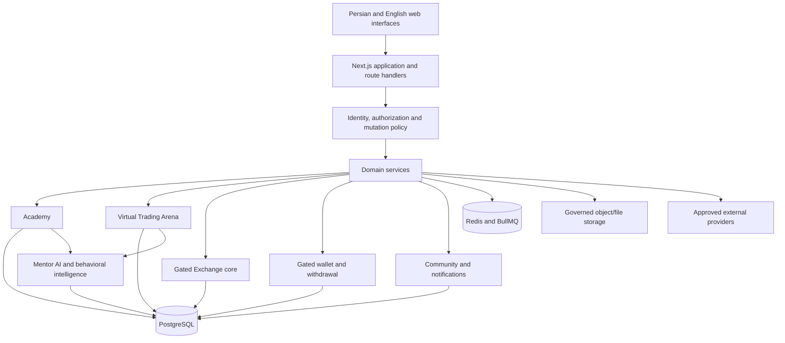

<div align="center">


# TecPey

## Digital Financial Education & Trading Operating System

**«تک‌پی، نقطه امن ورود به بازار رمزارز»**

**“TecPey — a safer entry point into the crypto market.”**

[Website](https://tecpey.ir) · [Project audit](./docs/audits/TECPEY_PROJECT_STATE_AUDIT_2026-07-26.md) · [Architecture](./docs/architecture/SERVER_SIDE_SOURCE_OF_TRUTH.md) · [Security](./SECURITY.md)

</div>

> [!IMPORTANT]
> TecPey is an education-first platform under controlled launch hardening. The repository includes virtual trading and gated financial infrastructure, but it is **not evidence that real-money Exchange, custody, deposits, or withdrawals are active**. Repository implementation, CI evidence, operational deployment, and product activation are separate decisions.

## What TecPey Is

TecPey is being built as a **Digital Financial Education & Trading Operating System**: one governed platform connecting structured education, guided practice, behavioral intelligence, and—only after independent safety and operational gates—financial execution.

It is not simply a cryptocurrency exchange. Its central product relationship is the connection between:

- **TecPey Academy**, where a learner develops concepts and skills;
- **Virtual Trading / Trading Arena**, where those skills can be practised with simulated capital;
- **Mentor AI**, which can use authorized learning and practice evidence to support reflection and risk awareness;
- **Exchange, wallet, and ledger infrastructure**, which is engineered behind separate activation gates;
- **Community, notification, administration, and future enterprise services**, which extend the learning and operating environment without weakening privacy or financial controls.

The initial direction is Iran-first and Persian-first, with a growing English experience and a multilingual architecture. The longer-term direction includes enterprise SaaS, multi-tenant and white-label operation, a developer ecosystem, and a governed TecPey AI operating layer. Those are ambitions and open engineering programs, not current production claims.

## Why TecPey Exists

Entering crypto markets is often fragmented. Education may be separated from the interface where users later act. Demo trading may offer simulated orders without a curriculum, reflection model, or explanation of risk. Behavioral patterns—overtrading, poor position sizing, inconsistent review, or decision-making under stress—are rarely connected to a learner’s progress.

TecPey’s intended progression is different:

1. Learn concepts in a structured path.
2. Practise without real-money exposure.
3. Record and review decisions rather than only outcomes.
4. Receive consent-aware educational and behavioral guidance.
5. Activate higher-risk capabilities only after technical, operational, legal, custody, and jurisdictional gates pass.

This progression is the reason Academy, Arena, and Mentor are designed as one product loop rather than unrelated applications.

## Product Principles

- **Education first.** Learning context and risk literacy precede financial activation.
- **Safety before activation.** A capability can exist in code while remaining deliberately unavailable to users.
- **Truthful product claims.** Educational market information and simulation must never be presented as an active exchange or guaranteed outcome.
- **Server-side persistence.** Critical user and financial state belongs to governed backend authorities, not browser storage.
- **Fail-closed financial operations.** Missing authorization, persistence, price, provider, reconciliation, custody, or readiness evidence must not silently degrade into success.
- **Privacy and consent.** Behavioral memory, community evidence, communications, and AI context must use authorized data for a defined purpose.
- **Evidence-driven release governance.** Tests, exact-head CI, operational drills, and independent review define completion—not route count or visual polish.
- **Multilingual and accessible UX.** Persian RTL, English LTR, keyboard access, responsive layouts, and WCAG-oriented checks are product requirements.
- **Modular enterprise architecture.** Domains have explicit authorities and can evolve toward enterprise delivery without implying that multi-tenancy is complete today.
- **Progressive capability activation.** Public education, virtual practice, real-money execution, custody, and enterprise operation have distinct release gates.

## Product Ecosystem

### TecPey Academy

Academy is the structured learning foundation. The repository includes term-based learning, lessons, quizzes, assessments, onboarding, progress tracking, achievements, certificates, flashcards, challenges, simulations, risk and psychology labs, and career-oriented experiences under [`src/app/academy`](./src/app/academy) and [`src/components/academy`](./src/components/academy).

Canonical progress, assessments, and certificates have PostgreSQL-backed authorities in [`src/lib/academy-progress.ts`](./src/lib/academy-progress.ts), [`src/lib/academy-assessment.ts`](./src/lib/academy-assessment.ts), and [`src/lib/academy-certificates.ts`](./src/lib/academy-certificates.ts). Security and integration suites test those boundaries. Mentor memory can read authorized Academy progress to provide educational continuity.

Not every Academy experience has equal maturity. Some engagement, lab, and presentation state is intentionally classified as disposable browser-local state, and some older experiences remain partial. English coverage does not mirror the full depth of the Persian route tree. Certificate issuance exists, but a complete enterprise certificate rotation and revocation program is not claimed.

### Virtual Trading / Trading Arena

Trading Arena is simulated practice, not real-money trading. Its purpose is to let learners apply concepts, observe risk, and review behavior without transferring customer funds.

The official Arena core uses a server-authoritative PostgreSQL aggregate for virtual accounts, balances, attempts, positions, orders, executions, fees, and revisions. It uses decimal-string arithmetic, idempotency controls, and server-resolved market inputs. The governed model currently includes virtual capital and a three-attempt cycle, with server-owned reflections available to authorized learning and Community projections. See [`src/lib/trading-arena-account.ts`](./src/lib/trading-arena-account.ts), [`src/lib/trading-arena-execution-v2.ts`](./src/lib/trading-arena-execution-v2.ts), [`src/lib/trading-arena-reflections.ts`](./src/lib/trading-arena-reflections.ts), and [`docs/arena/TRADING_ARENA_UI_AUTHORITY.md`](./docs/arena/TRADING_ARENA_UI_AUTHORITY.md).

Some historical replay, scenario, and journal experiences still use quarantined local simulation modules. Those paths are not canonical financial or reputation evidence. No simulated result, virtual balance, or historical outcome represents real performance or a promise of reward.

### Mentor AI

Mentor AI is TecPey’s educational and behavioral intelligence layer. The implemented foundation can store server-side profiles, conversations, memories, Academy progress context, and selected Arena signals. It can help a learner review concepts, reflect on authorized practice events, and notice risk-related patterns. Provider access is kept behind a server boundary with governed fallbacks and trust tests.

Mentor is not an autonomous financial adviser, signal provider, or prediction engine. It must not guarantee results, place trades, move funds, or use private behavioral evidence outside consent and authorization boundaries. Some event-delivery and interaction paths remain incomplete or non-durable, and the wider multi-provider “TecPey AI Operating System” remains an open program. Current evidence is in [`src/lib/mentor-memory.ts`](./src/lib/mentor-memory.ts), [`src/lib/ai/mentor-provider.ts`](./src/lib/ai/mentor-provider.ts), and [`docs/MENTOR_AI_MODEL.md`](./docs/MENTOR_AI_MODEL.md).

### Exchange Core

The repository contains engineering for authenticated order admission, holds, matching, trades, fees, ledger records, audit evidence, idempotency, and decimal-safe arithmetic. These are important platform foundations, tested through Exchange authority suites and documented in [`docs/architecture/EXCHANGE_ORDER_ADMISSION_AUTHORITY.md`](./docs/architecture/EXCHANGE_ORDER_ADMISSION_AUTHORITY.md) and [`docs/financial/FINANCIAL_CORE_CERTIFICATION.md`](./docs/financial/FINANCIAL_CORE_CERTIFICATION.md).

They do not authorize real-money operation. Reconciliation, ambiguous-result recovery, distributed ownership, provider evidence, compliance, custody, and production recovery remain independently gated. The controlled Soft Launch must not imply that a live exchange is available.

### Wallet and Ledger

TecPey includes database-authoritative withdrawal admission, transaction persistence before broadcast, queue/worker foundations, confirmation processing, and ledger integration. These paths have dedicated authority and failure-mode tests.

Production custody is explicitly disabled by policy. The repository does not contain an approved production HSM/MPC signing deployment, and raw private-key custody is rejected as a production solution. Deposit allocation, signing, broadcast, and withdrawal activation remain subject to custody, chain-provider, reconciliation, compliance, disaster-recovery, and operational gates. See [`docs/WALLET_ENGINE.md`](./docs/WALLET_ENGINE.md), [`docs/WITHDRAW_SECURITY.md`](./docs/WITHDRAW_SECURITY.md), and [`src/lib/wallet/custody-launch-policy.ts`](./src/lib/wallet/custody-launch-policy.ts).

### Community and Social Learning

The governed Community foundation supports private/default-consent profiles, canonical Arena reflection projection, journal challenges, immutable reputation evidence, and a private discipline score. Public ranking, financial rewards, scholarships, and real Instructor authority remain disabled.

The broader professional learning network—social graph, rich publishing, moderation, search, lifecycle management, and public reputation—is not complete. The current boundary is documented in [`docs/academy/COMMUNITY_REPUTATION_EVIDENCE_AUTHORITY.md`](./docs/academy/COMMUNITY_REPUTATION_EVIDENCE_AUTHORITY.md) and [`docs/academy/COMMUNITY_INSTRUCTOR_ACCESS_BOUNDARY.md`](./docs/academy/COMMUNITY_INSTRUCTOR_ACCESS_BOUNDARY.md).

### Notification and CRM Platform

The repository has PostgreSQL-backed notification preferences and consent, durable outbox/domain foundations, in-app delivery workers, producer authority, and CRM lead handling with protected fields and delivery tests. These services are intended to connect Academy, Arena, Mentor, security, and operations without becoming an unrestricted engagement engine.

A complete multichannel platform—email, SMS, push, governed cohorts, broad campaigns, fatigue policy, and full operational analytics—remains incomplete. Mandatory security messages must remain separate from marketing, and all audience expansion must be server-resolved and consent-aware.

### Admin and Security Control Plane

TecPey has individual administrator identities, server-side sessions, permission checks, passkey/step-up foundations, transaction-coupled audit evidence, and a command-center surface. These are meaningful controls, not a finished enterprise administration product.

Complete privileged-route inventory, dual control for high-impact financial actions, separation of duties, and full operational domain coverage remain open. The governing security standard is [`docs/security/ADMIN_CONTROL_PLANE_SECURITY_STANDARD.md`](./docs/security/ADMIN_CONTROL_PLANE_SECURITY_STANDARD.md).

### Developer and Enterprise Platform

TecPey’s long-term direction is API-first delivery through governed APIs, webhooks, SDKs, developer documentation, and reusable product modules. The platform is also intended to support independently configured tenants and white-label education, Arena, Mentor, and financial products.

Today’s runtime is deliberately single tenant. Repository-wide tenant isolation, tenant configuration, billing, domain routing, tenant-specific keys, and an enterprise control plane are not complete. Developer Platform, SaaS, multi-tenant, and white-label descriptions are roadmap direction only; see [`docs/WHITE_LABEL_PLATFORM.md`](./docs/WHITE_LABEL_PLATFORM.md) and GitHub Issues [#20](https://github.com/tecpey/Tecpey-Os/issues/20) and [#109](https://github.com/tecpey/Tecpey-Os/issues/109).

### TecPey AI Operating System

The long-term TecPey AI Operating System is a governed intelligence layer for users, support, administration, content, QA, operations, and enterprise workflows. It would own model routing, tools, memory permissions, evaluations, audit, budgets, and human approvals across providers.

That platform is not a completed subsystem. The current Mentor foundation is one bounded product capability; it should not be used to imply autonomous operations, complete enterprise AI governance, or permission to execute financial or administrative actions.

## Current Soft Launch Boundary

| Capability | Intended Soft Launch state | Notes |
|---|---|---|
| Public landing | Included | Governed public Persian and English paths |
| Persian/English experience | Controlled | Public parity is tested; full application parity remains incomplete |
| Academy | Controlled | Canonical progress/assessment authority is server-backed; not every experience has equal maturity |
| Mentor AI | Controlled | Educational assistance with authorized context; provider/configuration dependent |
| Virtual Trading Arena | Controlled | Simulation with virtual capital; official execution authority is server-backed |
| Real-money Exchange | Disabled | Core code exists, but financial and operational activation gates remain open |
| Custody | Disabled | Production policy rejects activation without approved non-exportable signing infrastructure |
| Withdrawals | Disabled | Pipeline engineering does not equal production broadcast authorization |
| Community | Limited | Governed evidence/challenges only; public ranking and broad social network are gated |
| Multi-tenant operation | Post-launch | Current runtime is single tenant |
| White-label platform | Post-launch | Strategic direction, not current capability |
| Developer Platform | Planned | APIs exist for the application; no complete public developer product is claimed |
| AI Operating System | Planned | Mentor foundation exists; broader operating layer remains open |

## Current Repository Status

This README is based on the repository audit dated **2026-07-26** at exact `main` SHA **`52ad2af621bdb9750fecf56060c6c841492078ba`**. Read the complete evidence and limitation matrix in [`docs/audits/TECPEY_PROJECT_STATE_AUDIT_2026-07-26.md`](./docs/audits/TECPEY_PROJECT_STATE_AUDIT_2026-07-26.md).

At that SHA, the GitHub `main` checks for quality, repository hygiene, API and sensitive-mutation authority, public browser Golden Path, container/SBOM/vulnerability enforcement, rollback/volume restore, and image provenance completed successfully. Deterministic migration/readiness work and production deployment hardening had been merged through PRs #258 and #259.

The repository is **not fully production-ready for the complete TecPey vision**. Its immediate critical path is production-like backup, restore, and recovery evidence; real staging evidence; bounded CSP allowlisting; known lint-authority gaps; and final controlled-launch reconciliation. Real-money Exchange and custody have a larger independent certification path.

## Architecture Overview

TecPey is a Next.js App Router application with TypeScript domain services and APIs in the same deployable runtime. PostgreSQL is the durable authority. Redis and BullMQ provide coordination and queue infrastructure for governed domains. A compiled custom server performs dependency and schema readiness before listening; production migrations are a separate operational action.


```mermaid
flowchart TB
    UI[Persian and English web interfaces] --> APP[Next.js application and route handlers]
    APP --> AUTH[Identity, authorization and mutation policy]
    AUTH --> DOMAINS[Domain services]

    DOMAINS --> ACADEMY[Academy]
    DOMAINS --> ARENA[Virtual Trading Arena]
    DOMAINS --> EXCHANGE[Gated Exchange core]
    DOMAINS --> WALLET[Gated wallet and withdrawal]
    DOMAINS --> COMMUNITY[Community and notifications]

    ACADEMY --> PG[(PostgreSQL)]
    ARENA --> PG
    EXCHANGE --> PG
    WALLET --> PG
    COMMUNITY --> PG
    DOMAINS --> REDIS[(Redis and BullMQ)]
    DOMAINS --> STORAGE[Governed object/file storage]
    DOMAINS --> PROVIDERS[Approved external providers]

    ACADEMY --> MENTOR[Mentor AI and behavioral intelligence]
    ARENA --> MENTOR
    MENTOR --> PG
```

The browser never receives direct database access. APIs and domain services are expected to authenticate the principal, validate input, enforce tenant/principal context where applicable, perform a transactional mutation, and record required evidence before reporting success.

Key architecture contracts:

- [`docs/architecture/SERVER_SIDE_SOURCE_OF_TRUTH.md`](./docs/architecture/SERVER_SIDE_SOURCE_OF_TRUTH.md)
- [`docs/architecture/DATABASE_MIGRATION_RUNTIME_CONTRACT.md`](./docs/architecture/DATABASE_MIGRATION_RUNTIME_CONTRACT.md)
- [`migrations/README.md`](./migrations/README.md)
- [`docs/operations/PRODUCTION_DEPLOYMENT_CONTRACT.md`](./docs/operations/PRODUCTION_DEPLOYMENT_CONTRACT.md)

## Data Persistence and Source of Truth

The permanent rule is:

> Critical user, educational, behavioral, operational, and financial state must be authoritative in backend services and the platform database—not `localStorage` or `sessionStorage`.

This supports cross-device continuity, account recovery, consistent Mentor context, auditability, concurrency control, privacy requests, and financial reconciliation. PostgreSQL-backed authorities currently exist for canonical Academy progress and assessments, certificates, Mentor memory, official Arena execution/reflections, Exchange activity, withdrawals, notifications, Community evidence, and sensitive audit history.

The repository also contains browser storage. [`scripts/check-browser-persistence.mjs`](./scripts/check-browser-persistence.mjs) inventories and classifies it so new local authority cannot be introduced silently. Current exceptions include disposable presentation state and quarantined legacy simulation modules. Those exceptions must not influence canonical progress, financial balances, Mentor evidence, Community reputation, or durable user history. Production restore and full cross-device failure evidence remain under active governance.

## Security Model

TecPey uses layered controls rather than a single “secure” flag:

- HttpOnly server sessions, JTI revocation, strict production secrets, and bounded session lifetimes;
- Origin-based CSRF protection for state-changing browser requests;
- TOTP and WebAuthn/passkey foundations, including stronger administrator authentication;
- explicit backend permissions and principal/tenant context helpers;
- request-body limits, validation, operation manifests, and idempotency/revision controls;
- transaction-coupled audit evidence for governed sensitive mutations;
- CSP nonces and security headers, with a remaining production endpoint-allowlist issue tracked in #164;
- deterministic, checksummed database migrations executed outside request paths;
- verify-only health/readiness and fail-closed pre-listen startup;
- mandatory production credentials and authenticated Redis;
- pinned Actions/images, SBOM generation, vulnerability thresholds, image provenance and signing workflow;
- production custody and withdrawal activation gates.

Repository presence of a capability does not imply production activation. In particular, wallet adapters, order APIs, workers, and schemas do not authorize custody or real-money trading. Security status and responsible disclosure instructions are in [`SECURITY.md`](./SECURITY.md).

## Quality and Verification

Install the locked dependency graph before running checks:

```bash
npm ci
npm run lint
npm run typecheck
npm run build
```

Focused authority commands include:

```bash
npm run migrations:check
npm run test:migrations
npm run test:readiness
npm run test:startup
npm run ui:check
npm run ui:public:check
npm run auth:check
npm run api:security:check
npm run audit:sensitive:check
npm run custody:check
npm run withdrawals:check
npm run exchange:check
npm run test:e2e:public
npm run audit:hygiene
```

`npm run release:check` aggregates many repository authority suites. Some PostgreSQL-, Redis-, browser-, container-, or production-environment checks require their corresponding services and configuration.

CI is split by authority: the main quality workflow, API mutation security, sensitive-mutation audit, Exchange authority, public browser Golden Path, repository hygiene, staging evidence, and container supply-chain workflows. A green workflow proves its exact contract at its exact commit; it does not replace staging evidence, provider certification, manual review, or disaster-recovery drills.

## Accessibility and Internationalization

The public product supports Persian RTL and English LTR. The governed browser matrix covers:

- Chromium Persian mobile;
- Chromium English desktop;
- Firefox Persian desktop;
- Firefox English mobile.

The public Golden Path uses zero retries, fails on flaky tests, checks keyboard navigation and responsive geometry, and applies axe/WCAG-oriented assertions. It verifies both public routes, mobile and desktop layouts, missing-animation-observer fallback, navigation targets, and fixed-control/CTA relationships.

This is strong evidence for those paths, not comprehensive accessibility certification for every authenticated Academy, Arena, Admin, or legacy route. English content depth and application-wide RTL/LTR parity remain ongoing work.

## Repository Structure

```text
src/app/                 Next.js pages, layouts, and API route handlers
src/components/          Shared and product UI components
src/lib/                 Domain services, persistence, security, and runtime authorities
src/tests/               Unit, policy, PostgreSQL, Redis, concurrency, and security tests
migrations/              Physical SQL and the migration operator contract
scripts/                 Build, migration, worker, authority, and operational commands
tests/e2e/               FA/EN public browser Golden Path and runtime harness
config/                  Governed API security policy data
public/                  Shipped static assets
storage/                 Runtime storage mount; not a source-code authority
deploy/                  Nginx and systemd deployment assets
docs/architecture/       Current architecture and authority contracts
docs/security/           Security standards and generated security authority data
docs/operations/         Production deployment and operational contracts
docs/                    Strategic, governance, operational, and historical references
docs/audits/             Point-in-time, evidence-based repository audits
.github/workflows/       Exact-head CI, security, browser, and supply-chain gates
server.ts                Custom server, readiness, health, WebSocket, and shutdown entry
Dockerfile               Multi-stage rootless production image
docker-compose.production.yml  Digest-governed production composition
```

Historical reports under `docs/internal-qa` and older phase documents are point-in-time evidence, not automatically current authority. When documents disagree, verify the current implementation contract, tests, exact GitHub Issue, and latest audit.

## Local Development

### Prerequisites

- Node.js `>=20.11.0`
- npm `>=10.0.0 <11.0.0`
- PostgreSQL for durable domain and migration work
- Redis for queues, revocation, coordination, and production-like runtime work
- Playwright browser dependencies only when running browser tests

### Setup

```bash
git clone https://github.com/tecpey/Tecpey-Os.git
cd Tecpey-Os
npm ci
```

The repository intentionally does not provide a deployable production `.env` with default credentials. Create an untracked `.env.local` and configure the values required for the work you are running, including `DATABASE_URL`, `REDIS_URL`, and application session/authentication secrets. Generate local secrets with a cryptographically secure tool; never reuse them in production or commit the file. [`scripts/validate-env.mjs`](./scripts/validate-env.mjs) is the executable environment authority, and [`docs/operations/PRODUCTION_DEPLOYMENT_CONTRACT.md`](./docs/operations/PRODUCTION_DEPLOYMENT_CONTRACT.md) describes production requirements.

Initialize the governed schema and start the custom development server:

```bash
npm run db:migrate
npm run dev
```

Useful development commands:

```bash
npm run typecheck
npm run lint
npm test
npm run build
```

`npm run dev:next` runs the Next.js development server without the complete custom-server contract and is not production evidence. Production-like startup uses the compiled bootstrap and custom server:

```bash
npm run build
npm run prod:start
```

Production migration is a separate operator action. HTTP requests and readiness probes never apply or repair schema.

## Production and Deployment Model

The current production contract uses:

- a multi-stage `Dockerfile` with a minimal, non-root runtime;
- immutable image digests in `docker-compose.production.yml`;
- mandatory PostgreSQL, Redis, session, and application credentials without deployable defaults;
- authenticated private Redis and persistent PostgreSQL/Redis/application volumes;
- a one-shot canonical migration action before the web service;
- the compiled custom server and pre-listen database/schema/Redis readiness;
- dependency-aware liveness and readiness endpoints;
- bounded HTTP, WebSocket, worker, and Redis shutdown;
- pinned GitHub Actions and service images;
- SBOM generation, high/critical vulnerability enforcement, provenance, attestation, and keyless signing workflows;
- candidate-to-previous-image rollback and volume-restore evidence in CI.

The canonical deployment contract is [`docs/operations/PRODUCTION_DEPLOYMENT_CONTRACT.md`](./docs/operations/PRODUCTION_DEPLOYMENT_CONTRACT.md). Migration operations are defined in [`migrations/README.md`](./migrations/README.md).

These repository controls are implemented and CI-evidenced. Registry publication, post-merge provenance/signing, production secrets distribution, real host configuration, backup policy, RPO/RTO, and disaster-recovery execution are operational responsibilities. They must be independently verified before depending on a production deployment.

## Roadmap and Release Gates

The roadmap is organized by risk boundary rather than feature volume:

1. **Controlled Soft Launch:** public FA/EN experience, controlled Academy, educational Mentor, and official virtual Arena; complete recovery, staging, CSP, quality, and release evidence.
2. **Beta hardening:** deeper cross-device/product parity, communications, Community lifecycle, public/discovery completeness, admin operations, and independent red-team evidence.
3. **Real-money activation:** reconciliation, custody/HSM-MPC, chain providers, compliance, withdrawal safety, disaster recovery, segregation of duties, and production certification.
4. **Enterprise and multi-tenant:** tenant isolation, configuration, white-label delivery, billing, support, and tenant operations.
5. **Developer ecosystem:** public API contracts, keys, webhooks, SDKs, documentation, and partner governance.
6. **AI operating layer:** governed provider routing, tools, evaluations, memory scopes, cost policy, audit, and human approvals.

Current work is tracked in [GitHub Issues](https://github.com/tecpey/Tecpey-Os/issues). The dated [project-state audit](./docs/audits/TECPEY_PROJECT_STATE_AUDIT_2026-07-26.md) maps the active critical path without treating every issue titled “P0” as a blocker for the narrower educational launch.

## Documentation Map

| Authority type | Documents | How to use them |
|---|---|---|
| Strategic authority | [`docs/TECPEY_MASTER_BLUEPRINT.md`](./docs/TECPEY_MASTER_BLUEPRINT.md), [`docs/TECPEY_CONSTITUTION.md`](./docs/TECPEY_CONSTITUTION.md) | Product direction and permanent principles; not implementation proof |
| Release governance | [`docs/FINAL_IMPLEMENTATION_GATE.md`](./docs/FINAL_IMPLEMENTATION_GATE.md), current GitHub Issues | Gate intent and tracked work; verify date and current code |
| Architecture contracts | [`docs/architecture/SERVER_SIDE_SOURCE_OF_TRUTH.md`](./docs/architecture/SERVER_SIDE_SOURCE_OF_TRUTH.md), [`docs/architecture/DATABASE_MIGRATION_RUNTIME_CONTRACT.md`](./docs/architecture/DATABASE_MIGRATION_RUNTIME_CONTRACT.md) | Current backend and migration invariants |
| Security authority | [`SECURITY.md`](./SECURITY.md), [`docs/security/ADMIN_CONTROL_PLANE_SECURITY_STANDARD.md`](./docs/security/ADMIN_CONTROL_PLANE_SECURITY_STANDARD.md), [`docs/SECURITY.md`](./docs/SECURITY.md) | Disclosure policy and implementation standards |
| Operational runbooks | [`migrations/README.md`](./migrations/README.md), [`docs/operations/PRODUCTION_DEPLOYMENT_CONTRACT.md`](./docs/operations/PRODUCTION_DEPLOYMENT_CONTRACT.md), [`docs/OPERATIONS_RUNBOOK.md`](./docs/OPERATIONS_RUNBOOK.md) | Migration, deployment, and incident operations |
| Audits | [`docs/audits/TECPEY_PROJECT_STATE_AUDIT_2026-07-26.md`](./docs/audits/TECPEY_PROJECT_STATE_AUDIT_2026-07-26.md), [`docs/audits/REPOSITORY_HYGIENE_BASELINE_20260719.md`](./docs/audits/REPOSITORY_HYGIENE_BASELINE_20260719.md) | Dated evidence; never assume it describes a later SHA |
| Living references | [`docs/PRODUCTION_DECISIONS.md`](./docs/PRODUCTION_DECISIONS.md), [`docs/LAUNCH_ACCEPTED_RISKS.md`](./docs/LAUNCH_ACCEPTED_RISKS.md) | Decision history; reconcile against current contracts when entries are superseded |

AI coding agents and contributors must read [`AGENTS.md`](./AGENTS.md) plus the relevant current contract before editing. Older phase and internal QA reports preserve history but may contain superseded architecture or maturity claims.

## Contribution and Engineering Governance

TecPey uses a deliberately narrow delivery model:

1. one Issue defines the contract;
2. one dedicated branch contains that Issue only;
3. one focused pull request carries the change;
4. exact-head CI and relevant authority suites must pass;
5. a separate independent audit attempts to falsify acceptance;
6. approved work is merged without mixing unrelated scope.

Contributors must keep commits logical, avoid unrelated cleanup, preserve fail-closed behavior, never weaken assertions for a green build, never commit secrets or generated diagnostics, and update documentation truthfully when a contract changes. See [`CONTRIBUTING.md`](./CONTRIBUTING.md).

## Responsible Product and Financial Disclaimer

TecPey’s educational content and Mentor interactions are general educational tools, not individualized financial, investment, legal, or tax advice. Virtual Trading Arena activity is simulation; virtual balances and simulated or historical performance do not represent customer assets and do not guarantee future results.

Any real-money service remains subject to explicit product activation, applicable legal and jurisdictional review, identity/compliance requirements, approved custody and providers, reconciliation, security, disaster recovery, and operational evidence. Availability in source code or documentation does not mean a service is offered in a particular jurisdiction.

## License, Security, and Contact

TecPey is distributed under the repository’s [proprietary license](./LICENSE). Authorized contribution requirements are described in [`CONTRIBUTING.md`](./CONTRIBUTING.md).

Do not report vulnerabilities through a public Issue. Follow [`SECURITY.md`](./SECURITY.md) and contact `security@tecpey.ir` or `support@tecpey.ir`. General repository contact details published by the project are `info@tecpey.ir`, [tecpey.ir](https://tecpey.ir), and [@tecpeyco](https://t.me/tecpeyco).
