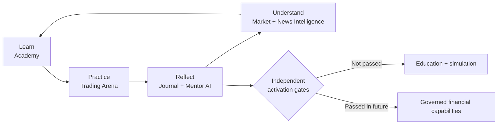
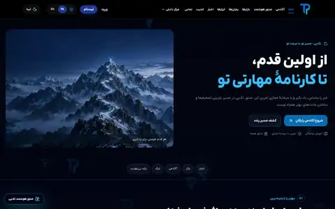
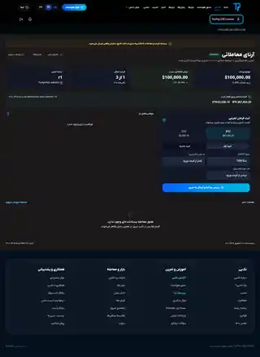
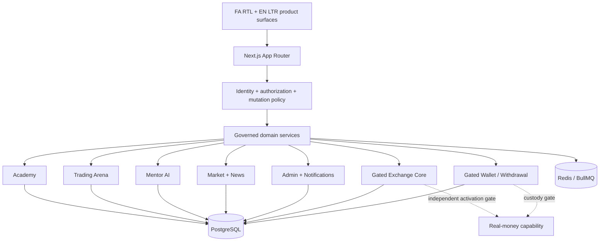

<div align="center">


# TecPey

### Digital Financial Education & Trading Operating System

**Learn with context. Practice with discipline. Activate with evidence.**

**«تک‌پی، نقطه امن ورود به بازار رمزارز»**

[Website](https://tecpey.ir) · [Architecture](./docs/architecture/SERVER_SIDE_SOURCE_OF_TRUTH.md) · [Security](./SECURITY.md) · [Launch Governance](./docs/launch/CONTROLLED_SOFT_LAUNCH_GO_NO_GO_CHECKLIST.md) · [فارسی](./README.fa.md)

`Education-first` · `Virtual trading` · `AI-assisted learning` · `PostgreSQL authority` · `FA RTL + EN LTR` · `Evidence-gated activation`

</div>

> [!IMPORTANT]
> **TecPey is under controlled launch hardening.** Trading Arena uses simulated capital. Real-money Exchange, custody, deposits and withdrawals are separate gated capabilities and are **not represented here as active production services**. In TecPey, implementation ≠ CI proof ≠ staging proof ≠ operational approval ≠ production activation.

## One Product Loop, Not a Collection of Crypto Features

Most crypto journeys are fragmented: people learn in one place, watch markets somewhere else, practice without structured feedback, and eventually reach high-risk execution with little continuity between knowledge, behavior and action.

TecPey is being built around a different loop:


```mermaid
flowchart LR
    A[Learn\nAcademy] --> B[Practice\nTrading Arena]
    B --> C[Reflect\nJournal + Mentor AI]
    C --> D[Understand\nMarket + News Intelligence]
    D --> A
    C --> E{Independent\nactivation gates}
    E -->|Not passed| F[Education + simulation]
    E -->|Passed in future| G[Governed financial capabilities]
```

Academy builds knowledge. Trading Arena turns knowledge into controlled practice. Mentor AI connects learning and practice context to reflection. Market and News surfaces add timely context. Higher-risk financial capabilities remain behind independent technical, operational, custody, compliance and jurisdictional gates.

That continuity is the product thesis: **a financial learning system that can grow with the user without pretending that every future capability is already live.**

## Real Product, Real Evidence

The screenshots below are **actual TecPey browser captures**, not mockups, concept art or reconstructed marketing screens. They were captured by the governed Public Browser Golden Path for the exact head of merged PR #642 (`c28ec91f397fb4f1580d2b6d2499d867c176fa77`). The full-resolution CI artifact and provenance are documented in [`docs/assets/screenshots/showcase/PROVENANCE.md`](./docs/assets/screenshots/showcase/PROVENANCE.md).

### The guided entry experience

<p align="center">
  
</p>

The current landing experience frames TecPey as a guided growth journey—not an exchange-first funnel. The bilingual experience connects Academy, Mentor, virtual practice, market context and the longer learning path while keeping real-money capabilities truthfully gated.

### Practice without customer-fund exposure

<p align="center">
  
</p>

Trading Arena is a simulation environment backed by server-side authority for virtual accounts, balances, attempts, positions, orders and executions. Its job is to create a serious place to practice execution and review decisions—not to manufacture performance claims.

> The source CI artifact also contains full-resolution Academy, Mentor, authentication, responsive, light/dark and FA/EN captures. We intentionally keep the root README focused; the evidence manifest points reviewers to the exact originals.

## Built for Three Audiences

<table>
<tr>
<td width="33%" valign="top">

### For learners

A coherent path from **understanding → practice → reflection**.

- structured Academy progression
- quizzes, assessments, challenges and certificates
- virtual Trading Arena
- Mentor AI with authorized learning/practice context
- market and News intelligence designed to support understanding
- security/account flows that belong to the same product journey

</td>
<td width="33%" valign="top">

### For partners & investors

A platform thesis with multiple expansion surfaces around one governed user journey.

- education and premium learning
- AI-assisted mentorship
- simulation and advanced practice
- multilingual market intelligence
- enterprise/white-label foundations
- developer ecosystem direction
- financial infrastructure only after independent activation gates

No revenue, market-share or regulatory-readiness claim is implied by this roadmap.

</td>
<td width="33%" valign="top">

### For engineers

Named authorities and explicit failure boundaries instead of UI-only product claims.

- PostgreSQL-backed critical state
- server-authoritative simulation
- idempotency and decimal-safe financial paths
- tenant/RLS foundations
- audit and sensitive-mutation controls
- exact-head CI and browser evidence
- progressive capability activation

</td>
</tr>
</table>

## Product Pillars

### 01 — TecPey Academy

Academy is the learning foundation: term-based education, lessons, quizzes, assessments, flashcards, challenges, simulations, achievements, certificates and progression. Canonical progress and assessment paths are backed by server-side persistence rather than browser storage as the source of truth.

The Academy is designed to do more than publish content. It creates structured evidence of learning that can inform Mentor context and future practice experiences. Not every route has equal maturity and broader language parity remains an active program; the repository does not hide that distinction.

### 02 — Trading Arena

Trading Arena is **virtual practice**, not real-money trading. The governed core owns virtual accounts, balances, attempts, positions, orders, executions, fees and revisions on the server. Simulated balances and outcomes are educational evidence, not customer assets or promises of return.

The longer-term Arena direction includes richer replay, scenario, journal, league and analytics experiences while preserving the distinction between simulation evidence and real financial performance. See [`docs/arena/TRADING_ARENA_UI_AUTHORITY.md`](./docs/arena/TRADING_ARENA_UI_AUTHORITY.md).

### 03 — Mentor AI

Mentor is the intelligence and reflection layer. Its role is to explain, continue a learning conversation and help users inspect authorized learning, practice and behavioral context. Provider access stays behind server boundaries and memory/context is subject to privacy and consent controls.

Mentor is **not** positioned as an autonomous financial adviser, signal seller, prediction engine or trade executor. The broader multi-provider TecPey AI operating layer remains an active engineering program, not a completed enterprise claim. See [`docs/MENTOR_AI_MODEL.md`](./docs/MENTOR_AI_MODEL.md).

### 04 — Market & News Intelligence

TecPey is evolving its public experience into a source-backed discovery layer for crypto market context, News, coins and tools. The governing direction preserves provenance, freshness, entities, canonical routes and internal learning connections rather than creating an opaque content feed.

Live-source quality, translation, media rights, publication authority and indexing behavior are operational concerns and must be evidenced independently in staging.

### 05 — Governed Financial Core

The repository contains meaningful engineering for order admission, holds, matching, trades, fees, ledgers, withdrawal pipelines, reconciliation and audit evidence. Those foundations matter because they establish financial-domain boundaries early.

They do **not** authorize customer-fund operation. Production Exchange, custody, deposits and withdrawals remain disabled until their own custody, compliance, provider, reconciliation, recovery and operational gates are approved. See [`docs/WALLET_ENGINE.md`](./docs/WALLET_ENGINE.md) and the controlled launch checklist.

## Why the Architecture Matters


```mermaid
flowchart TB
    UX[FA RTL + EN LTR product surfaces] --> APP[Next.js App Router]
    APP --> IAM[Identity + authorization + mutation policy]
    IAM --> DOMAIN[Governed domain services]

    DOMAIN --> ACA[Academy]
    DOMAIN --> ARENA[Trading Arena]
    DOMAIN --> AI[Mentor AI]
    DOMAIN --> NEWS[Market + News]
    DOMAIN --> ADMIN[Admin + Notifications]
    DOMAIN --> EX[Gated Exchange Core]
    DOMAIN --> WALLET[Gated Wallet / Withdrawal]

    ACA --> PG[(PostgreSQL)]
    ARENA --> PG
    AI --> PG
    NEWS --> PG
    ADMIN --> PG
    EX --> PG
    WALLET --> PG
    DOMAIN --> REDIS[(Redis / BullMQ)]

    EX -. independent activation gate .-> REAL[Real-money capability]
    WALLET -. custody gate .-> REAL
```

TecPey uses Next.js App Router and TypeScript domain services in the deployable runtime. PostgreSQL is the durable authority for critical state; Redis/BullMQ provides governed coordination and queues. Production migrations and runtime activation remain operationally separate actions.

### Engineering principles

| Principle | What it means in TecPey |
|---|---|
| **Server-side source of truth** | Critical user, simulation and financial state belongs to governed backend authorities |
| **Fail closed** | Missing authorization, persistence, pricing, provider, reconciliation or readiness evidence must not silently become success |
| **Progressive activation** | Education, simulation, financial execution, custody and enterprise operation have separate gates |
| **Evidence-driven delivery** | Exact-head CI, browser evidence, security manifests and operational drills define readiness |
| **Privacy & consent** | AI memory, behavioral context, notifications and community evidence are purpose-bound and authorized |
| **Tenant isolation direction** | Tenant-scoped data is enrolled in isolation policy; complete enterprise runtime authority is still an active program |
| **Multilingual UX** | Persian RTL and English LTR are first-class product surfaces; broader localization is an active direction |
| **Truthful claims** | Code existence is never used as proof of customer activation |

## Investor & Strategic Partner View

TecPey’s strategic value is not based on adding more unrelated crypto tabs. It comes from **compounding context across a governed lifecycle**: what a user learns can shape practice; practice can shape reflection; reflection can guide the next learning step; market context can connect back to the curriculum.

That architecture creates several potential business surfaces without requiring a premature real-money launch: premium education, advanced Mentor experiences, richer simulation, market intelligence, enterprise delivery and—only where the independent requirements permit—regulated financial capabilities.

The defensibility thesis is therefore operational as much as visual: persistent learning/practice state, consent-aware intelligence, release evidence, security boundaries and progressive activation are harder to reproduce responsibly than a collection of frontend features. This is a product and engineering thesis, **not a claim of present commercial scale, regulatory approval or future returns**.

## Security, Governance & Operational Discipline

TecPey treats financial capability as a security boundary. The repository includes session/auth foundations, CSRF controls, TOTP/passkey paths, privileged administration controls, audit logging, sensitive-mutation policy, tenant-isolation policy, secret scanning and dedicated financial authority tests.

Just as importantly, the project records what is **not yet proven**. Production custody requires approved non-exportable signing infrastructure and operational evidence. Complete multi-tenant runtime isolation, full privileged-route separation of duties, enterprise control-plane depth and broader AI governance remain active programs rather than finished claims.

Useful review paths:

- [`SECURITY.md`](./SECURITY.md)
- [`docs/architecture/SERVER_SIDE_SOURCE_OF_TRUTH.md`](./docs/architecture/SERVER_SIDE_SOURCE_OF_TRUTH.md)
- [`docs/security/ADMIN_CONTROL_PLANE_SECURITY_STANDARD.md`](./docs/security/ADMIN_CONTROL_PLANE_SECURITY_STANDARD.md)
- [`docs/launch/CONTROLLED_SOFT_LAUNCH_GO_NO_GO_CHECKLIST.md`](./docs/launch/CONTROLLED_SOFT_LAUNCH_GO_NO_GO_CHECKLIST.md)

## Controlled Launch Boundary

| Capability | Current intended boundary |
|---|---|
| Public landing | **Included** |
| Persian / English public experience | **Controlled** |
| Academy | **Controlled** |
| Mentor AI | **Controlled** — provider/configuration dependent |
| Trading Arena | **Controlled simulation** — virtual capital |
| Market & News | **Controlled** — runtime freshness/publication evidence required |
| Real-money Exchange | **Disabled** |
| Custody | **Disabled** |
| Deposits / Withdrawals | **Disabled** |
| Public financial rewards | **Gated** |
| Community | **Limited governed scope** |
| Multi-tenant / white-label | **Active post-launch engineering direction** |
| Public Developer Platform | **Planned** |
| Broader TecPey AI Operating System | **Active program, not a completed subsystem** |

## Current Evidence Snapshot — 2026-09-13

The current repository baseline for this Showcase is `main@c4751708ae6c1d2f2877ed64e7de36e5b963a045`, which merged the bilingual growth-story landing in PR #642.

The source product head for the screenshots and final browser evidence is `c28ec91f397fb4f1580d2b6d2499d867c176fa77`. On that exact head, the following governed workflows completed successfully before merge:

- CI
- Public Browser Golden Path
- Full Suite Diagnostics
- Repository Audit Manifest
- API Security Manifest
- Sensitive Mutation Audit
- Full History Secret Scanning
- AI Tenant RLS Runtime Evidence

That is strong evidence for the accepted change; it is **not a substitute for current protected-staging evidence or final launch approval**. The canonical release decision remains [`docs/launch/CONTROLLED_SOFT_LAUNCH_GO_NO_GO_CHECKLIST.md`](./docs/launch/CONTROLLED_SOFT_LAUNCH_GO_NO_GO_CHECKLIST.md).

## Explore the Engineering

```bash
npm ci
npm run lint
npm run typecheck
npm test
npm run build
```

A green local build is not sufficient for a protected change. Review exact-head GitHub checks and the relevant staging/runtime evidence for the domain being changed.

Start here:

- [Server-side source of truth](./docs/architecture/SERVER_SIDE_SOURCE_OF_TRUTH.md)
- [Trading Arena authority](./docs/arena/TRADING_ARENA_UI_AUTHORITY.md)
- [Admin control-plane security](./docs/security/ADMIN_CONTROL_PLANE_SECURITY_STANDARD.md)
- [Wallet engine](./docs/WALLET_ENGINE.md)
- [Mentor AI model](./docs/MENTOR_AI_MODEL.md)
- [Verified screenshot provenance](./docs/assets/screenshots/showcase/PROVENANCE.md)

## Responsible Disclosure

Please do not disclose vulnerabilities through public issues. Follow [`SECURITY.md`](./SECURITY.md) for the responsible disclosure path.

---

<div align="center">

### TecPey

**Education first. Practice before exposure. Evidence before activation.**

</div>
