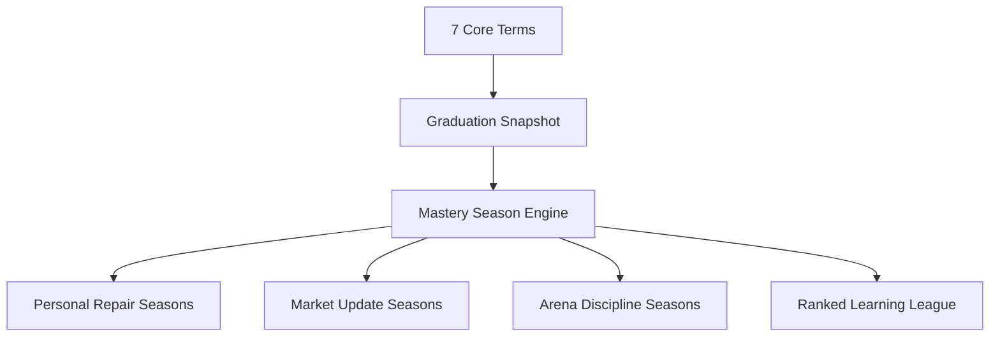

# TecPey Infinite Academy & Mastery Seasons Blueprint

**Status:** Official product authority  
**Date:** 2026-08-11  
**Scope:** Academy, Mentor AI, Trading Arena, Community Ranking, Revenue Strategy  
**Classification:** Permanent Academy Learning System Contract  

---

## 1. Executive Decision

TecPey Academy must not end when the learner finishes the 7 core terms.

The 7 terms remain the canonical, certifiable, finite foundation. After Term 7, TecPey opens an ongoing adaptive layer named **Mastery Seasons**: personalized, time-boxed, evidence-driven learning seasons generated from the learner's weak areas, market changes, Mentor AI observations, Trading Arena behavior, and new world-relevant crypto topics.

This turns TecPey Academy from a static course into a living education operating system.

**Permanent rule:** Core Academy completion is a graduation moment, not the end of learning.

---

## 2. Product Thesis

Most crypto education products fail in one of three ways:

1. They publish articles but do not verify competence.
2. They use gamification to drive clicks, not durable skill.
3. They finish the course exactly when the learner needs guided practice most.

TecPey's advantage is to combine:

- structured 7-term Academy;
- assessment-gated mastery;
- Mentor AI coaching;
- Trading Arena practice;
- behavioral safety scoring;
- adaptive post-graduation seasons;
- discipline-weighted ranking.

The learner should feel: "TecPey understands where I am weak and gives me the next useful challenge."

---

## 3. Learning Science Foundation

Mastery Seasons are grounded in evidence-backed learning models, adapted for financial education where overconfidence can be dangerous.

| Model | TecPey Application |
| --- | --- |
| Mastery Learning | Learners must demonstrate competence before higher-risk topics unlock. Weak areas generate repair seasons. |
| Retrieval Practice | Seasons rely on recall, scenario answers, journal reflection, and applied quizzes rather than passive rereading. |
| Spaced Repetition | Concepts missed in quizzes, flashcards, Mentor sessions, and Arena journals return across days/weeks. |
| Interleaving | Seasons mix security, risk, psychology, analysis, and market context so learners do not overfit to one lesson type. |
| Desirable Difficulty | Challenges become harder only when the learner shows readiness; difficulty creates effort, not humiliation. |
| Self-Determination Theory | The system supports autonomy, competence, and relatedness through choice, visible growth, and fair cohort leagues. |
| Flow | Missions should sit near the edge of learner ability: hard enough to feel meaningful, clear enough to finish. |

---

## 4. System Shape

The engine does not replace the curriculum. It extends it.

---

## 5. Core Academy vs Mastery Seasons

| Layer | Duration | Purpose | Certificate | Price Decision |
| --- | --- | --- | --- | --- |
| Core Academy | Finite, 7 terms | Safe entry foundation | Term certificates + graduation | Free by default |
| Repair Seasons | Adaptive, recurring | Fix weak concepts and behavioral risk | Season completion badge | Free initially |
| Market Update Seasons | Weekly/monthly | Teach new risks, tools, coins, regulations, narratives | Season badge | Pricing pending |
| Arena Discipline Seasons | Monthly cycles | Convert learning into risk-aware practice | Arena readiness badge | Pricing pending |
| Pro Mastery Seasons | Ongoing | Advanced AI, deeper analytics, cohort league, premium labs | Advanced badges/certificates | Pricing pending |

**Revenue lock:** Pricing must not be finalized before usage, retention, completion, AI cost, and learner value evidence are collected. The first implementation must optimize trust and learning value, not monetization.

---

## 6. Mastery Season Types

### 6.1 Personal Repair Season

Generated when a learner shows repeated weakness in a concept.

Signals:

- quiz accuracy below threshold;
- repeated wrong answers with high confidence;
- long hesitation before answers;
- repeated hint requests;
- Mentor AI confusion topics;
- flashcard misses;
- term final weak domain.

Examples:

- Risk Repair: position sizing, stop-loss, expectancy.
- Security Repair: seed phrase, phishing, transfer networks.
- Analysis Repair: support/resistance, RSI, volume, invalidation.
- Psychology Repair: FOMO, revenge trading, hesitation, overconfidence.

### 6.2 Market Update Season

Generated from important market, tool, coin, security, regulation, or macro updates.

Signals:

- curated platform news;
- coin/tool growth automation;
- high-impact security events;
- recurring user questions;
- Mentor AI observed topic demand.

Examples:

- "ETF narrative and market structure."
- "Stablecoin depeg risk refresher."
- "New wallet-drainer attack pattern."
- "AI tools for research, with trust boundaries."

### 6.3 Arena Discipline Season

Generated from simulated decision behavior.

Signals:

- stop-loss violations;
- oversized simulated positions;
- missing journal entries;
- revenge-trade pattern;
- frequent entries during low-quality setups;
- improvement/regression in Trading DNA dimensions.

Examples:

- "No-trade discipline week."
- "Position-size reset."
- "Journal before entry."
- "Risk-first challenge."

### 6.4 Cohort League Season

Time-boxed competition among comparable learners.

Rules:

- learners compete only inside comparable levels/cohorts;
- opt-in visibility is required;
- ranking cannot use real P&L;
- ranking cannot reward raw speed alone;
- discipline, accuracy, consistency, improvement, and journal quality matter more than volume.

---

## 7. Personalized Season Generation

The engine should evaluate learner signals through a transparent scoring contract:

| Signal | Meaning | Season Reaction |
| --- | --- | --- |
| Fast wrong answer | Overconfidence | Short explanation, confidence recalibration, harder concept check later |
| Slow wrong answer | Confusion | Smaller lesson unit, hint ladder, Mentor explanation |
| Slow correct answer | Productive effort | Reinforcement and spaced follow-up |
| Repeated hint use | Concept fragility | Repair micro-season |
| Arena rule violation | Behavioral risk | Arena discipline season |
| Journal missing | Low reflection | Journal challenge |
| News topic interest | Curiosity | Market update season |
| Post-Term 7 completion | Readiness for lifelong path | Mastery Seasons unlock |

---

## 8. Mission Anatomy

Every season contains missions, and every mission must contain:

1. Learning hook.
2. Micro-lesson or refresher.
3. Retrieval question.
4. Scenario decision.
5. Timed challenge only when appropriate.
6. Mentor AI feedback.
7. Reflection/journal prompt.
8. Spaced follow-up item.

Timers are allowed, but must be used responsibly:

| Context | Timer Policy |
| --- | --- |
| First learning exposure | No timer |
| Low-stakes practice | Soft timer |
| Challenge | Real timer |
| Final assessment / Arena readiness | Strict timer |

---

## 9. Ranking Contract

Ranking must be motivational without pushing unsafe market behavior.

Allowed scoring dimensions:

- assessment accuracy;
- mastery improvement;
- consistency;
- journal quality;
- rule compliance;
- completed repair work;
- Mentor-reviewed reflection;
- Trading DNA discipline dimensions;
- community contribution after consent.

Forbidden ranking dimensions:

- real exchange profit/loss;
- raw trade volume;
- leverage;
- risky frequency;
- amount of money deposited;
- paid-plan advantage;
- speed without correctness.

**Permanent rule:** TecPey must never rank learners by real financial profit.

---

## 10. TP Progress Core

The official TecPey mark becomes the learner's **Progress Core**:

- Core Academy completion lights the base TP mark.
- Repair Seasons add stabilized rings.
- Market Update Seasons add active knowledge pulses.
- Arena Discipline Seasons add shield/risk-control layers.
- Cohort League Seasons add temporary season bands.
- Advanced mastery adds permanent prestige layers.

This must stay elegant and financial-grade. No childish badge overload. The logo should feel more capable over time, not visually noisy.

---

## 11. Mentor AI Role

Mentor AI is the personalization layer, but not the authority for certification.

Mentor AI may:

- summarize weak concepts;
- explain mistakes Socratically;
- recommend next missions;
- produce review plans;
- generate safe practice prompts;
- draft new source-backed Mastery Seasons as untrusted candidates;
- identify confidence mismatch;
- encourage reflection.

Mentor AI must not:

- issue certificates alone;
- publish a generated Season directly into the official catalog;
- promise profit;
- give buy/sell signals;
- override server-backed progress;
- use real-exchange signals without explicit governed consent;
- expose another learner's data.

---

## 12. Data Authority

All authoritative Mastery Season state must be server-backed.

Authoritative data:

- season assignment;
- season progress;
- mission completion;
- assessment results;
- leaderboard score;
- ranking visibility consent;
- Mentor-derived recommendations;
- Trading Arena discipline signals.

Browser state may only be used for temporary UI convenience. It is not the source of truth.

---

## 13. AI Season Generation Safety Contract

Generated Seasons are treated as untrusted drafts, even when they are produced by TecPey Mentor AI.

Publication requires all of the following:

- at least two trusted HTTPS sources;
- measurable learning objectives;
- at least three missions;
- a validated question bank with challenging questions;
- explicit risk controls;
- no profit promises, price predictions, buy/sell signals, leverage culture, or paid-plan/rich-user ranking inputs;
- server-side review summary stored with the draft;
- human approval before catalog publication.

The automation may create `review_ready` drafts. It may not directly publish official curriculum.

---

## 14. Implementation Phases

### Phase A — Product Contract and Static Experience

- Add this blueprint.
- Add season catalog and recommendation rules.
- Add public Academy page explaining Mastery Seasons.
- Add tests for ranking safety and recommendation determinism.

### Phase B — Server-Backed Season Assignment

- Add database tables for learner season assignments.
- Store mission completion and progress by tenant/user.
- Add idempotent API for assigned seasons.
- Connect Academy profile dashboard.

### Phase C — Governed AI Season Drafting

- Add AI-generated Season draft validator.
- Store draft/review evidence by tenant/workspace.
- Reject unsourced, malformed, hype-driven, signal-like, or unscorable generated content.
- Require human approval before official catalog publication.

### Phase D — Mentor and Arena Integration

- Feed quiz, flashcard, lesson, Mentor, and Arena signals into the season engine.
- Generate repair seasons from weak concepts.
- Add Mentor explanations and reflection prompts.

### Phase E — Dynamic Market Update Seasons

- Connect curated news, coin growth, and tool growth automation.
- Generate governed market update seasons with source evidence.
- Add editorial approval for sensitive topics.

### Phase F — Ranked Learning Leagues

- Add opt-in cohort leagues.
- Enforce anti-profit ranking.
- Add seasonal rewards and Hall of Fame surfacing.

### Phase G — Revenue Experiment

- Decide pricing only after evidence.
- Keep Core Academy free.
- Consider paid features only where they add real marginal value: advanced AI, advanced analytics, premium labs, private cohort, enterprise/white-label seasons.

---

## 15. Initial Pricing Principle

No final price is set in this document.

The default strategy is:

- Core Academy: free.
- First repair seasons: free.
- Basic market update seasons: free or freemium.
- Advanced AI-personalized seasons: candidate for subscription.
- Advanced Arena analytics and cohort leagues: candidate for subscription.
- Enterprise/white-label mastery seasons: paid B2B license.

Pricing must be decided with evidence, not guesswork.

---

## 16. Acceptance Criteria

Mastery Seasons are considered ready for first controlled release only when:

- the learner can see why a season was recommended;
- the season does not rely on browser-only state as authority;
- ranking excludes real P&L and paid-plan advantage;
- Mentor AI language remains educational and risk-aware;
- weak areas produce actionable repair missions;
- the 7-term Core Academy remains free and intact;
- telemetry can measure learning value without invasive behavior.

---

## 17. Canonical Product Statement

TecPey Academy is not a course library. It is a lifelong learning operating system for safer crypto participation.

The learner graduates from the 7-term foundation, then enters adaptive Mastery Seasons that continuously repair weaknesses, respond to market changes, and build disciplined decision-making without promoting gambling, leverage culture, or profit-chasing.
