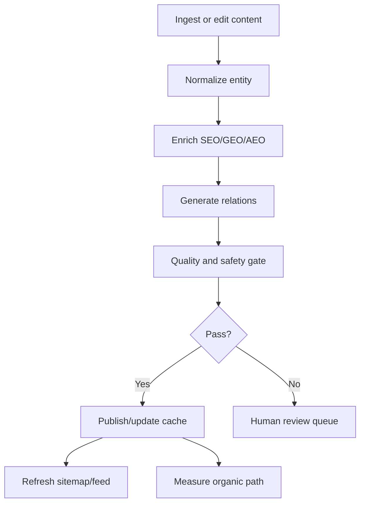

# TecPey Content Growth Automation Contract

**Status:** Execution contract for the next growth and UI/UX PRs
**Date:** 2026-08-09
**Owner:** Growth, Academy, Platform Engineering, Frontend, AI Platform
**Related strategy:** `docs/DISCOVERABILITY_STRATEGY.md`
**Route inventory:** `docs/architecture/TECPEY_ORGANIC_GROWTH_ROUTE_INVENTORY.md`
**UI foundation:** `docs/ui/TECPEY_DESIGN_SYSTEM_FOUNDATION.md`

## Executive Intent

TecPey must become the Persian-first and global answer destination for searches about crypto education, coins, market news, trading tools, Trading Arena practice and AI Mentor guidance. This is not a blog add-on. It is a platform loop:

1. ingest useful market, coin, tool and Academy content;
2. normalize it into durable entities;
3. enrich it with SEO, GEO, AEO and structured-data metadata;
4. connect it to related TecPey pages;
5. publish only after quality, safety and brand gates pass;
6. refresh discovery surfaces, sitemaps and AI-readable feeds;
7. measure organic acquisition and use the evidence to improve ranking.

The system must not chase traffic with thin pages, hype, financial advice, copied source text or keyword stuffing. Every public page must be useful to a human learner first and machine-readable second.

## Non-Negotiable Product Rules

- Persian content is first-class, not a translated afterthought.
- English/global content must have professional parity where a page is public and strategic.
- The official TP blue/cyan identity remains the visual anchor across public pages, Academy, Arena, news, coins, tools and English routes.
- New public content is not published until SEO/GEO/AEO metadata, canonical URL, hreflang policy, structured data and internal relations are generated or intentionally waived.
- AI-generated or AI-assisted content requires validation against factuality, source attribution, duplicate detection, financial-advice policy and TecPey editorial tone.
- News and market-intelligence modules must be educational and risk-aware. They may not tell users to buy, sell, hold or chase a coin.
- Automation publishes only content that passes objective gates. Ambiguous, high-risk or regulatory-sensitive content enters human review.
- All content state, ranking evidence and publication decisions must be server-side and auditable.

## Capability Preservation Ledger

This table is the scope ledger for the coming PR sequence. A future PR that touches these surfaces must either implement the row, explicitly defer it with a reason, or cite the row as unaffected.

| Capability | Required Outcome | First Execution PR |
| --- | --- | --- |
| Unified UI/UX identity | All page families use TP brand tokens, shared layout primitives, RTL/LTR rules, accessible states and restrained motion from `docs/ui/TECPEY_DESIGN_SYSTEM_FOUNDATION.md`. | `agent/design-system-brand-foundation` |
| Persian and English discovery | Every strategic page has locale-specific metadata, canonical/hreflang and culturally correct copy. | `agent/seo-geo-aeo-public-surfaces` |
| Automated SEO/GEO/AEO | New or updated content passes metadata, schema, FAQ/AEO answer and internal-link generation before publication. | `agent/content-optimization-pipeline` |
| Coin-news priority row | Coin hub surfaces the top five coins affected by fresh high-priority news, refreshed on a ten-minute target cadence. | `agent/news-coin-priority-surface` |
| Coin detail enrichment | Each coin page shows profile, official links, risk context, related news, related lessons, FAQs and structured data. | `agent/coin-entity-content-depth` |
| News hub and detail routing | News hub, news cards and impact history link to canonical TecPey news detail pages, not only external sources or ephemeral feed items. Seed impact history now has FA/EN hub evidence, detail routes, CollectionPage/ItemList/NewsArticle schema and sitemap entries. | `agent/news-detail-entity-pages` |
| Tool discovery | Tools page shows five featured/new flagship tools, then ranked tools by usefulness, safety and popularity. | `agent/tools-ranking-detail-pages` |
| Tool detail and iframe | Tool detail pages include official site, download links, safety note, education context and safe iframe with fallback when blocked. | `agent/tools-ranking-detail-pages` |
| Academy depth | Terms, lessons and quizzes become complete, citable, linked to coins/tools/news and connected to Mentor signals. | `agent/academy-content-depth-term-by-term` |
| News-driven quizzes | High-quality news items can generate validated quiz prompts without allowing untrusted feed content into exams. | `agent/academy-news-quiz-governance` |
| Trading Arena realism | Market data abstraction, symbol coverage, chart datafeed and execution state become aligned and evidence-backed. | `agent/arena-market-data-maturity` |
| Mentor AI memory | Provider-backed Mentor writes durable evidence, retrieves authorized memory and reuses prior incident/problem patterns. | `agent/mentor-ai-operating-memory` |
| my.tecpey account separation | Public UI clearly states Academy account and temporary exchange account are separate until identity bridge exists. | `agent/account-boundary-ux-clarity` |
| Organic acquisition measurement | Content pages emit privacy-safe analytics for impressions, clicks, rankings, referrals and conversion paths. | `agent/growth-measurement-foundation` |

## Content Entity Model

The implementation should formalize these contracts before page rewrites:

| Entity | Purpose | Required Fields |
| --- | --- | --- |
| `ContentItem` | Common publication state for all discoverable content | id, type, locale, slug, title, status, canonicalUrl, publishedAt, updatedAt, revision |
| `SeoProfile` | Search and answer-engine metadata | title, description, canonical, hreflang, og, schemaTypes, faqAnswers, llmSummary |
| `EntityRelation` | Internal graph between pages | fromType, fromId, toType, toId, relationType, confidence, editorialWeight |
| `CoinEntity` | Coin profile and discovery target | symbol, slug, names, officialLinks, riskFlags, marketImportance, contentCompleteness |
| `NewsArticle` | Canonical TecPey news item | source, sourceUrl, headline, summary, language, symbols, impact, urgency, sourceTrust, canonicalStatus |
| `NewsCoinImpact` | News-to-coin ranking evidence | newsId, symbol, confidence, impactScore, freshnessScore, severity, expiresAt |
| `NewsImpactHistory` | Auditable news evidence shown on coin/tool detail pages | newsId, locale, relatedCoins, relatedTools, title, summary, source, publishedAt, recordedAt, priority, impactScore, reason |
| `NewsAutomationDecision` | Fail-closed decision envelope for any ingested news item | status, reasons, normalized article, SEO profile, relations, coin impacts, history items, idempotencyKey |
| `ToolEntity` | Trading/research/toolbox entry | name, slug, category, officialUrl, appLinks, iframePolicy, safetyScore, beginnerUsefulness, proUsefulness |
| `LessonEntity` | Academy learning unit | term, lesson, locale, prerequisites, concepts, relatedCoins, relatedTools, relatedNews |
| `QuizEntity` | Assessment unit | lessonId, question, answers, explanation, difficulty, sourceType, validationStatus |

## Publication Pipeline



### Stage 1 — Ingest

Allowed sources:

- internal Academy/editorial authoring;
- approved RSS/news feeds;
- official coin/project websites, docs and whitepapers;
- official tool websites and app-store pages;
- platform-owned Trading Arena, Mentor and learner-event summaries when privacy policy allows;
- manual editorial curation for high-stakes or regulatory topics.

Disallowed sources:

- copied article bodies without permission;
- social rumor summaries as factual claims;
- hidden affiliate pages presented as neutral education;
- AI-generated pages without source and quality evidence.

### Stage 2 — Normalize

Every item is converted into a typed entity with locale, status, source, update time and ownership. Unknown fields stay out of the public page until validated.

The first code-level contract is `src/lib/news-automation.ts`. It is intentionally pure: no fetch, no DB writes and no hidden side effects. Feed/API/jobs can pass a raw item into the contract and receive a deterministic `NewsAutomationDecision` containing the normalized article, source trust, detected coins/tools, related Academy path, ranking evidence, history items and publish/review/reject reasons. Later database persistence must preserve the same decision envelope.

Runtime bridge: `/api/crypto-news?automation=1` keeps the existing news response intact and adds an opt-in `automation` payload for QA, future workers and admin dashboards. Public UI must not depend on unapproved automation output until persistence and materialized ranking tables exist.

Materialization bridge: `src/lib/news-materialization.ts` converts publishable `NewsAutomationDecision` output into the durable shape that workers persist: deduped `NewsImpactHistory` items, canonical news slugs, sitemap entries, top news-led coins and decision summaries. The API response remains explicitly `ephemeral_contract`; it is safe for QA and admin inspection, but public ranking and sitemap generation must rely on persisted evidence. Persistence authority is now defined by migration `0058_news_materialization_authority.sql` and `src/lib/news-materialization-persistence.ts`: snapshots, history items and snapshot-item links are append-only, idempotency-keyed and hash-verified before a replay is accepted. The scheduled execution entrypoint is `npm run news:materialization:worker`, backed by `scripts/run-news-materialization-worker.ts` and `src/lib/news-materialization-worker.ts`; it fetches approved feeds, builds the materialized snapshot and persists each locale in its own transaction. Scheduler guardrails are now first-class: `npm run news:materialization:env-check` validates required production settings, `npm run news:materialization:install` renders and installs the governed systemd service/timer, `deploy/systemd/tecpey-news-materialization.service.in` and `.timer` define the ten-minute host schedule, successful and partial runs emit append-only `platform_operational_job_runs` evidence, and `TECPEY_OPS_STATE_DIR/news-materialization-last-run.json` records cache-freshness evidence for support handoff. The protected staging evidence path is governed by `.github/workflows/staging-news-materialization-evidence.yml`: it targets the GitHub `staging` environment on the `tecpey-staging` self-hosted runner, verifies the exact deployed `main` SHA, starts `tecpey-news-materialization.service`, verifies `news-materialization-last-run.json` through `npm run news:materialization:last-run:verify`, and uploads a redacted artifact plus digest. Public read-through is defined by `src/lib/news-impact-history-authority.ts`: persisted rows are merged over seeded history by locale/slug, so DB authority can add or override evidence without dropping seed-backed public routes when the database is unavailable or only partially populated.

Seed bridge: high-priority `NewsImpactHistory` items now generate canonical `/crypto-news` and `/en/crypto-news` hub evidence plus `/crypto-news/[slug]` and `/en/crypto-news/[slug]` detail pages through `src/lib/news-detail-pages.ts`. The hubs expose server-rendered evidence cards and CollectionPage/ItemList/FAQ/Breadcrumb schema. Detail pages preserve the public evidence trail with summary, source, publish time, TecPey record time, priority, impact score, related coins, related tools, related Academy path, no-advice framing, NewsArticle/Breadcrumb/FAQ schema and sitemap entries. Hub pages, detail pages, metadata, landing structured-data schemas, visible landing radar cards and dynamic sitemap now use the persisted PostgreSQL authority when available and fall back to seed history when it is not.

### Stage 3 — SEO/GEO/AEO Enrichment

Each public content update should produce:

- localized title and description;
- canonical URL;
- hreflang alternates when a counterpart exists;
- Open Graph and Twitter metadata;
- concise AEO answer block;
- FAQ candidates where genuinely useful;
- schema.org JSON-LD;
- `datePublished` and `dateModified`;
- internal links to related Academy, coin, news, tool and glossary pages;
- AI-readable summary that avoids advice or hype.

### Stage 4 — Quality and Safety Gate

The gate rejects or queues content when:

- title/description are missing or duplicate;
- generated text is too similar to a source article;
- a financial-advice phrase appears without educational framing;
- a coin page has no official source links;
- a tool page has no official URL or has suspicious download links;
- English content is thin or lower quality than the Persian original;
- schema is invalid or inconsistent with the visible page;
- the page cannot render a useful empty/degraded state.

Initial automated reject/review reasons are codified as:

- `missing_required_field`
- `unapproved_source`
- `low_source_trust`
- `invalid_published_at`
- `stale_news`
- `prohibited_financial_advice`
- `hype_or_profit_promise`
- `no_supported_entity`
- `missing_seo_schema`

Rejected items never create public `NewsImpactHistory`. Review-only items may be stored for audit, but they must not alter public coin/tool rankings until approved.

## Ranking Contracts

### Coin Priority Ranking

Target public behavior:

- The coin hub shows five priority coins at the top when fresh high-importance news exists.
- Target refresh cadence is ten minutes for ranking materialization.
- Pages serve cached server results and display `updatedAt`.
- Each priority card shows the coin, impact label, short news slice, source/time, and a link to the TecPey news detail page.
- Coin detail pages preserve high-priority related news with `publishedAt` and TecPey `recordedAt`, so users can audit why a coin was highlighted.

Initial scoring:

```text
coinPriorityScore =
  freshnessScore * 0.25 +
  newsImpactScore * 0.25 +
  symbolConfidence * 0.15 +
  sourceTrust * 0.10 +
  marketImportance * 0.10 +
  learningRelevance * 0.10 +
  editorialWeight * 0.05
```

Decay rules:

- breaking/news urgency decays quickly after the first hour;
- evergreen educational relevance can remain on the coin page but should not keep a coin in the top-five breaking row;
- disputed or corrected news must be demoted and marked.

### Tool Ranking

Target public behavior:

- Top row: five featured/new flagship tools.
- Below: ranked tools with category filters, deep links, official links and safety context.
- Tool detail page can embed a safe iframe only when allowed by the target and by TecPey policy.
- If iframe is blocked, show a stable fallback with official external link.

Initial scoring:

```text
toolRankScore =
  featuredWeight * 0.16 +
  newsImpactScore * 0.10 +
  safetyScore * 0.20 +
  beginnerUsefulness * 0.15 +
  proUsefulness * 0.15 +
  categoryImportance * 0.10 +
  popularitySignal * 0.06 +
  officialLinkCompleteness * 0.05 +
  editorialWeight * 0.05
```

Tool detail pages must show the high-priority news items that materially influenced `newsImpactScore`, including publish time, TecPey record time, source, priority and the editorial reason.

## Page Family Requirements

| Page Family | Required Discovery Blocks |
| --- | --- |
| Landing | Brand promise, dual CTA, Organization schema, Academy/Arena/Mentor summaries, five news-led coins from high-priority impact history, five governed tools, high-signal FAQ |
| Coins hub | Priority news row, ranked coin list, glossary links, Academy path, FAQ schema |
| Coin detail | Official links, risk, tokenomics, latest related news, related lessons, related tools, Article/FAQ/Breadcrumb schema |
| News hub | Server-rendered canonical impact history, breaking/high-impact board, categories, related coin/tool/lesson relations, source policy, CollectionPage/ItemList schema |
| News detail | Summary, source attribution, related coins/tools/lessons, no-advice disclaimer, Article schema |
| Tools hub | Featured five, ranked list, filters, safety notes, deep-linkable cards |
| Tool detail | Official URL, app links, iframe/fallback, risk/security note, related lessons, FAQ/schema where useful |
| Academy term | Course/Lesson schema, term outcomes, quizzes, related coins/tools/news, Mentor loop |
| Lesson | Definition block, AEO answer, examples, quiz, glossary links, related news/tools |
| Trading Arena | Data source clarity, simulation disclaimer, chart/tool capabilities, Mentor and journal relation |
| Mentor | Provider/privacy explanation, memory controls, evidence boundary, no-advice policy |

## UI/UX Integration Rules

- Design-system tokens must be imported from one brand authority, not recreated per page.
- Public content pages should use dense, scannable modules: priority strips, ranked rows, entity cards and plain language summaries.
- Avoid nested cards and decorative panels that reduce scan speed.
- Cards must have loading, empty, error and stale-data states.
- All ranked surfaces need keyboard navigation, visible focus, accessible labels and 44px touch targets.
- RTL and LTR spacing must be verified separately.
- The TP mark must come from the governed runtime component or official asset path.
- Data-heavy pages should use tabular numbers and stable row heights to prevent layout shift.

## Automation and Jobs

The first implementation should avoid overbuilding, but the contract should support:

- `news.ingest` every ten minutes where infrastructure permits;
- `news.normalize` and `news.entity_link` after ingestion;
- `content.optimize` after any content mutation;
- `content.quality_gate` before public status changes;
- `ranking.materialize` for coin and tool surfaces;
- `sitemap.refresh` after public content changes;
- `growth.measure` for privacy-safe referral and conversion evidence.

All jobs must be idempotent. A retry must not duplicate content, relations, sitemap entries or analytics events.

The current foundation computes an article `idempotencyKey` from locale, canonical source URL, publish time and cleaned title. The scheduled worker computes a snapshot idempotency key as `crypto-news:materialize:{sourceMode}:{locale}:{fetchedAt}` and production persistence enforces it with a unique constraint, rejecting same-key/different-payload conflicts. Public hub/detail/metadata/sitemap, landing structured-data and visible landing radar reads now use the persisted PostgreSQL authority with seed fallback. Production scheduler wiring, operational run evidence and last-run cache freshness reporting are defined; the remaining work is staging/production execution proof with real `DATABASE_URL`, live feed reachability and an alert policy for repeated partial failures.

## AI Usage Policy

TecPey can use external model providers for summarization, AEO answer drafts, relation suggestions and Mentor responses only behind a server trust boundary.

Required evidence for AI-assisted content:

- provider/model/version or internal fallback path;
- prompt/policy template identifier;
- source IDs used for grounding;
- redaction status;
- output hash;
- quality-gate result;
- human review status when needed.

Future TecPey AI should learn from this evidence. That means repeated issues, rejected drafts, source quality problems and ranking anomalies must become retrievable operational memory.

## Measurement

Track privacy-safe metrics:

- organic search impressions and clicks by route and locale;
- AI/referral traffic where detectable;
- page-to-signup path;
- page-to-Academy-start path;
- page-to-Arena-start path;
- coin/news/tool internal-link CTR;
- content freshness and stale-page counts;
- quality-gate rejection reasons.

Do not track sensitive trading behavior for public growth analytics. Academy and Arena behavior belongs to the governed learner/Mentor data boundary.

## Acceptance Gates

Before a PR claims this contract is implemented for any page family:

- [ ] route inventory updated;
- [ ] Design System Foundation cited when the page is user-facing;
- [ ] content entity or file contract documented;
- [ ] metadata, canonical and hreflang covered;
- [ ] schema.org output validated;
- [ ] AEO block present where useful;
- [ ] Persian and English behavior stated;
- [ ] internal relations generated or manually curated;
- [ ] stale/empty/error UI states implemented;
- [ ] no financial advice/hype wording;
- [ ] sitemap/feed impact tested;
- [ ] accessibility and mobile checks documented;
- [ ] organic measurement hook defined or intentionally deferred.

## PR Sequence

1. `agent/design-system-brand-foundation`
2. `agent/growth-discovery-entity-model`
3. `agent/content-optimization-pipeline`
4. `agent/news-detail-entity-pages`
5. `agent/news-coin-priority-surface`
6. `agent/tools-ranking-detail-pages`
7. `agent/seo-geo-aeo-public-surfaces`
8. `agent/academy-content-depth-term-by-term`
9. `agent/arena-market-data-maturity`
10. `agent/mentor-ai-operating-memory`
11. `agent/growth-measurement-foundation`
12. `agent/page-by-page-ui-redesign`

This sequence keeps the platform coherent: brand first, data contracts second, automation third, then page-by-page UI/UX and content expansion.
