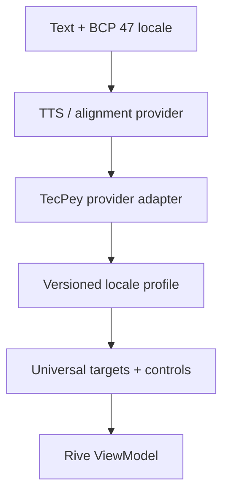

# TecPey Mentor — Multilingual Speech Rig Contract v1.0

**Status:** Phase 0 sign-off candidate
**Character:** `tecpey_mentor`
**Scope:** Global, provider-agnostic 2D lip sync in Rive
**Locale identifiers:** BCP 47
**Related contracts:** [Character Bible](./TECPEY_LIVING_MENTOR_CHARACTER_BIBLE_V1.md) · [Rive ViewModel](./RIVE_VIEWMODEL_CONTRACT_V1.md) · [Rive Rig Blueprint](./RIVE_RIG_BLUEPRINT_V1.md)

## 1. Executive decision

TecPey ships one global facial rig and versioned locale profiles. It does not ship a Persian rig, an English rig, or provider-specific mouth IDs inside the `.riv` asset.

The architecture has four boundaries:

1. a stable universal set of visual anchors in Rive;
2. continuous articulation controls for language-specific nuance;
3. versioned locale profiles that map IPA phonemes or provider events into the universal rig;
4. a client speech adapter that synchronizes targets to the audio clock.

Persian (`fa-IR`) and US English (`en-US`) are the first reference profiles. They prove the contract; they do not limit the supported-language roadmap. A language is not product-supported until its profile, voice, captions, pronunciation, code-switching, and native-listener gates pass.

## 2. Why the rig is language-neutral

- A viseme is a visible speech pose shared by multiple phonemes; phoneme-to-viseme mapping varies by locale.
- A fixed English table is not a universal pronunciation model.
- Meta's language-agnostic 15-target set is a useful coverage baseline, while continuous controls prevent the baseline from flattening distinctions such as rounded front vowels, interdental consonants, or locale-specific rhotics.
- Diphthongs and coarticulation are timed blends, not additional frozen drawings.
- Provider IDs are translated at the adapter boundary. They never become TecPey's public or Rive contract.

## 3. Universal visual-anchor registry

These IDs are stable TecPey identifiers. They are descriptive and provider-independent.

| Target ID | Visual family | Typical coverage |
|---|---|---|
| `sil` | Neutral/rest | Silence and safe fallback |
| `bilabial` | Closed/pressed lips | `/p b m/` and visually equivalent sounds |
| `labiodental` | Upper teeth to lower lip | `/f v/` |
| `interdental` | Controlled tongue-forward dental | `/θ ð/` and locale equivalents |
| `alveolar` | Tongue-tip/alveolar family | `/t d n l/` and related sounds |
| `velar` | Rear articulation, neutral lips | `/k g ŋ x ɣ q/` and related sounds |
| `postalveolar` | Mild rounding/protrusion | `/ʃ ʒ tʃ dʒ/` and related sounds |
| `sibilant` | Narrow gap, close teeth | `/s z/` and related sounds |
| `nasal_lateral` | Subtle open/raised tongue family | Locale-specific nasal/lateral distinctions |
| `rhotic` | Locale-profiled rhotic | Tap, trill, or approximant without a universal tongue caricature |
| `vowel_open` | Open vowel anchor | Open/front/back vowels refined by controls |
| `vowel_mid_front` | Mid-front anchor | `/e ɛ/` families |
| `vowel_close_front` | Close-front/wide anchor | `/i ɪ j/` families |
| `vowel_mid_back_round` | Mid-back rounded anchor | `/o ɔ/` families |
| `vowel_close_back_round` | Close-back rounded anchor | `/u ʊ w/` families |

If a locale cannot be represented acceptably by these anchors plus continuous controls, the profile fails closed. A new universal capability requires a contract-minor change, regression renders for existing locales, and a new `.riv` compatibility declaration.

## 4. Continuous articulation controls

The anchor selects a broad mouth family. These 0–1 controls supply the language and speaker nuance:

| Control | Purpose |
|---|---|
| `jawOpen` | Continuous jaw rotation/opening |
| `lipClose` | Aperture closure independent of jaw |
| `lipPress` | Bilabial compression |
| `lipWide` | Horizontal spread |
| `lipRound` | Lip rounding |
| `lipFunnel` | Forward protrusion/funneling |
| `lowerLipBite` | Labiodental tooth-to-lip contact |
| `tongueTipUp` | Internal alveolar/lateral/rhotic articulation |
| `tongueForward` | Bounded interdental visibility; zero forbids protrusion |

The rig artist authors safe deformation limits. Locale profiles can choose values only inside those limits and can never alter the nose, eye spacing, skull, beard boundary, or identity geometry.

## 5. Locale-profile contract

Each locale profile is machine-readable and validated by [`speech/locale-profile.v1.schema.json`](./speech/locale-profile.v1.schema.json).

Required profile properties:

- canonical BCP 47 `locale`;
- stable `profileId` and semantic `profileVersion`;
- IPA phoneme groups mapped to universal targets;
- optional continuous-control overrides;
- explicit draft/candidate/approved status;
- a fallback locale only for product copy/voice selection, never as silent pronunciation substitution.

Initial examples:

- [`fa-IR.v1.json`](./speech/locales/fa-IR.v1.json)
- [`en-US.v1.json`](./speech/locales/en-US.v1.json)

Both profiles are deliberately marked `draft`. Their normalized control values are calibration seeds for rig prototyping, not production-approved speech constants. Native-listener and selected-voice testing owns the final values.

The runtime validates tags against the IANA language-subtag registry. The JSON schemas use a bounded structural pattern only; they do not pretend that a regular expression fully validates BCP 47 semantics.

## 6. Runtime and provider adapters

Rules:

1. The audio/phoneme timeline is the clock authority; React render time and network arrival are not.
2. Azure, Meta, local TTS, forced-alignment, or future provider IDs are normalized before Rive.
3. Frame-level articulation values are ephemeral and are never persisted to the server, localStorage, analytics, crash reports, or conversation memory.
4. `utteranceId` prevents late events from an interrupted utterance moving the mouth.
5. A missing locale profile fails to captions plus `sil`; it never guesses the nearest language.
6. Provider switching cannot change the character rig contract.

## 7. Coarticulation and code-switching

- Adjacent targets interpolate; the rig never pops between full poses.
- Diphthongs are transitions between vowel anchors with locale-specific control curves.
- Bilabial closure may anticipate acoustic release; exact timing is calibrated with each approved voice.
- Emotion and speech are independent layers. Expressions may influence cheeks and brows but must not redesign articulation.
- Code-switched utterances carry locale-tagged segments. The adapter switches profiles only at aligned segment boundaries and preserves the current deformation as the transition origin.
- Numbers, currency, tickers, abbreviations, and borrowed financial terms receive a locale-aware pronunciation lexicon outside Rive.
- Speech ends by blending to `sil`, not by freezing on the final phoneme.

## 8. Global gesture and culture rules

The body system is also global by default:

- prefer open palms, attentive posture, small nods, and spatial explanation gestures;
- avoid finger signs such as OK, thumbs-up, victory, beckoning, pointing at the viewer, or culturally specific greetings in the global base asset;
- mirror directional gestures for RTL/LTR only when meaning is spatial, not merely decorative;
- tenant/locale gesture overrides require cultural review and cannot replace safety poses;
- celebrations remain restrained and never resemble profit hype, religious ritual, political symbolism, or national costume.

## 9. Accessibility and motion

- Lip motion is essential state indication while audio plays; decorative ambient motion is separately suppressible.
- Reduced-motion mode keeps captions and bounded lip synchronization but removes parallax, bounce, continuous room motion, and nonessential gesture overlap.
- Captions default on when audio is enabled for the first time and use semantic HTML outside the canvas.
- Audible greetings never autoplay on entry.
- On any alignment, audio, locale-profile, or renderer failure, the character returns to `sil` while HTML copy and controls remain usable.

## 10. Enterprise acceptance gates

| Owner | Required gate |
|---|---|
| Global Product | Locale appears in the support registry only after end-to-end voice, copy, captions, and fallback pass |
| Language QA | Native reviewers validate pronunciation, articulation, code-switching, numbers, names, and financial vocabulary |
| Character/Brand | Identity is stable across all anchors, controls, angles, and emotions |
| Animation | No popping, rubber lips, black-hole mouth, malformed teeth/tongue, or gesture/viseme conflict |
| Engineering | Audio-clock sync, interruption, cleanup, profile versioning, stale-event rejection, and mobile/web parity pass |
| Accessibility | Audio-off parity, captions, reduced motion, screen-reader equivalent, and no-autoplay pass |
| Privacy/Security | Raw audio and frame timelines never enter Rive files, telemetry, or behavioral profiles |
| Legal/Trust | Voice, likeness, dataset, model, locale, and commercial-use rights are documented per market |
| Cultural Review | Base gestures and locale overrides avoid offensive, coercive, or misleading meanings |

## 11. Source references

- [Meta: language-agnostic 15-viseme reference](https://developers.meta.com/horizon/documentation/unity/audio-ovrlipsync-viseme-reference/)
- [Microsoft: locale-specific phoneme and viseme mappings](https://learn.microsoft.com/en-us/azure/ai-services/speech-service/speech-ssml-phonetic-sets)
- [IETF BCP 47](https://datatracker.ietf.org/doc/html/bcp47)
- [Rive Data Binding](https://rive.app/docs/runtimes/data-binding)
