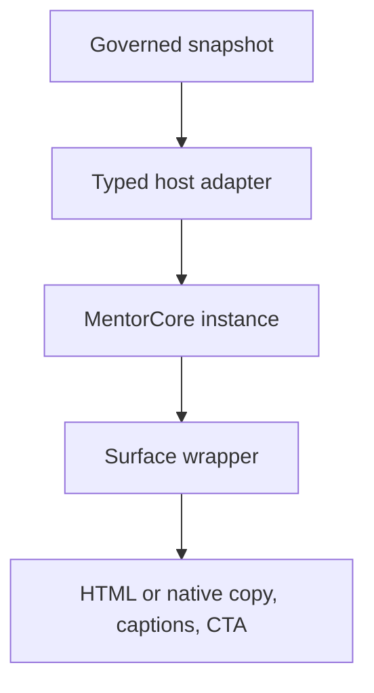

# TecPey Living Mentor — Rive Rig Blueprint v1.0

**Status:** Phase 0 sign-off candidate
**Blueprint version:** `1.0.0`
**Character:** `tecpey_mentor`
**Canonical authoring source:** `tecpey-mentor-global.v1.riv`
**Machine manifest:** [`rig/tecpey-mentor-rig-manifest.v1.json`](./rig/tecpey-mentor-rig-manifest.v1.json)
**Manifest schema:** [`rig/tecpey-mentor-rig-manifest.v1.schema.json`](./rig/tecpey-mentor-rig-manifest.v1.schema.json)
**Related contracts:** [Character Bible](./TECPEY_LIVING_MENTOR_CHARACTER_BIBLE_V1.md) · [Rive ViewModel](./RIVE_VIEWMODEL_CONTRACT_V1.md) · [Multilingual Speech Rig](./MULTILINGUAL_SPEECH_RIG_CONTRACT_V1.md)

## 1. Executive decision

TecPey will author one global, reusable `MentorCore` character rig and place instances of it inside thin surface artboards. The launcher, Mentor tab, learner profile, Academy, and Trading Arena do not receive independent character copies.

The production system separates four concerns:

1. **Identity geometry:** the approved likeness-inspired face and silhouette;
2. **Animation rig:** bones, meshes, constraints, hands, face, gaze, and speech;
3. **Presentation policy:** the deterministic ViewModel snapshot and state machine;
4. **Host UI:** localized copy, captions, CTA, focus, accessibility, lifecycle, and fallback.

This separation is non-negotiable. It lets Design redraw scenery and surface layout without changing the backend contract, and lets Engineering replace a runtime or speech provider without redesigning the character.

The character remains a respectful fictional identity inspired by Mahdi. It is never represented as Mahdi himself. The approved smooth, narrow, hump-free nose with a gently upturned tip is identity-critical geometry and cannot be regenerated by expressions, speech, head turns, or automated tooling.

## 2. Release topology

### 2.1 Canonical and derived assets

| Artifact | Role | Rule |
|---|---|---|
| `tecpey-mentor-global.v1.riv` | Canonical animated release asset | Contains `MentorCore`, wrappers, one ViewModel contract, and one state machine contract |
| `tecpey-mentor-launcher.v1.svg` | Approved static launcher image | Exported from the same approved model; used while the launcher is closed |
| Poster/fallback exports | Static failure and reduced-capability fallback | Generated from approved neutral frames; never independently redrawn |
| Share-video composition | Deferred Phase 6 consumer | May render the canonical character but cannot fork its identity or behavior |

The closed global launcher does not load the Rive runtime. It shows the static approved launcher export. The full runtime and `.riv` asset load on explicit open intent or an approved idle-prefetch policy. When the Mentor panel is open, the launcher instance is static or unmounted.

### 2.2 Artboard registry

| Artboard | Reference size | Use | Character crop | Runtime policy |
|---|---:|---|---|---|
| `MentorCore` | 1024 × 1024 | Reusable canonical component | Upper body and hands | Never mounted directly by product UI |
| `MentorLauncher` | 256 × 256 | Bottom-page launcher export and one-shot preview | Head and upper chest | Static while closed |
| `MentorPanel` | 720 × 960 | Dedicated Mentor tab and expanded drawer | Upper body and both hands | Load on intent |
| `MentorProfile` | 960 × 960 | AI-enriched learner profile | Bust or upper body | Load only when visible |
| `MentorScene` | 1440 × 900 | Academy and Arena scenes | Upper body with safe gesture space | Load only when visible |
| `MentorShare` | 1080 × 1920 | Optional vertical media | Art-directed per template | Deferred until Phase 6 |

Wrapper artboards own crop, alignment, palette slots, room decoration, and non-character hit regions. They may not contain a copied face, skeleton, hand library, speech rig, or state machine.

### 2.3 Surface mapping

| Product surface | Artboard | Notes |
|---|---|---|
| `launcher` | `MentorLauncher` | Static SVG by default; no constant breathing loop across all pages |
| `mentor_tab` | `MentorPanel` | Primary conversational surface |
| `profile_summary` | `MentorProfile` | Character contextualizes progress; it never verifies identity or credentials |
| `academy` | `MentorScene` | Teaching and review acts |
| `arena` | `MentorScene` | Simulation-only risk and reflection acts |
| `credential_helper` | `MentorPanel` | May introduce the credential UI; never appears on the official credential |
| `share_render` | `MentorShare` | Phase 6 only and rendered on demand |

## 3. Exact component hierarchy

The following names are canonical and case-sensitive. A Rive editor export fails review if required nodes are renamed or duplicated without a manifest version change.

- `MentorCore`
  - `grp_shadow`
  - `grp_character`
    - `grp_body_back`
      - `geo_arm_R_back`
      - `geo_torso_back`
    - `grp_torso`
      - `mesh_torso`
      - `geo_neck`
      - `geo_shirt_trim`
    - `grp_head`
      - `geo_ear_L`
      - `geo_ear_R`
      - `mesh_face_base`
      - `geo_nose_identity`
      - `grp_eye_L`
      - `grp_eye_R`
      - `grp_brow_L`
      - `grp_brow_R`
      - `grp_mouth`
        - `mask_mouth_cavity`
        - `geo_mouth_cavity`
        - `geo_teeth_upper`
        - `geo_teeth_lower`
        - `geo_tongue`
        - `geo_lip_upper`
        - `geo_lip_lower`
        - `mesh_lower_face_speech`
      - `mesh_beard_lower`
      - `geo_hair_back`
      - `geo_hair_front`
    - `grp_body_front`
      - `geo_arm_L_front`
      - `cmp_hand_L`
      - `cmp_hand_R`
  - `grp_controls`
    - `ctl_head_aim`
    - `ctl_gaze_target`
    - `ctl_blink_L`
    - `ctl_blink_R`
    - `ctl_motion_intensity`
    - `ctl_viseme_blend`
    - nine continuous speech controls defined by the multilingual speech contract
  - `grp_skeleton`
    - canonical bones from section 5
  - `grp_debug`
    - hidden guides, safe zones, angle guides, and weight diagnostics; excluded from production export

### 3.1 Naming convention

| Prefix | Meaning |
|---|---|
| `ab_` | Build/export identifier for an artboard |
| `cmp_` | Reusable nested-artboard component |
| `grp_` | Organizational group |
| `geo_` | Rigid vector geometry |
| `mesh_` | Deforming vector or image mesh |
| `b_` | Bone |
| `ctl_` | Animator-facing control |
| `ik_` | IK target |
| `mask_` | Clipping/masking shape |
| `hit_` | Interaction target; wrappers only |

Names use ASCII `snake_case`; left/right suffixes are always `_L` and `_R`. User-facing text, locale names, and generated labels never become node names.

## 4. Draw order and clipping

The canonical draw order is:

1. shadow and rear scenery;
2. rear arm;
3. torso and shirt;
4. neck and rear ears/hair;
5. face base;
6. eyes, brows, and immutable nose;
7. mouth cavity, tongue, teeth, lips, and lower-face speech mesh;
8. beard and front hair;
9. front arm and hands;
10. wrapper-only foreground.

The mouth cavity is clipped by `mask_mouth_cavity`. Teeth and tongue never escape the lip silhouette. Draw-order animation is permitted only for arm/hand occlusion during authored acts; it cannot reorder the nose, lips, beard, or eyes.

## 5. Skeleton contract

| Bone | Parent | Role | Normal owner |
|---|---|---|---|
| `b_root` | — | Stable component origin | Structural; never keyed by acts |
| `b_torso_root` | `b_root` | Upper-body placement | Structural |
| `b_spine_act` | `b_torso_root` | Lean and posture | `ConversationAct` |
| `b_breath` | `b_spine_act` | Small chest-volume deformation | `Ambient` |
| `b_chest` | `b_spine_act` | Shoulder platform | `ConversationAct` |
| `b_neck` | `b_chest` | Neck rotation | `ConversationAct` |
| `b_head_act` | `b_neck` | Authored act pose | `ConversationAct` |
| `b_head_aim` | `b_head_act` | Bounded gaze follow | `GazeBlink` |
| `b_head` | `b_head_aim` | Head geometry parent | Structural |
| `b_jaw` | `b_head` | Jaw rotation/opening | `Speech` |
| `b_clavicle_L/R` | `b_chest` | Shoulder articulation | `ConversationAct` |
| `b_upperarm_L/R` | matching clavicle | Upper arm | `ConversationAct` |
| `b_forearm_L/R` | matching upper arm | Elbow chain | `ConversationAct` |
| `b_wrist_L/R` | matching forearm | Wrist pose | `ConversationAct` |
| `b_hand_L/R` | matching wrist | Hand component transform | `ConversationAct` |
| `b_mouth_corner_L/R` | `b_head` | Affect-only corner elevation | `FaceAffect` |
| `b_lip_upper_mid` | `b_head` | Upper-lip articulation | `Speech` |
| `b_lip_lower_mid` | `b_jaw` | Lower-lip articulation | `Speech` |
| `b_brow_inner_L/R` | `b_head` | Inner brow expression | `FaceAffect` |
| `b_brow_outer_L/R` | `b_head` | Outer brow expression | `FaceAffect` |

### 5.1 Constraints

- `ik_hand_L` and `ik_hand_R` use bounded two-bone IK for authored hand destinations.
- Elbow, wrist, neck, head, and jaw rotation constraints prevent anatomical inversion.
- Eye pupils use translation constraints inside their eye masks.
- The head-aim control is limited to the approved front-to-three-quarter range; full profile is a separately authored reference pose, not a runtime squash of the front face.
- Constraint limits are validated at every act extreme and cannot be expanded to solve a single animation without rerunning identity and gesture regression.

## 6. Mesh and weighting strategy

### 6.1 Mesh registry

| Mesh | Purpose | Allowed deformation | Locked regions |
|---|---|---|---|
| `mesh_face_base` | Cheek and subtle head-turn volume | Head aim and upper-cheek affect | Nose bridge, dorsum, tip, nostrils, eye spacing, skull outline |
| `mesh_lower_face_speech` | Jaw/lip-adjacent coarticulation | Jaw, lip midpoints, mouth corners | Nose base and identity silhouette |
| `mesh_beard_lower` | Keeps beard attached to jaw and cheeks | Jaw and bounded lower-cheek movement | Upper beard boundary and sideburn silhouette |
| `mesh_torso` | Lean and restrained breathing | Spine, chest, breath | Collar/logo placement |
| `mesh_sleeve_L/R` | Elbow deformation | Matching arm chain | Cuff shape at neutral |
| `mesh_forearm_L/R` | Forearm bend | Matching arm chain | Wrist seam |

### 6.2 Weight rules

- Maximum four bone influences per vertex; two is preferred for most vertices.
- Identity-locked nose vertices have zero weight to speech, affect, jaw, and head-aim deformers.
- The head-turn mesh uses one bounded joystick only. A second complex face joystick requires a measured size/performance exception.
- Face expression and speech compose through different bones: mouth corners belong to affect; jaw and lip midpoints belong to speech.
- No state-machine layer keys a mesh vertex directly if the same region is already bone-weighted.
- Weight normalization is mandatory; negative weights and orphaned vertices fail export review.
- The beard is tested at all jaw extremes so it never floats, clips the lips, or changes the approved jawline.

## 7. Identity and facial controls

### 7.1 Immutable identity layer

`geo_nose_identity`, eye spacing, skull outline, ear placement, hairline, and the upper beard boundary are immutable identity geometry. They may be repositioned only in a new character-model revision approved by Design, Brand, and the memorial-likeness owner.

The nose acceptance criteria are explicit:

- smooth and narrow bridge;
- no dorsal hump or broad upper-body swelling;
- continuous gentle slope;
- refined, slightly upturned tip;
- consistent nostril width and projection at front, three-quarter, and profile references;
- no expression or viseme-induced widening, drooping, pinching, or bridge deformation.

### 7.2 Head and gaze

- `ctl_head_aim` is a bounded two-axis control for subtle front-to-three-quarter motion.
- `ctl_gaze_target` moves pupils within masked eye bounds and may add only a small composed head follow through `b_head_aim`.
- Gaze follows conversational focus or a governed CTA target. It never follows the cursor continuously and never uses camera-based eye contact in v1.
- Blink is independent per eye but coordinated by a single non-periodic blink policy; it must not loop like a metronome.
- Gaze, blink, affect, and speech must remain independently interruptible.

### 7.3 Affect

The six canonical affect states are `calm`, `attentive`, `curious`, `warm`, `concerned`, and `steady`. Affect may use brows, eyelids, upper cheeks, and mouth-corner bones. It cannot key the jaw, lip articulation bones, teeth, tongue, or identity geometry.

### 7.4 Speech

The `Speech` layer owns:

- the 15 universal visual anchors;
- jaw, lip, teeth, tongue, and local lower-cheek deformation;
- the nine continuous articulation controls;
- transition to `sil` on interruption, error, or utterance end.

The enum `speech.viseme` selects the sparse anchor state; `speech.blend` controls its influence; the numeric articulation properties bind directly to dedicated deformers. Provider-specific viseme IDs never enter the Rive file.

## 8. Hands and global gesture library

Hands are authored nested components, not fully simulated finger skeletons. Each side has a human-reviewed pose library with:

- `neutral_relaxed`;
- `open_diagonal`;
- `open_explain`;
- `open_present`;
- `chin_support`;
- `caution_flat`;
- `celebrate_open`.

Left and right hands are separately authored. Negative-scale mirroring is not used for anatomical artwork. Wrist transforms and arm IK position the hand component; hand shape changes use short, interruptible swaps.

The eight global body poses remain those defined in the Character Bible: idle, greet, listen, think, explain, invite, celebrate effort, and risk caution. Safety poses cannot be overridden by locale or tenant variants. Culturally specific greetings, finger signs, religious or political gestures, viewer-pointing, and profit-hype poses are forbidden in the global asset.

## 9. State-machine topology

Rive state-machine layers play concurrently. When two layers animate the same property, a lower layer in the Editor stack takes priority. The Editor order below is therefore mandatory, but normal operation still relies on exclusive property ownership rather than priority.

| Editor order, top to bottom | Layer | Default | States or mixer | Normal ownership |
|---:|---|---|---|---|
| 1 | `Ambient` | `still` | `off`, `still`, `breathe` | Breath and permitted clothing secondary motion |
| 2 | `ConversationAct` | `idle_attentive` | Non-safety act registry | Torso, arms, hands, and `b_head_act` |
| 3 | `FaceAffect` | `calm` | Six affect states | Brows, upper cheeks, mouth corners |
| 4 | `GazeBlink` | `still` | `still`, `auto`, `focus` | Pupils, eyelids, and `b_head_aim` |
| 5 | `Speech` | `sil` | `sil`, 15 sparse anchors, `recover` | Jaw, lip articulation, teeth, tongue, lower cheek |
| 6 | `SafetyBase` | `clear` | Safety and failure states | Intentional body override only |

`SafetyBase.clear` keys no properties. During `pause_reflect`, `risk_caution`, `privacy_notice`, `data_unavailable`, or `error_recover`, it may override torso, arm, hand, and act-head properties. It never keys lips, jaw, teeth, tongue, captions, copy, or CTA eligibility.

### 9.1 Conflict rules

1. Every animated property has exactly one normal owner layer.
2. The only permitted cross-layer override is `SafetyBase` over declared body-act domains.
3. A sparse animation keys only the properties it owns; unneeded zero keyframes are prohibited.
4. A transition begins from the current mixed pose, not the animation's authored first frame.
5. A safety event interrupts any positive act immediately and remains until the governed snapshot clears it.
6. An act replays only when `eventId` changes and the host fires `playAct` once.
7. Unknown values resolve to `clear`, `idle_attentive`, `calm`, `still`, and `sil`.

## 10. Data-binding boundary

The snapshot is broader than the character's visual input. The manifest is the binding allowlist.

### 10.1 Bound to Rive

- `mentor.act`, `mentor.affect`, `mentor.intensity`, and governed priority;
- `speech.state`, universal anchor, blend, and nine continuous controls;
- `world.theme`, validated room-level presentation, and approved celebration tier;
- `accessibility.reducedMotion` and `accessibility.highContrast`;
- the derived one-shot `playAct` trigger.

### 10.2 Host-only

Display name, localized sentence text, captions, CTA label/action, locale direction, learning metrics, market labels, risk evidence, privacy status, entitlement, and provenance remain in semantic HTML or native UI. They are not copied into the `.riv` file.

This rule:

- prevents sensitive evidence from entering renderer memory unnecessarily;
- avoids loading global-script font payloads into the character asset;
- keeps screen readers, text selection, bidi isolation, localization, and responsive copy under the host platform;
- prevents the Mentor from visually inventing a recommendation that the host policy did not authorize.

## 11. Motion system

### 11.1 Timing and easing

| Motion | Duration | Curve | Rule |
|---|---:|---|---|
| Safety interruption | 120–180 ms | `cubic-bezier(0.23,1,0.32,1)` | Immediate, calm, no shake or alarm bounce |
| Ordinary act entry | 180–240 ms | `cubic-bezier(0.23,1,0.32,1)` | Enter from current pose |
| On-screen pose change | 220–300 ms | `cubic-bezier(0.77,0,0.175,1)` | Preserve continuity and allow interruption |
| Ordinary act exit | 180–240 ms | `cubic-bezier(0.23,1,0.32,1)` | Retarget responsively from the current pose and return cleanly to idle |
| Speech interruption to `sil` | no more than 120 ms | linear or short ease-out | Audio stop and `utteranceId` change are authoritative |
| Hand-shape swap | 100–180 ms | short ease-in-out | Never pop or cross through malformed fingers |

The act-specific dwell times in the Character Bible still apply. Timing is calibrated at real 32–56 px, 160 px, and 420 px presentation sizes; an animation that reads only in the editor does not pass.

### 11.2 Motion behavior

- Motion is restrained, purposeful, and interruptible.
- No bounce, elastic overshoot, shake, floating, or profit-celebration physics.
- Breathing affects a dedicated child bone and never moves the whole canvas.
- Secondary clothing/hair movement follows body motion and settles; it never loops independently.
- The character does not fake typing, scan the user, react to P&L, or track the cursor.
- Multiple visible Mentor instances never animate simultaneously.

## 12. Reduced motion and accessibility

When `accessibility.reducedMotion` is true:

- `Ambient` becomes `off`;
- act motion resolves to a restrained static key pose with a transition no longer than 120 ms;
- head follow, parallax, secondary hair/clothing motion, and gesture overlap are disabled;
- gaze can move within the eyes but does not pull the head;
- bounded speech articulation remains only while user-enabled audio plays;
- captions and semantic copy remain the source of truth.

Audio never autoplays on entry. The canvas exposes one concise accessible label; it does not announce decorative motion. All messages, controls, safety warnings, and CTAs exist outside the canvas with keyboard, screen-reader, high-contrast, and bidi support.

## 13. TecPey performance budget

These are TecPey product budgets, not claims made by Rive. A budget may change only through a measured architecture decision and regression evidence.

### 13.1 Authoring ceilings

| Metric | Ceiling |
|---|---:|
| Canonical bones | 32 |
| Constraints | 20 |
| Deforming meshes | 12 |
| Influences per vertex | 4 |
| Complex deformation joysticks | 1 |
| Nested-artboard depth | 2 |
| Raster bytes in `MentorCore` | 0 |

### 13.2 Runtime ceilings

| Metric | Gate |
|---|---:|
| Full `.riv` transfer size | no more than 1,200,000 bytes |
| Closed-launcher Rive runtime cost | 0 bytes before intent/prefetch |
| Visible animated Mentor instances | 1 |
| Cached ready-to-first-safe-frame p95 | no more than 350 ms |
| Uncached ready-to-first-safe-frame p95 on test 4G | no more than 1,500 ms |
| Static fallback commit p95 after renderer failure | no more than 100 ms |
| Regression against approved baseline | no more than 10% without review |

### 13.3 Frame budget

Measure after a 5-second warmup for 30 seconds, three runs, with production builds and representative host UI:

| Tier | p95 frame time | Sustained floor | Failure action |
|---|---:|---:|---|
| Reference web desktop | no more than 16.7 ms | 55 fps | Block release |
| Reference iOS/Android | no more than 16.7 ms | 50 fps | Block release |
| Low-tier fallback device | no more than 33.3 ms | 28 fps | Use static/reduced runtime fallback |

The measured baseline records asset bytes, artboard load, animation CPU/GPU time, memory delta, dropped frames, long tasks, and thermal behavior. Offscreen, backgrounded, or hidden instances pause or unmount.

## 14. Runtime integration gates

### 14.1 Web

- Use a pinned `@rive-app/react-webgl2` version for the Phase 2 spike.
- Lazy-load the runtime and full asset; render the static launcher before intent.
- Stage the validated ViewModel before the first personalized frame.
- Keep localized copy, captions, CTA, focus, and error recovery in semantic HTML.
- Pause/unmount on `visibilitychange`, route changes, and offscreen state.
- Use one renderer instance per visible Mentor surface and clean it up deterministically.
- Renderer failure, WebGL loss, unsupported feature, or schema mismatch returns the approved static frame plus functional HTML UI.

### 14.2 React Native / Expo

- Use the current Nitro-based `@rive-app/react-native` line with `react-native-nitro-modules`, pinned only in the mobile repository.
- The build matrix must pass the current official runtime minimums and TecPey's selected Expo release.
- The same `.riv`, manifest version, ViewModel enums, five MVP acts, speech fallback, reduced-motion behavior, and identity-regression set must pass on iOS and Android.
- App backgrounding pauses animation and audio; foregrounding never replays a stale act.
- Native text owns captions, copy, CTA, dynamic type, RTL/LTR, and accessibility.

### 14.3 Renderer parity

The Phase 2 spike checks every used Rive feature against the official feature-support matrix. A feature that fails web/mobile parity is removed or replaced; the team does not ship separate character behavior per platform.

## 15. Validation and acceptance

### 15.1 Automated manifest checks

- schema-valid manifest;
- unique IDs across artboards, bones, controls, meshes, layers, and gates;
- every parent and referenced layer/artboard/bone exists;
- no bone cycles;
- contiguous layer order;
- one normal property owner per domain;
- only `SafetyBase` declares intentional overrides;
- every Rive binding is present in the approved allowlist;
- every speech anchor matches the multilingual contract;
- authoring ceilings are not exceeded.

### 15.2 Visual regression matrix

Before asset approval, render:

- approved head angles × all 12 expression references;
- approved head angles × all 15 speech anchors;
- all eight global body poses at target sizes;
- every safety state in light, Academy, Arena, profile, high-contrast, and reduced-motion variants;
- targeted stress combinations for warm/concerned affect with open, rounded, bilabial, labiodental, and interdental speech.

Identity comparison includes nose bridge, tip rotation, nostril width, eye spacing, jawline, beard boundary, hairline, and silhouette. Automated diffs detect drift; a human likeness review owns approval.

### 15.3 Executive sign-off

| Owner | Must approve |
|---|---|
| Product | Surface behavior, load policy, act semantics, and Phase scope |
| Character/Brand | Likeness, silhouette, palette, and global recognizability |
| Memorial-likeness owner | Respectful inspiration boundary and identity-critical geometry |
| Learning | Educational acts and non-coercive progression |
| Financial Risk/Compliance | Arena language, safety interruption, and no advice/hype |
| Globalization | Script independence, locale ownership, cultural gesture review |
| Accessibility | Reduced motion, captions, native text, contrast, focus, and fallback |
| Engineering | Manifest, bindings, lifecycle, performance, web/mobile parity |
| Security/Privacy | Data minimization, no snapshot leakage, telemetry boundaries |
| Legal | Likeness, voice, asset, font, model, and dataset rights |

Phase 2 begins only after this Blueprint, the Character Bible, the ViewModel contract, the multilingual speech contract, and the machine manifest are signed as one package.

The signed delivery is evaluated by the machine-readable
[`acceptance/tecpey-mentor-rive-acceptance.v1.schema.json`](./acceptance/tecpey-mentor-rive-acceptance.v1.schema.json)
and the fail-closed policy described in
[`acceptance/README.md`](./acceptance/README.md). Installing a web Rive runtime
or adding a `.riv` asset without an accepted packet is a repository policy
failure, not a soft warning.

## 16. Phase 2 delivery sequence

The governed trace inputs and their hashes are recorded in
[`design/mentor/vector-source/v1-adobe/mentor-vector-source-pack.v1.json`](../../design/mentor/vector-source/v1-adobe/mentor-vector-source-pack.v1.json).
They are authoring references, not runtime assets. The four-view sheet owns
identity geometry; the expression sheet owns affect intent only. The current
reference set honestly leaves the left three-quarter and left profile identity
reviews open—mirroring cannot satisfy those acceptance items.

1. Rebuild the approved character reference as clean vector geometry with identity-locked guides and the semantic groups in the vector source pack.
2. Author `MentorCore` with the skeleton and mesh ceilings in this Blueprint.
3. Implement the five MVP acts: idle, greet, explain, celebrate effort, and risk caution.
4. Implement six affects, gaze/blink, `sil`, and five speech stress anchors before all 15 anchors.
5. Bind a safe default ViewModel instance and the machine manifest.
6. Verify web and mobile parity on the same asset.
7. Run identity, motion, cultural, accessibility, and performance gates.
8. Expand to all acts and all 15 speech anchors only after the five-state spike passes.

## 17. Official Rive references

- [State machine layers](https://rive.app/docs/editor/state-machine/layers)
- [State types and blend states](https://rive.app/docs/editor/state-machine/states)
- [Data binding overview](https://rive.app/docs/editor/data-binding/overview)
- [Runtime data binding](https://rive.app/docs/runtimes/data-binding)
- [Bones](https://rive.app/docs/editor/manipulating-shapes/bones)
- [Meshes](https://rive.app/docs/editor/manipulating-shapes/meshes)
- [Constraints](https://rive.app/docs/editor/constraints/constraints-overview)
- [IK constraints](https://rive.app/docs/editor/constraints/ik-constraint)
- [Joysticks](https://rive.app/docs/editor/manipulating-shapes/joysticks)
- [React runtime](https://rive.app/docs/runtimes/react/react)
- [React Native runtime](https://rive.app/docs/runtimes/react-native/react-native)
- [Renderer overview](https://rive.app/docs/runtimes/choose-a-renderer/overview)
- [Feature support](https://rive.app/docs/feature-support)
- [Runtime sizes](https://rive.app/docs/runtimes/runtime-sizes)
- [Runtime best practices](https://rive.app/docs/runtimes/react/best-practices)
