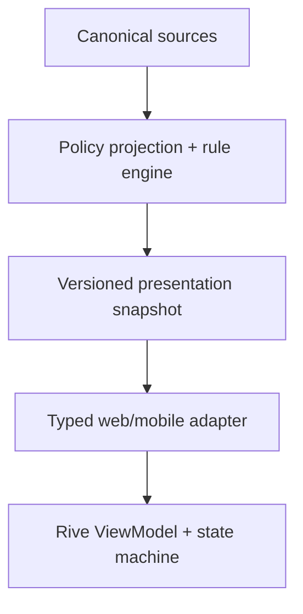

# TecPey Mentor — Rive ViewModel Contract v1.0

**Status:** Phase 0 sign-off candidate
**Contract version:** `1.0.0`
**Character:** `tecpey_mentor`
**Machine schema:** [`schemas/tecpey-mentor-rive-viewmodel.v1.schema.json`](./schemas/tecpey-mentor-rive-viewmodel.v1.schema.json)
**Valid example:** [`examples/tecpey-mentor-rive-viewmodel.v1.example.json`](./examples/tecpey-mentor-rive-viewmodel.v1.example.json)
**Character rules:** [Character Bible v1](./TECPEY_LIVING_MENTOR_CHARACTER_BIBLE_V1.md)
**Global speech:** [Multilingual Speech Rig Contract v1](./MULTILINGUAL_SPEECH_RIG_CONTRACT_V1.md)
**Rig implementation:** [Rive Rig Blueprint v1](./RIVE_RIG_BLUEPRINT_V1.md)

## 1. Decision

TecPey will use a versioned presentation snapshot as the only contract between governed product data and the Rive character.

Rive is a renderer and interaction layer. It is not an authority for learning scores, risk, entitlements, credentials, consent, market claims, or next-action eligibility.

The backend does not push arbitrary database rows into a `.riv` file. It materializes a bounded JSON snapshot. A small typed runtime adapter validates the snapshot, maps values to Rive ViewModel properties, and fires `playAct` only when `eventId` changes.

Data binding removes coupling to the scene hierarchy. It does not remove the need for schema validation, semantic mapping, consent, versioning, or a runtime adapter.

## 2. Corrections to the technical brief

These statements were verified against first-party sources on 2026-08-30:

| Topic | Verified decision |
|---|---|
| Data binding | Rive recommends View Models/data binding for new runtime control. React's `useStateMachineInput` is deprecated, but state machines themselves remain the animation/interaction orchestrator. |
| Web renderer | `@rive-app/react-webgl2` is the recommended TecPey default because it matches Editor rendering. It is not the only package with data-binding APIs; Canvas and WebGL2 share the same core API, with different feature/performance tradeoffs. |
| React Native | The new `@rive-app/react-native` runtime uses Nitro and requires `react-native-nitro-modules`; official requirements currently include React Native 0.78+, Expo SDK 53+, and Nitro 0.25.2+. TecPey's current repository is Next.js-only, so Expo support is a future-repository gate, not a completed capability. |
| Rive pricing | Current advertised annual-equivalent prices are Free, Cadet $9, Voyager $32, and Enterprise $120 **per seat per month**. Monthly prices differ. Runtime use is not priced per TecPey end user, but editor/export seats are not a single flat company fee. |
| Rive MCP | Officially desktop-only on Windows/macOS. Use it for inspectable mechanical work; all generated bindings, states, and keyframes still require human visual review. |
| Remotion | Organizations of up to three people may qualify for the Free License. For a Company License automation, pricing is $0.01 per successful render with a $100/month minimum. Personalized user videos based on a TecPey template are an accepted use case. This belongs to Phase 6 only. |
| ParsVoice | The paper/dataset versions report different released subsets. The Hugging Face metadata says MIT, while the dataset card still contains an unresolved license placeholder and research-access language. Treat commercial training rights as **unresolved** until a signed license/provenance review is complete. |
| Chatterbox Persian | The official MIT Chatterbox family is commercially permissive, but Persian is not in the published supported-language list. The identifiable Persian community fine-tune is CC BY-NC 4.0 and is not approved for TecPey commercial production. |
| Piper Persian | Persian voices exist, but core/runtime and individual voice-model licenses must be reviewed separately. Piper is a benchmark candidate, not an approved production decision. |
| Fish/Voxtral weights | Fish S2 weights require a separate commercial license; Voxtral TTS open weights are CC BY-NC. A paid commercial API is a different legal route from self-hosting the weights. |

## 3. Non-negotiable architecture rules

1. The character consumes only the presentation snapshot defined here.
2. Every field has a canonical source, status, freshness, and consent rule.
3. Unknown data stays unknown. Numeric fallbacks such as `0` are hidden unless the matching state is `ready`.
4. The deterministic rule engine selects `act`, `priority`, `reasonCode`, `messageKey`, and `ctaAction`.
5. An LLM may draft conversational explanation after policy selection, but cannot change the act, risk guard, entitlement, grade, credential, or CTA eligibility.
6. The public market regime may select an observation exercise, never higher risk.
7. The `.riv` file performs presentation transitions only. It makes no network calls and contains no secrets or user records.
8. The final snapshot contains no legal name, photo, email, phone, wallet address, credential identifier, raw conversation, or KYC data.
9. The Rive asset must render a safe default instance before real data and must never flash fake personalized values.
10. Contract-major mismatch, invalid JSON, stale safety data, or renderer failure produces the static HTML fallback.

## 4. Snapshot envelope

The server response contains:

| Field | Purpose |
|---|---|
| `contractVersion` | Semantic version of this contract |
| `snapshotId` | Idempotent ID for tracing and replay protection |
| `generatedAt` / `expiresAt` | Freshness boundary |
| `surface` | Launcher, Mentor tab, profile, Academy, Arena, credential helper, or share render |
| `locale` / `direction` | BCP 47 copy locale and layout context |
| `dataState` | Overall `ready`, `partial`, `unavailable`, `consent_required`, or `stale` state |
| `viewModel` | The only subtree mapped to Rive properties |
| `provenance` | Sanitized source status used by UI/trust logic; not shown as raw Rive data |

The client may overlay device-only settings such as `prefers-reduced-motion` and audio preference before binding. It may not recalculate learning, practice, market, safety, or entitlement values.

## 5. Rive ViewModel tree

The presentation snapshot uses the tree below. Create one root editor ViewModel named `TecPeyMentorVM` containing only the visual paths allowlisted by the [machine-readable rig manifest](./rig/tecpey-mentor-rig-manifest.v1.json). Display name, localized sentences, captions, CTA, evidence, privacy, entitlement, provenance, and adapter-only identifiers remain in the host UI and never enter the `.riv` instance.

The table documents the complete presentation snapshot; it is not blanket permission to bind every row into Rive:

| Property path | Contract type | Meaning |
|---|---|---|
| `user.displayName` | String | User-provided display name; never legal identity |
| `user.displayNameState` | Enum | `user_provided`, `hidden`, `unavailable` |
| `user.selfReportedMood` | Enum | Explicit self-report only |
| `learning.state` | Enum | Availability/consent state |
| `learning.learningBand` | Enum | Estimated learning band, not a credential |
| `learning.completedTerms` | Number | Canonical completed-term count |
| `learning.masteryPercent` | Number | Bounded educational evidence score |
| `learning.streakDays` | Number | Canonical server streak only |
| `learning.streakState` | Enum | Hides the numeric fallback when unavailable |
| `learning.focusKey` | String | Stable internal topic key |
| `learning.focusLabel` | String | Bounded localized display label |
| `learning.nextAction` | Enum | Governed educational action |
| `practice.state` | Enum | Arena signal availability/consent |
| `practice.riskBand` | Enum | `unknown`, `low`, `moderate`, `high` |
| `practice.disciplineScore` | Number | Simulation evidence only |
| `practice.guardState` | Enum | Educational practice guard, never real-trading permission |
| `practice.guardReason` | Enum | Stable reason code |
| `practice.arenaMode` | Enum | `none`, `unranked`, `ranked` |
| `market.state` | Enum | Public market-context availability |
| `market.regime` | Enum | `unknown`, `range`, `volatile`, `bullish`, `bearish`, `mixed` |
| `market.freshness` | Enum | `current`, `stale`, `unavailable` |
| `market.confidence` | Number | Evidence confidence 0–1 |
| `market.sourceCount` | Number | Count of eligible public sources |
| `market.educationalUse` | Enum | `none`, `observe`, `unranked_scenario` |
| `mentor.affect` | Enum | Character presentation affect, not user diagnosis |
| `mentor.act` | Enum | Character act from the Bible registry |
| `mentor.intensity` | Number | Motion intensity 0–1 |
| `mentor.priority` | Number | Interruption priority |
| `mentor.eventId` | String | Unique event identifier |
| `mentor.reasonCode` | Enum | Governed reason for the act |
| `speech.state` | Enum | Playback state; single source of truth for speech activity |
| `speech.locale` | String | BCP 47 locale for the current utterance/segment |
| `speech.profileId` / `profileVersion` | String | Versioned locale-mapping profile |
| `speech.viseme` | Enum | Current provider-independent universal target |
| `speech.blend` | Number | Current target influence, 0–1 |
| `speech.jawOpen` | Number | Continuous jaw opening, 0–1 |
| `speech.lipClose` / `lipPress` / `lipWide` | Number | Continuous aperture/compression/spread controls |
| `speech.lipRound` / `lipFunnel` | Number | Continuous rounding/protrusion controls |
| `speech.lowerLipBite` | Number | Labiodental contact control |
| `speech.tongueTipUp` / `tongueForward` | Number | Bounded internal/dental tongue controls |
| `speech.utteranceId` | String | Rejects stale or superseded speech timelines |
| `copy.messageKey` | String | Versioned deterministic template key |
| `copy.headline` | String | Bounded, sanitized headline |
| `copy.body` | String | Bounded, sanitized body |
| `copy.ctaLabel` | String | Bounded CTA label |
| `copy.ctaAction` | Enum | Whitelisted product action |
| `world.roomLevel` | Number | Durable progression level, 0–5 |
| `world.roomState` | Enum | Hides unavailable progression |
| `world.theme` | Enum | `neutral`, `academy`, `arena`, `profile` |
| `world.celebrationTier` | Enum | `none`, `small`, `milestone` |
| `accessibility.reducedMotion` | Boolean | Device/user preference |
| `accessibility.captionsEnabled` | Boolean | Audio caption state |
| `accessibility.audioEnabled` | Boolean | No autoplay; explicit preference |
| `accessibility.highContrast` | Boolean | Presentation preference |
| `privacy.behavioralPersonalization` | Enum | Consent-backed authority state |
| `privacy.externalAi` | Enum | External-provider preference |
| `privacy.marketPersonalization` | Enum | Public context preference |
| `privacy.allowsDisplayName` | Boolean | Permission to speak/show display name |
| `entitlement.plan` | Enum | `free`, `premium`, `institutional` |
| `entitlement.adsMode` | Enum | `sponsor_supported`, `ad_free` |
| `entitlement.voiceMode` | Enum | `caption_only`, `cached`, `synthesized` |
| `playAct` | Trigger | Fired by the adapter after a new `eventId` is bound |

### v1 feature budget

Use only String, Number, Boolean, Enum, Trigger, and nested ViewModel properties in v1. Lists, runtime image replacement, dynamic fonts, nested artboard swaps, and Rive scripting are deferred until web/mobile parity and performance are proven.

The snapshot initializes `speech` to a safe state. During playback, a client adapter combines provider events with a versioned locale profile and updates ephemeral universal targets/controls from the audio clock. These frame-level updates are not server state and are never persisted or logged. Diphthongs are interpolated between vowel anchors; `mentor.speaking` is intentionally removed to avoid duplicated state.

## 6. Source mapping for the current repository

| Snapshot field | Current/future TecPey source | Phase 0 status |
|---|---|---|
| `user.displayName` | Academy display profile | Available only after principal/student binding succeeds; user-provided, not verified identity |
| `learning.learningBand` | `mentor_profiles.level` projected to a non-credential label | Available but estimated |
| `learning.completedTerms` | `academy_term_progress` | Available when account/student binding is authoritative |
| `learning.masteryPercent` | Academy assessment/progress authority | Requires an explicitly documented formula |
| `learning.streakDays` | Current engagement streak is localStorage-backed | **Unavailable until server migration** |
| `practice.riskBand` | `academy_trading_arena_trades` via `mentor-signals.ts` | Consent-gated simulation only |
| `practice.disciplineScore` | `mentor_profiles.discipline_score` | Available with evidence-state label |
| `market.*` | Materialized public market snapshot with timestamp/confidence/sources | Requires a new governed projection; no LLM-only regime |
| `mentor.act` | New deterministic presentation rule engine | Not implemented |
| `world.roomLevel` | New durable progression ledger | Not implemented; must stay unavailable |
| `privacy.*` | `mentor_ai_preferences` plus client settings | Partially available |
| `entitlement.*` | Tenant/product and subscription authority | Requires normalized presentation projection |

The initial projection maps the existing `mentor_profiles.level` values as `beginner → foundation`, `intermediate → developing`, and `advanced → applied`. These are estimated presentation bands, not grades or credentials. Existing `risk_profile` values map as `low → low`, `medium → moderate`, and `high → high`; absence of eligible simulation evidence always maps to `unknown`.

Existing UI issues that this contract must replace rather than copy:

- `TecpeyMentorMark` and the chat header are a logo/Bot icon, not a character.
- The widget exposes ephemeral user-editable level/risk values next to server-derived profile values; presentation must distinguish preference from evidence.
- No-data risk currently defaults to `medium`; the presentation contract requires `unknown`.
- `confidenceScore` is a composite heuristic but is labeled as self-confidence in the UI; v1 does not expose it under that ambiguous name.
- Current engagement streak and room progression are not server-authoritative.
- Rive, React Native, Expo, and Remotion are not current dependencies in this repository.

## 7. Deterministic presentation policy

The first matching rule wins:

| Order | Condition | Act | CTA |
|---:|---|---|---|
| 1 | Secret/privacy boundary | `privacy_notice` | `open_privacy_settings` or none |
| 2 | Contract/source failure | `error_recover` / `data_unavailable` | `retry_snapshot` |
| 3 | Stale market/risk evidence | `data_unavailable` | `open_learning_home` |
| 4 | High Arena risk or an active risk-review guard | `risk_caution` | `open_risk_review` |
| 5 | Cooldown or post-loss reflection | `pause_reflect` | `open_reflection` |
| 6 | Due learning repair | `encourage_retry` | `open_focus_lesson` |
| 7 | Earned effort milestone | `celebrate_effort` | `open_progress` |
| 8 | Safe next lesson/exercise | `invite_next_step` | whitelisted educational action |
| 9 | Otherwise | `greet` or `idle_attentive` | `open_mentor` |

Market context may change the lesson or simulated scenario topic. It may never change `riskBand` downward, remove a guard, or recommend leverage.

## 8. Copy contract

- `messageKey` identifies a reviewed deterministic template.
- `headline`, `body`, and `ctaLabel` are server-rendered from that template and bounded by the JSON schema.
- The rule engine supplies only whitelisted variables. Raw conversation text and market headlines are not injected into character copy.
- LLM-generated explanation stays in the ordinary Mentor conversation UI and is not persisted as a trusted Rive presentation template.
- The character `.riv` contains no personalized sentence text. Semantic HTML/native text owns shaping, RTL/LTR, bidi isolation, captions, copy, CTA, dynamic type, and accessibility.

## 9. Runtime binding contract

### Web

- Phase 2 target: `@rive-app/react-webgl2` with a pinned, tested version.
- Use `onRiveReady` to stage and bind the validated ViewModel before the first personalized frame.
- Use `useOffscreenRenderer: true` when several character instances may appear on one page.
- Do not pass the unvalidated API object directly to hooks.
- Destroy/unmount Rive instances cleanly and keep only one animated instance visible per surface when possible.
- Evaluate `react-canvas` only as a measured fallback for low-end devices; do not fork the contract.

### React Native / Expo

- Future target: the new `@rive-app/react-native` package with `react-native-nitro-modules`.
- Pin versions only in the actual mobile repository after a matrix test on iOS and Android.
- The Phase 2 gate requires the same `.riv` asset, enums, initial bind, five MVP acts, reduced motion, RTL copy, and fallback behavior on web and mobile.

### Binding sequence

1. Fetch snapshot with `private, no-store` semantics.
2. Validate against the machine schema and supported contract major.
3. Reject expired safety-sensitive snapshots.
4. Merge device-only accessibility settings.
5. Create/select the Rive ViewModel instance.
6. Project and set only the paths allowlisted by the rig manifest.
7. Bind before the first personalized frame.
8. If `eventId` is new, fire `playAct` once.
9. Render the localized HTML-equivalent copy and CTA outside the canvas, with bidi isolation for mixed-script content.
10. Record anonymous renderer health; never log the personalized snapshot body.

## 10. Versioning and compatibility

The contract uses semantic versioning:

- **Major:** renamed/removed field, changed meaning, changed enum behavior, or changed safety semantics.
- **Minor:** additive optional field or enum understood by a new asset/runtime.
- **Patch:** bounds, documentation, copy-key, or implementation correction without semantic change.

Every `.riv` release must declare the compatible contract range in the asset registry. The web/mobile adapter supports one current major and at most one explicitly tested previous major. Unknown enum values map to a safe unavailable/idle fallback, never the closest guessed state.

## 11. Privacy, storage, and observability

- Snapshot responses are private and no-store.
- Do not persist snapshots in localStorage, analytics payloads, crash reports, or Rive files.
- Server evidence logs store IDs, policy version, source status, act/reason codes, and hashes—not personalized copy or raw input.
- Behavioral personalization is default-off until the existing consent authority reports enabled.
- Revocation must stop future projections immediately and remove personal fields from the next snapshot.
- Ads and sponsor identifiers are not accepted by the schema.

## 12. Voice and video gates

Voice is accepted only after:

- commercial rights for code, weights, datasets, and the chosen voice are documented separately;
- a signed voice-actor consent covers synthetic generation, fine-tuning, product use, and revocation/termination terms;
- Persian intelligibility, pronunciation, latency, privacy, watermark/disclosure, and listener-comfort tests pass;
- a caption-only fallback works with no lost functionality.

The global target registry, locale-profile format, coarticulation rules, and acceptance tests are defined in the [Multilingual Speech Rig Contract](./MULTILINGUAL_SPEECH_RIG_CONTRACT_V1.md).

ParsVoice and the existing Persian Chatterbox community checkpoint do not currently pass the documented commercial-license gate. Piper remains an evaluation candidate pending per-model license review.

Remotion/video remains Phase 6. It is approved for evaluation only if Phases 2–4 show a measurable retention or sharing benefit and legal/telemetry costs are accepted.

## 13. Official references

- [Rive Data Binding Overview](https://rive.app/docs/editor/data-binding/overview)
- [Rive Data Binding Migration Guide](https://rive.app/docs/editor/data-binding/migration-guide)
- [Rive React Runtime](https://rive.app/docs/runtimes/react/react)
- [Rive Canvas vs WebGL2](https://rive.app/docs/runtimes/web/canvas-vs-webgl)
- [Rive React Native Runtime](https://rive.app/docs/runtimes/react-native/react-native)
- [Rive Feature Support](https://rive.app/docs/feature-support)
- [Rive MCP Integration](https://rive.app/docs/editor/ai/mcp)
- [Rive Pricing](https://rive.app/docs/account-admin/pricing)
- [Remotion License and Pricing](https://www.remotion.dev/docs/license/pricing)
- [Remotion License FAQ](https://www.remotion.dev/docs/license/faq)
- [ParsVoice paper](https://arxiv.org/abs/2510.10774)
- [ParsVoice dataset card](https://huggingface.co/datasets/MohammadJRanjbar/ParsVoice)
- [Chatterbox official repository](https://github.com/resemble-ai/chatterbox)
- [Chatterbox published language list](https://www.resemble.ai/learn/models/chatterbox-multilingual)
- [Persian Chatterbox community checkpoint](https://huggingface.co/Thomcles/Chatterbox-TTS-Persian-Farsi)
- [Fish S2 licensing statement](https://fish.audio/blog/what-we-mean-by-open-source-for-s2/)
- [Voxtral TTS release and license](https://mistral.ai/news/voxtral-tts/)

## 14. Phase 0 acceptance tests

- [ ] Machine schema rejects extra fields, contains no direct-identifier properties, and the projection sanitizer rejects direct-identifier-shaped values.
- [ ] Valid example passes schema validation.
- [ ] Every Rive property has one type, one fallback, and one authoritative source rule.
- [ ] The rig manifest is the only binding allowlist; host-only paths never enter the `.riv` instance.
- [ ] Six state-machine layers match the Blueprint order and have no undeclared property conflicts.
- [ ] `unknown`/`unavailable` hides fallback numbers.
- [ ] Same `eventId` never replays an act.
- [ ] Safety act interrupts celebration and greeting.
- [ ] Market regime cannot lower risk guards or select high-risk practice.
- [ ] Free/Premium changes cosmetics/capacity only, not safety or truth.
- [ ] Reduced-motion and caption-only modes preserve the full user journey.
- [ ] Contract-major mismatch renders the static HTML fallback.
- [ ] Product, Design, Engineering, Learning, Security, Privacy, and Legal sign the same contract version.
